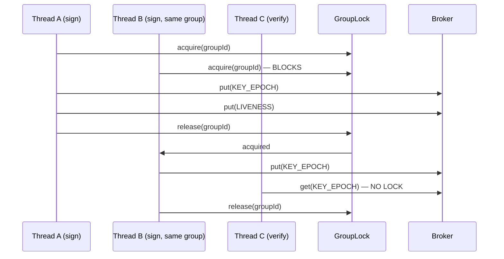

import Tabs from '@theme/Tabs';
import TabItem from '@theme/TabItem';

# veridot-core

`veridot-core` is the heart of Veridot. It contains the protocol engine, signing/verification logic, session management, and all extension point interfaces. Every other Veridot module depends on it.

```
io.github.cyfko:veridot-core:4.0.0
```

<Tabs>
<TabItem value="maven" label="Maven">

```xml
<dependency>
    <groupId>io.github.cyfko</groupId>
    <artifactId>veridot-core</artifactId>
    <version>4.0.0</version>
</dependency>
```

</TabItem>
<TabItem value="gradle" label="Gradle">

```groovy
implementation 'io.github.cyfko:veridot-core:4.0.0'
```

</TabItem>
</Tabs>

:::info
`veridot-core` requires **Java 25+** for sealed interfaces and modern language features.
:::

## Internal Architecture

```mermaid
graph TB
    subgraph "GenericSignerVerifier"
        KRS["KeyRotationService<br/>(ephemeral key pairs)"]
        JM["JwtMaker<br/>(JWT creation)"]
        JV["JwtVerifier<br/>(JWT validation)"]
        EP["EntryPublisher<br/>(envelope building)"]
        EV["EntryVerifier<br/>(envelope validation)"]
        SV["SignatureVerifier<br/>(crypto verification)"]
        CV["CapabilityVerifier<br/>(authorization)"]
        LM["LivenessManager<br/>(LIVENESS entries)"]
        LC["LivenessChecker<br/>(liveness checks)"]
        FM["FenceManager<br/>(fencing tokens)"]
        CM["CapacityManager<br/>(session limits)"]
        CR["ConfigResolver<br/>(config cascade)"]
        RM["ReconciliationManager<br/>(periodic sync)"]
        SC["SessionCounter<br/>(active count)"]
        VW["VersionWatermark<br/>(monotonic versions)"]
    end

    subgraph "Extension Points (interfaces)"
        B["Broker"]
        TR["TrustRoot"]
        WS["WatermarkStore"]
        DT["DataTransformer"]
    end

    EP --> B
    EV --> B
    EV --> TR
    SV --> TR
    LM --> B
    CM --> B
    CR --> B
    RM --> B

    style B fill:#f59e0b,color:#000,stroke:#d97706
    style TR fill:#f59e0b,color:#000,stroke:#d97706
    style WS fill:#f59e0b,color:#000,stroke:#d97706
    style DT fill:#f59e0b,color:#000,stroke:#d97706
```



### GenericSignerVerifier

The central orchestrator that implements four core interfaces:

| Interface | Purpose |
|-----------|---------|
| `DataSigner` | Sign arbitrary data → JWT or messageId |
| `TokenVerifier` | Verify JWT or messageId → `VerifiedData<T>` |
| `TokenRevoker` | Revoke sessions (single or group-wide) |
| `TokenTracker` | Check if a session is currently active |

### Constructor

```java
public GenericSignerVerifier(
    Broker broker,              // Storage backend (Kafka or Database)
    TrustRoot trustRoot,        // Public key resolver
    String issuerId,            // Unique signer identifier
    PrivateKey longTermKey,     // Long-term signing key
    Algorithm envelopeSigAlg,   // Envelope signature algorithm
    int maxSessions,            // Max concurrent sessions (-1 = unlimited)
    EvictionPolicy policy,      // FIFO, LIFO, LRU, or REJECT
    WatermarkStore watermarkStore // Optional: persistent watermark storage
)
```

## Internal Components

### KeyRotationService

Manages **ephemeral key pair rotation**. Every `KEYS_ROTATION_MINUTES` (default: 24 hours), a new asymmetric key pair is generated. Tokens signed with the previous key remain valid until they expire naturally.

- Default algorithm: **Ed25519** (NIST SP 800-186)
- Fallback: ECDSA_SHA256, then RSA_SHA256 (based on `ALLOWED_SIG_ALGS`)
- Key pairs are generated in-memory only — never persisted

```java
KeyRotationService.KeySnapshot snapshot = keyRotationService.snapshot();
// snapshot.privateKey()  — current ephemeral private key
// snapshot.publicKey()   — current ephemeral public key
// snapshot.alg()         — algorithm identifier
```

### JwtMaker & JwtVerifier

`JwtMaker` builds compact JWTs with the ephemeral key:

```java
String jwt = JwtMaker.builder()
    .subject(messageId)         // "4:groupId:sequenceId"
    .claim("data", serialized)
    .issuedAt(Instant.now())
    .expiration(Instant.now().plusSeconds(3600))
    .signWith(keySnapshot.privateKey())
    .alg(keySnapshot.alg())
    .compact();
```

`JwtVerifier` validates the JWT header algorithm against the `KEY_EPOCH` algorithm claim to prevent **algorithm confusion attacks** (V-03/V-05).

### EntryPublisher & EntryVerifier

`EntryPublisher` constructs Protocol V4 envelopes (TLV binary format) and publishes them to the broker:

```
Envelope = version(1B) ‖ entryType(1B) ‖ sigAlg(1B) ‖ issuer(TLV)
         ‖ version(8B) ‖ payload(TLV) ‖ signature(TLV)
```

`EntryVerifier` runs the full verification pipeline:
1. Fetch envelope from broker
2. Parse and validate TLV structure
3. Verify long-term signature via `TrustRoot`
4. Check version monotonicity via `VersionWatermark`
5. Validate temporal bounds (issued-at, expiration, clock drift)
6. Check liveness attestation
7. Verify capability authorization

### LivenessManager

Manages **LIVENESS attestation entries** — heartbeats that prove a session is still active:

- `publishActive()`: Write a `LIVENESS(ACTIVE)` entry with TTL
- `startRenewalLoop()`: Schedule periodic renewal before TTL expiry
- `publishRevoked()`: Write a `LIVENESS(REVOKED)` entry for instant revocation
- `stopRenewalLoop()`: Cancel the renewal scheduler

This is how Veridot achieves **instant revocation without a revocation list**: revoking a session means writing a single `LIVENESS(REVOKED)` entry to the broker.

### CapacityManager

Enforces **session capacity limits** with configurable eviction policies:

| Policy | Behavior |
|--------|----------|
| `FIFO` | Evict the oldest session first |
| `LIFO` | Evict the newest session first |
| `LRU` | Evict the least recently used session |
| `REJECT` | Throw `SessionCapacityExceededException` |

### ReconciliationManager

Runs **periodic reconciliation** against the broker to detect and repair state drift:

- Interval: configurable via `VDOT_RECONCILIATION_INTERVAL_MINUTES` (default: 15 min)
- Staleness check: if reconciliation hasn't run within `RECONCILIATION_MAX_STALENESS_MINUTES` (default: 60 min), verification is rejected
- Watermark snapshots are saved after each reconciliation

### VersionWatermark

Thread-safe monotonic version tracker that prevents **replay attacks**:

```java
watermark.accept(entryId, version);  // Only accepts if version > current
long current = watermark.current(entryId);
byte[] snapshot = watermark.snapshot();  // Serializable for persistence
watermark.restore(snap);               // Load from WatermarkStore
```

## Threading Model

`GenericSignerVerifier` uses a `ScheduledExecutorService` with 2 core threads:

| Thread | Purpose |
|--------|---------|
| Thread 1 | Liveness renewal loops (heartbeats) |
| Thread 2 | Periodic reconciliation |

### Concurrency Design

- **Per-group locking**: `sign()` acquires a `ReentrantLock` scoped to the `groupId`, using reference-counted lock objects (`RefCountedLock`) to avoid memory leaks
- **Lock-free reads**: `verify()` does not acquire any locks — all state is read from the broker and validated
- **Watermark writes**: Atomic via `VersionWatermark` internal synchronization
- **Broker operations**: Thread-safety delegated to the `Broker` implementation



## Runtime Configuration (Config.java)

All runtime constants are resolved from environment variables (or system properties) at class-loading time:

| Environment Variable | Constant | Default | Description |
|---------------------|----------|---------|-------------|
| `VDOT_KEYS_ROTATION_MINUTES` | `KEYS_ROTATION_MINUTES` | 1440 (24h) | Ephemeral key rotation interval |
| `VDOT_RECONCILIATION_INTERVAL_MINUTES` | `RECONCILIATION_INTERVAL_MINUTES` | 15 | Periodic reconciliation interval |
| `VDOT_RECONCILIATION_MAX_STALENESS_MINUTES` | `RECONCILIATION_MAX_STALENESS_MINUTES` | 60 | Max tolerated reconciliation age |
| `VDOT_CAPABILITY_CACHE_TTL_SECONDS` | `CAPABILITY_CACHE_TTL_SECONDS` | 10 | Positive capability cache TTL |
| `VDOT_CAPABILITY_NEGATIVE_CACHE_TTL_SECONDS` | `CAPABILITY_NEGATIVE_CACHE_TTL_SECONDS` | 5 | Negative capability cache TTL |
| `VDOT_CLOCK_DRIFT_TOLERANCE_SECONDS` | `MAX_CLOCK_DRIFT_SECONDS` | 300 (5min) | Max allowed signer/verifier clock drift |
| `VDOT_ALLOWED_SIG_ALGS` | `ALLOWED_SIG_ALGS` | `RSA_PSS,ED25519` | Comma-separated allowed algorithms |
| `VDOT_MIN_RSA_KEY_LENGTH` | `MIN_RSA_KEY_LENGTH` | 2048 | Minimum RSA key size in bits |
| `VDOT_WATERMARK_PERSISTENCE_FILE` | `WATERMARK_PERSISTENCE_FILE` | — | Path to watermark snapshot file |

:::warning
These values are loaded **once** at JVM startup. Changing them requires a restart.
:::

### Hardcoded Constants

| Constant | Value | Notes |
|----------|-------|-------|
| `PROTOCOL_VERSION` | 4 | Protocol V4 (binary TLV) |
| `ASYMMETRIC_KEY_SIZE` | 3072 | RSA-3072 (NIST post-2030 recommendation) |
| `DEFAULT_CRYPTO_MODE` | `"rsa"` | Legacy V3 compatibility |
| `CONFIG_CACHE_TTL_SECONDS` | 60 | How long resolved configs are cached |

## VeridotMetrics

Thread-safe operational counters using `LongAdder` (zero contention on multi-core):

```java
public final class VeridotMetrics {
    public static final LongAdder ENVELOPE_ACCEPTED = new LongAdder();
    public static final LongAdder ENVELOPE_REJECTED = new LongAdder();
    public static final LongAdder FENCE_CONTENTIONS = new LongAdder();
    public static final LongAdder RECONCILIATIONS   = new LongAdder();

    public static void reset() { /* resets all counters */ }
}
```

**Integration with monitoring systems:**

```java
// Prometheus (Micrometer)
Gauge.builder("veridot.envelope.accepted", VeridotMetrics.ENVELOPE_ACCEPTED, LongAdder::sum)
     .register(meterRegistry);

// Simple logging
logger.info("Envelopes: accepted={}, rejected={}, reconciliations={}",
    VeridotMetrics.ENVELOPE_ACCEPTED.sum(),
    VeridotMetrics.ENVELOPE_REJECTED.sum(),
    VeridotMetrics.RECONCILIATIONS.sum());
```

## Extension Points

### Broker Interface

The `Broker` interface abstracts the storage and delivery mechanism:

```java
public interface Broker {
    CompletableFuture<Void> put(byte[] storageKey, byte[] envelopeBytes);
    byte[] get(byte[] storageKey);
    List<BrokerEntry> snapshot(Scope scope);
    void putLocal(byte[] storageKey, byte[] envelopeBytes);
}
```

Implementations: [KafkaBroker](./veridot-kafka.md), [DatabaseBroker](./veridot-databases.md)

### TrustRoot Interface

```java
public sealed interface TrustRoot permits PublicKeyTrustRoot, DelegatedTrustRoot {
    TrustIdentity resolve(String issuer);
}
```

- `PublicKeyTrustRoot`: Direct public key lookup (function-based or [CachingTrustRoot](../architecture/caching-trustroot.md))
- `DelegatedTrustRoot`: Delegates resolution to another service

### WatermarkStore Interface

```java
public interface WatermarkStore {
    void save(byte[] snapshot);
    byte[] load();
}
```

Implementations:
- `FileWatermarkStore` — file-based with HMAC integrity (auto-detected from `VDOT_WATERMARK_PERSISTENCE_FILE`)
- `KafkaBroker` — stores watermarks in RocksDB with `0xFF`-prefixed key
- `DatabaseBroker` — stores watermarks in the broker table with `0xFF`-prefixed key

### DataTransformer Interface

Pluggable serialization for custom data types:

```java
// Serialize
String json = configurer.getSerializer().apply(data);

// Deserialize
MyType result = sv.verify(token, json -> objectMapper.readValue(json, MyType.class));
```

## See Also

- [veridot-kafka](./veridot-kafka.md) — Kafka + RocksDB broker implementation
- [veridot-databases](./veridot-databases.md) — SQL database broker implementation
- [Protocol V4 Specification](../protocol/v4/index.md) — TLV envelope format
- [Security Model](../architecture/security-model.md) — Signature verification chain
