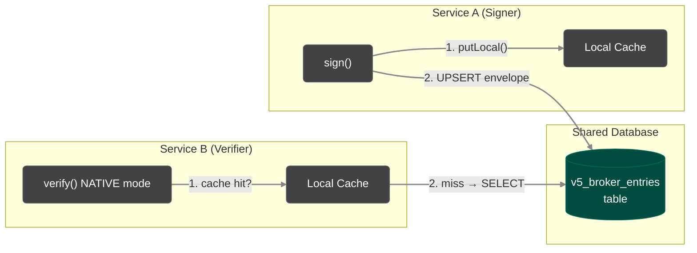

import Tabs from '@theme/Tabs';
import TabItem from '@theme/TabItem';

# veridot-databases

`veridot-databases` provides a **SQL database-backed `Broker` implementation** for Protocol V5. It supports PostgreSQL, MySQL, Oracle, and SQL Server with **auto-DDL** and **dialect-aware upsert strategies**.

<Tabs>
<TabItem value="maven" label="Maven">

```xml
<dependency>
    <groupId>io.github.cyfko</groupId>
    <artifactId>veridot-databases</artifactId>
    <version>5.0.0</version>
</dependency>
```

</TabItem>
<TabItem value="gradle" label="Gradle">

```groovy
implementation 'io.github.cyfko:veridot-databases:5.0.0'
```

</TabItem>
</Tabs>

## When to Choose DatabaseBroker vs KafkaBroker

| Criterion | `veridot-databases` | `veridot-kafka` |
|-----------|:-------------------:|:---------------:|
| Verification latency | ~1–5ms (DB round-trip) | &lt;1ms (local RocksDB) |
| Mode Optimization | `NATIVE` / `PRIVATE` storage | `NATIVE` / `PRIVATE` storage |
| Best for | Existing DB stacks | High-throughput events |

## Architecture Overview

In V5, the broker is untrusted. `DatabaseBroker` only needs to provide persistence and monotonic consistency. All validation (signatures, TLV parsing) is handled by the `veridot-core` processor.



## DatabaseBroker Implementation

```java
public class DatabaseBroker implements Broker, WatermarkStore {
    private final DataSource dataSource;
    private final String tableName;
    private final UpsertDialect upsertDialect;
    private final Map<String, byte[]> localCache = new ConcurrentHashMap<>();
}
```

## Auto-DDL: Table Creation

The DDL creates the schema required for V5 Storage Keys (`scope ‖ 0x00 ‖ entryType ‖ 0x00 ‖ key`).

<Tabs>
<TabItem value="pg" label="PostgreSQL">

```sql
CREATE TABLE IF NOT EXISTS v5_broker_entries (
    id          BIGINT GENERATED BY DEFAULT AS IDENTITY PRIMARY KEY,
    storage_key BYTEA NOT NULL UNIQUE,
    entry_bytes BYTEA NOT NULL,
    version     BIGINT NOT NULL,
    updated_at  TIMESTAMP DEFAULT CURRENT_TIMESTAMP
)
```

</TabItem>
<TabItem value="mysql" label="MySQL">

```sql
CREATE TABLE IF NOT EXISTS v5_broker_entries (
    id          BIGINT AUTO_INCREMENT PRIMARY KEY,
    storage_key VARBINARY(767) NOT NULL UNIQUE,
    entry_bytes LONGBLOB NOT NULL,
    version     BIGINT NOT NULL,
    updated_at  TIMESTAMP DEFAULT CURRENT_TIMESTAMP
                ON UPDATE CURRENT_TIMESTAMP
)
```

</TabItem>
</Tabs>

## Dialect-Aware Upsert Strategies

The upsert must ensure monotonic version updates to prevent downgrade replay attacks by the DB.

<Tabs>
<TabItem value="pg" label="PostgreSQL">

```sql
INSERT INTO v5_broker_entries (storage_key, entry_bytes, version)
VALUES (?, ?, ?)
ON CONFLICT (storage_key) DO UPDATE
SET entry_bytes = EXCLUDED.entry_bytes, version = EXCLUDED.version
WHERE v5_broker_entries.version < EXCLUDED.version
```

</TabItem>
</Tabs>

## Write Operations

### put() — Explicit Upsert

In V5, revocation is an explicit `LIVENESS(REVOKED)` envelope, NOT a tombstone.

```java
@Override
public CompletableFuture<Void> put(byte[] storageKey, byte[] envelopeBytes) {
    // 1. Validate envelope V5 structure
    Envelope env = Envelope.parse(envelopeBytes);
    
    // 2. Dialect-aware Upsert respecting Monotonic Version
    return CompletableFuture.runAsync(() -> {
        String sql = buildUpsertSql();  
        // execute with (storageKey, envelopeBytes, env.getVersion())...
    });
}
```

### get() — Read with Local Cache

```java
@Override
public byte[] get(byte[] storageKey) {
    byte[] cached = localCache.get(toHexKey(storageKey));
    if (cached != null) return cached;

    String sql = "SELECT entry_bytes FROM " + tableName + " WHERE storage_key = ?";
    // Execute, populate cache, return
}
```

## Supported Databases

| Database | Version | Dialect | Upsert Strategy |
|----------|---------|---------|-----------------|
| PostgreSQL | 13+ | `POSTGRES` | `ON CONFLICT DO UPDATE WHERE version < ?` |
| MySQL | 8+ | `MYSQL` | `ON DUPLICATE KEY UPDATE` |
| Oracle | 19c+ | `ORACLE` | `MERGE INTO USING DUAL` |

## See Also

- [veridot-core](./veridot-core.md)
- [Protocol V5 Specification](../protocol/index.md)
