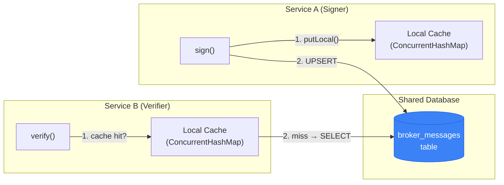
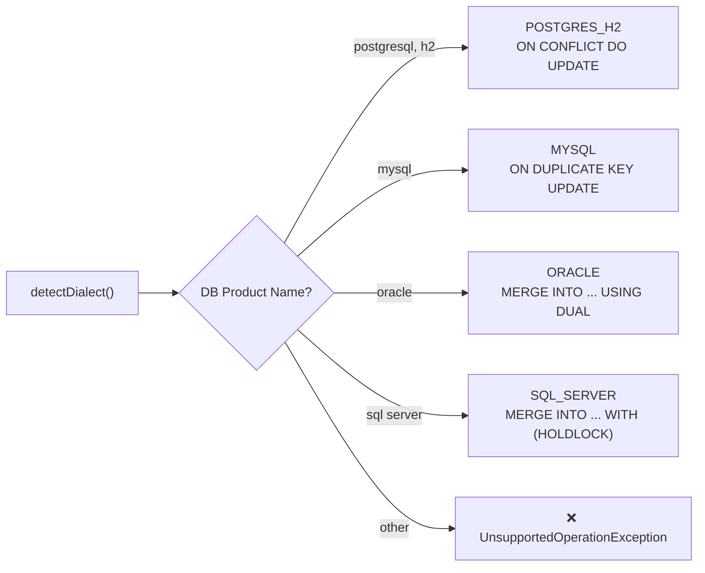

import Tabs from '@theme/Tabs';
import TabItem from '@theme/TabItem';

# veridot-databases

`veridot-databases` provides a **SQL database-backed `Broker` implementation** for environments where Kafka is unavailable or unnecessary. It supports PostgreSQL, MySQL, Oracle, SQL Server, and H2 out of the box with **auto-DDL** and **dialect-aware upsert strategies**.

<Tabs>
<TabItem value="maven" label="Maven">

```xml
<dependency>
    <groupId>io.github.cyfko</groupId>
    <artifactId>veridot-databases</artifactId>
    <version>4.0.0</version>
</dependency>
```

</TabItem>
<TabItem value="gradle" label="Gradle">

```groovy
implementation 'io.github.cyfko:veridot-databases:4.0.0'
```

</TabItem>
</Tabs>

## When to Choose DatabaseBroker vs KafkaBroker

| Criterion | `veridot-databases` | `veridot-kafka` |
|-----------|:-------------------:|:---------------:|
| Verification latency | ~1–5ms (DB round-trip) | &lt;1ms (local RocksDB) |
| Infrastructure | Any JDBC DataSource | Kafka 3.x cluster |
| Horizontal scale | Database replication | Kafka consumer group |
| Revocation propagation | Immediate (same DB) | ~200ms Kafka poll |
| Best for | DB-centric apps | Event-driven / high-throughput |

:::tip
Choose `veridot-databases` if your stack is already database-centric and you want to **avoid adding Kafka infrastructure**. Choose `veridot-kafka` for high-throughput workloads (over 10K verifications/sec) where sub-millisecond latency matters.
:::

## Architecture Overview



Unlike `KafkaBroker`, `DatabaseBroker` does **not** have a background consumer loop. All services point to the **same database** (or synchronized replicas), and consistency is achieved through the database's own ACID guarantees.

## DatabaseBroker Implementation

```java
public class DatabaseBroker implements Broker, WatermarkStore {
    private final DataSource dataSource;
    private final String tableName;
    private final UpsertDialect upsertDialect;
    private final Map<String, byte[]> localCache = new ConcurrentHashMap<>();
}
```

### Constructor

```java
// Default table name: "broker_messages"
Broker broker = new DatabaseBroker(dataSource);

// Custom table name
Broker broker = new DatabaseBroker(dataSource, "veridot_metadata");
```

:::warning Table Name Validation
Only alphanumeric characters and underscores are allowed in the table name. This prevents SQL injection at the constructor level:
```java
if (!tableName.matches("^[a-zA-Z][a-zA-Z0-9_]*$")) {
    throw new IllegalArgumentException("Invalid table name: " + tableName);
}
```
:::

## Auto-DDL: Table Creation

`DatabaseBroker` **automatically creates the table** on startup if it doesn't exist. No manual DDL required. The DDL is dialect-aware:

<Tabs>
<TabItem value="pg" label="PostgreSQL / H2">

```sql
CREATE TABLE IF NOT EXISTS broker_messages (
    id          BIGINT GENERATED BY DEFAULT AS IDENTITY PRIMARY KEY,
    storage_key BYTEA NOT NULL UNIQUE,
    entry_bytes BYTEA NOT NULL,
    updated_at  TIMESTAMP DEFAULT CURRENT_TIMESTAMP
)
```

</TabItem>
<TabItem value="mysql" label="MySQL / MariaDB">

```sql
CREATE TABLE IF NOT EXISTS broker_messages (
    id          BIGINT AUTO_INCREMENT PRIMARY KEY,
    storage_key VARBINARY(767) NOT NULL UNIQUE,
    entry_bytes LONGBLOB NOT NULL,
    updated_at  TIMESTAMP DEFAULT CURRENT_TIMESTAMP
                ON UPDATE CURRENT_TIMESTAMP
)
```

</TabItem>
<TabItem value="oracle" label="Oracle">

```sql
CREATE TABLE IF NOT EXISTS broker_messages (
    id          NUMBER GENERATED BY DEFAULT AS IDENTITY PRIMARY KEY,
    storage_key RAW(2000) NOT NULL UNIQUE,
    entry_bytes BLOB NOT NULL,
    updated_at  TIMESTAMP DEFAULT CURRENT_TIMESTAMP
)
```

</TabItem>
<TabItem value="mssql" label="SQL Server">

```sql
IF NOT EXISTS (
    SELECT * FROM INFORMATION_SCHEMA.TABLES
    WHERE TABLE_NAME = 'broker_messages'
)
BEGIN
    CREATE TABLE broker_messages (
        id          BIGINT IDENTITY(1,1) PRIMARY KEY,
        storage_key VARBINARY(900) NOT NULL UNIQUE,
        entry_bytes VARBINARY(MAX) NOT NULL,
        updated_at  DATETIME DEFAULT GETDATE()
    )
END
```

</TabItem>
</Tabs>

### Table Schema

| Column | Type | Purpose |
|--------|------|---------|
| `id` | Auto-increment | Surrogate primary key |
| `storage_key` | Binary (unique) | Protocol V4 storage key: `scope ‖ 0x00 ‖ entryType.code ‖ 0x00 ‖ key` |
| `entry_bytes` | Binary (blob) | TLV-encoded protocol envelope |
| `updated_at` | Timestamp | Last modification time |

## Dialect-Aware Upsert Strategies

`DatabaseBroker` auto-detects the database dialect from `Connection.getMetaData().getDatabaseProductName()` and selects the appropriate upsert strategy:



### Upsert SQL by Dialect

<Tabs>
<TabItem value="pg" label="PostgreSQL / H2">

```sql
INSERT INTO broker_messages (storage_key, entry_bytes)
VALUES (?, ?)
ON CONFLICT (storage_key) DO UPDATE
SET entry_bytes = EXCLUDED.entry_bytes
```

</TabItem>
<TabItem value="mysql" label="MySQL">

```sql
INSERT INTO broker_messages (storage_key, entry_bytes)
VALUES (?, ?)
ON DUPLICATE KEY UPDATE entry_bytes = VALUES(entry_bytes)
```

</TabItem>
<TabItem value="oracle" label="Oracle">

```sql
MERGE INTO broker_messages t
USING (SELECT ? AS k, ? AS v FROM DUAL) s
ON (t.storage_key = s.k)
WHEN MATCHED THEN UPDATE SET t.entry_bytes = s.v
WHEN NOT MATCHED THEN INSERT (storage_key, entry_bytes) VALUES (s.k, s.v)
```

</TabItem>
<TabItem value="mssql" label="SQL Server">

```sql
MERGE INTO broker_messages WITH (HOLDLOCK) AS t
USING (SELECT ? AS k, ? AS v) AS s
ON (t.storage_key = s.k)
WHEN MATCHED THEN UPDATE SET t.entry_bytes = s.v
WHEN NOT MATCHED THEN INSERT (storage_key, entry_bytes) VALUES (s.k, s.v);
```

</TabItem>
</Tabs>

:::info SQL Server HOLDLOCK
The `WITH (HOLDLOCK)` hint on SQL Server prevents race conditions in the `MERGE` statement by holding a range lock for the duration of the transaction.
:::

## Write Operations

### put() — Upsert or Delete

```java
@Override
public CompletableFuture<Void> put(byte[] storageKey, byte[] envelopeBytes) {
    // Physical deletion (zero-length payload = tombstone)
    if (envelopeBytes.length == 0) {
        localCache.remove(toHexKey(storageKey));
        return CompletableFuture.runAsync(() -> {
            String sql = "DELETE FROM " + tableName + " WHERE storage_key = ?";
            // execute...
        });
    }

    // Validate envelope before persisting
    Envelope.parse(envelopeBytes);

    return CompletableFuture.runAsync(() -> {
        String sql = buildUpsertSql();  // Dialect-aware
        // execute with (storageKey, envelopeBytes)...
    });
}
```

Key behaviors:
- **Envelope validation**: Every write is validated via `Envelope.parse()` before hitting the database
- **Physical deletion**: `put(key, new byte[0])` triggers a SQL `DELETE` — not an upsert of empty bytes
- **Async execution**: Writes run on `CompletableFuture.runAsync()` (ForkJoinPool)

### get() — Read with Local Cache

```java
@Override
public byte[] get(byte[] storageKey) {
    // 1. Check local cache
    byte[] cached = localCache.get(toHexKey(storageKey));
    if (cached != null) return cached;

    // 2. Query database
    String sql = "SELECT entry_bytes FROM " + tableName + " WHERE storage_key = ?";
    // execute...
    if (result != null) {
        localCache.put(toHexKey(storageKey), result);  // Warm cache
    }
    return result;
}
```

### snapshot() — Range Scan for Reconciliation

```java
@Override
public List<BrokerEntry> snapshot(Scope scope) {
    byte[] lowerBound = concat(scopeBytes, (byte) 0x00);
    byte[] upperBound = concat(scopeBytes, (byte) 0x01);

    String sql = "SELECT storage_key, entry_bytes FROM " + tableName
               + " WHERE storage_key >= ? AND storage_key < ?";
    // Binary range scan
}
```

## WatermarkStore Implementation

Like `KafkaBroker`, `DatabaseBroker` stores watermark snapshots in the same table using a `0xFF`-prefixed key:

```java
private static final byte[] WATERMARK_KEY;
static {
    byte[] raw = "__watermark_snapshot__".getBytes(UTF_8);
    WATERMARK_KEY = new byte[raw.length + 1];
    WATERMARK_KEY[0] = (byte) 0xFF;  // Invalid UTF-8 start byte
    System.arraycopy(raw, 0, WATERMARK_KEY, 1, raw.length);
}

@Override
public void save(byte[] snapshot) {
    // Uses the same dialect-aware upsert
    String sql = buildUpsertSql();
    stmt.setBytes(1, WATERMARK_KEY);
    stmt.setBytes(2, snapshot);
}

@Override
public byte[] load() {
    String sql = "SELECT entry_bytes FROM " + tableName + " WHERE storage_key = ?";
    stmt.setBytes(1, WATERMARK_KEY);
}
```

## DataSource Configuration Examples

### PostgreSQL with HikariCP

```java
HikariConfig config = new HikariConfig();
config.setJdbcUrl("jdbc:postgresql://db-host:5432/mydb");
config.setUsername("veridot");
config.setPassword(System.getenv("DB_PASSWORD"));
config.setMaximumPoolSize(10);
config.setConnectionTimeout(3000);

DataSource ds = new HikariDataSource(config);
Broker broker = new DatabaseBroker(ds);
```

### MySQL / MariaDB

```java
HikariConfig config = new HikariConfig();
config.setJdbcUrl("jdbc:mysql://db-host:3306/mydb?useSSL=true&requireSSL=true");
config.setUsername("veridot");
config.setPassword(System.getenv("DB_PASSWORD"));

DataSource ds = new HikariDataSource(config);
Broker broker = new DatabaseBroker(ds, "veridot_meta");
```

### H2 (Development / Testing)

```java
DataSource ds = new EmbeddedDatabaseBuilder()
    .setType(EmbeddedDatabaseType.H2)
    .build();
Broker broker = new DatabaseBroker(ds);
```

### Spring Boot Integration

```java
@Bean
public Broker veridotBroker(DataSource dataSource) {
    return new DatabaseBroker(dataSource, "veridot_metadata");
}
```

## Complete Usage Example

```java
import io.github.cyfko.veridot.core.*;
import io.github.cyfko.veridot.core.impl.GenericSignerVerifier;
import io.github.cyfko.veridot.databases.DatabaseBroker;

// Build the broker
Broker broker = new DatabaseBroker(dataSource);

// Build TrustRoot
TrustRoot trust = new PublicKeyTrustRoot(signerId -> {
    byte[] keyBytes = Files.readAllBytes(
        Paths.get("/etc/veridot/trust/" + signerId + ".pub.der"));
    KeyFactory kf = KeyFactory.getInstance("Ed25519");
    return new TrustIdentity(
        kf.generatePublic(new X509EncodedKeySpec(keyBytes)), false);
});

// Load long-term private key
PrivateKey longTermKey = loadPrivateKey("/etc/veridot/private.key");

// Build signer/verifier
var sv = new GenericSignerVerifier(
    broker, trust, "api-gateway", longTermKey,
    Algorithm.ED25519, 5, EvictionPolicy.FIFO
);

// Sign — DIRECT mode (JWT returned)
String jwt = sv.sign("user@example.com",
    BasicConfigurer.builder()
        .groupId("user-123")
        .validity(3600)
        .build());

// Verify
VerifiedData<String> result = sv.verify(jwt, s -> s);
System.out.println(result.data()); // "user@example.com"

// Revoke
sv.revoke("user-123", null); // All sessions for user-123
```

## Distributed Consistency

- Point all service instances to the **same database** (or synchronized read replicas)
- The `UNIQUE` constraint on `storage_key` prevents duplicates without distributed coordination
- Revocation is **immediately visible** to any instance querying the same database
- If using read replicas, revocations may be subject to replication lag

:::danger Read Replica Warning
For **strict revocation consistency**, route verification reads to the primary database — not read replicas. Replication lag could allow a revoked token to be accepted for a short window.
:::

## Supported Databases

| Database | Version | Dialect | Upsert Strategy | Notes |
|----------|---------|---------|-----------------|-------|
| PostgreSQL | 13+ | `POSTGRES_H2` | `ON CONFLICT DO UPDATE` | Recommended for production |
| MySQL | 8+ | `MYSQL` | `ON DUPLICATE KEY UPDATE` | Requires `useSSL=true` in production |
| MariaDB | 11+ | `MYSQL` | `ON DUPLICATE KEY UPDATE` | Full support |
| SQL Server | 2019+ | `SQL_SERVER` | `MERGE INTO WITH (HOLDLOCK)` | Full support |
| Oracle | 19c+ | `ORACLE` | `MERGE INTO USING DUAL` | Full support |
| H2 | Any | `POSTGRES_H2` | `ON CONFLICT DO UPDATE` | Development and testing only |

## See Also

- [veridot-core](./veridot-core.md) — Core module and `Broker` interface definition
- [veridot-kafka](./veridot-kafka.md) — Kafka + RocksDB broker (lower latency, recommended for high-throughput)
- [Distributed Consistency](../architecture/distributed-consistency.md) — Consistency model across broker implementations
