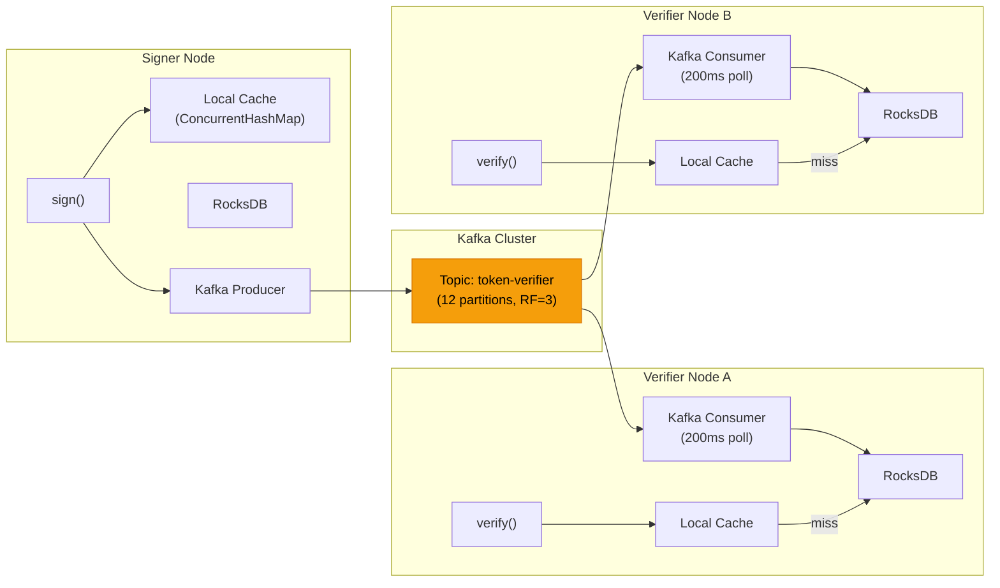
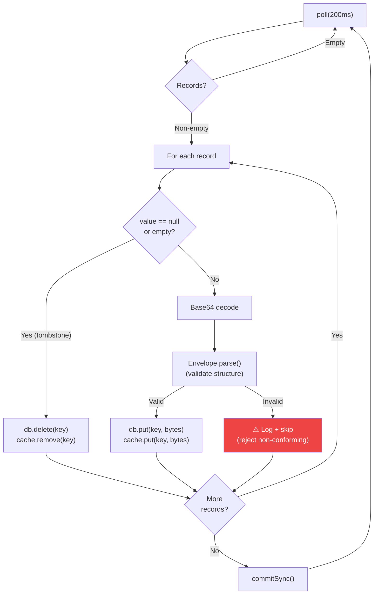
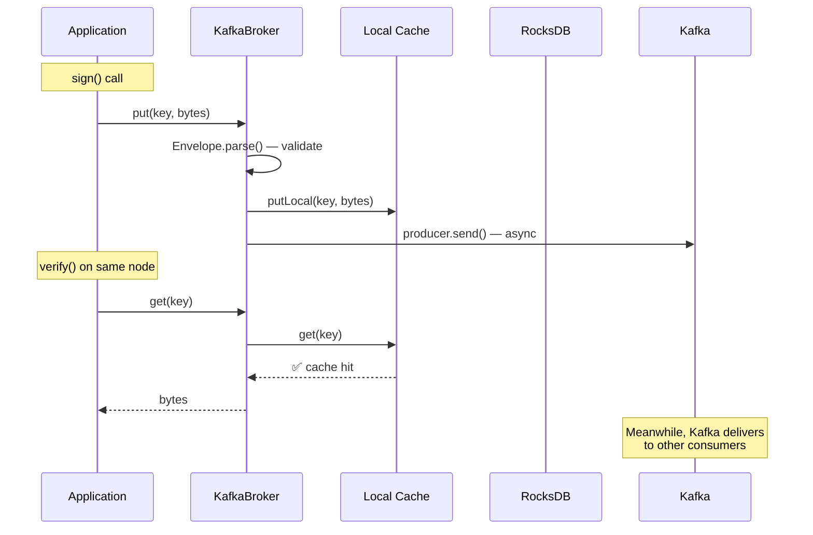

import Tabs from '@theme/Tabs';
import TabItem from '@theme/TabItem';

# veridot-kafka

`veridot-kafka` is the **recommended broker implementation** for production deployments. It uses Kafka for fan-out distribution and RocksDB for local read caching, achieving **sub-millisecond verification reads** with zero network I/O on the critical path.

<Tabs>
<TabItem value="maven" label="Maven">

```xml
<dependency>
    <groupId>io.github.cyfko</groupId>
    <artifactId>veridot-kafka</artifactId>
    <version>4.0.0</version>
</dependency>
```

</TabItem>
<TabItem value="gradle" label="Gradle">

```groovy
implementation 'io.github.cyfko:veridot-kafka:4.0.0'
```

</TabItem>
</Tabs>

## Architecture Overview



:::info[Key Design Principle]
**Writes go to Kafka** (asynchronous fan-out). **Reads come from local RocksDB** (no network). This means `get()` is always a local operation — verification never waits for Kafka.
:::

## KafkaBroker Implementation Details

`KafkaBroker` implements both `Broker` and `WatermarkStore`:

```java
public class KafkaBroker implements Broker, WatermarkStore, AutoCloseable {
    private final KafkaProducer<String, String> producer;
    private final KafkaConsumer<String, String> consumer;
    private final RocksDB db;
    private final Map<String, byte[]> localCache = new ConcurrentHashMap<>();
    // ...
}
```

### Dual Interface

| Interface | Method | Implementation |
|-----------|--------|----------------|
| `Broker` | `put()` | Write to local cache → Kafka produce |
| `Broker` | `get()` | Local cache → RocksDB fallback |
| `Broker` | `snapshot()` | RocksDB range scan |
| `Broker` | `putLocal()` | ConcurrentHashMap write |
| `WatermarkStore` | `save()` | RocksDB put with `0xFF` prefix |
| `WatermarkStore` | `load()` | RocksDB get with `0xFF` prefix |

## Background Consumer Loop

The consumer loop runs on a single-threaded `ExecutorService` and polls Kafka every **200ms**:

```java
private void runConsumerLoop() {
    while (!closed) {
        ConsumerRecords<String, String> records = consumer.poll(Duration.ofMillis(200));

        for (ConsumerRecord<String, String> record : records) {
            byte[] storageKey = HexFormat.of().parseHex(record.key());

            if (record.value() == null || record.value().isEmpty()) {
                // Tombstone → delete from RocksDB and local cache
                db.delete(storageKey);
                localCache.remove(toHexKey(storageKey));
                continue;
            }

            byte[] envelopeBytes = Base64.getDecoder().decode(record.value());

            // Validate envelope structure BEFORE writing to RocksDB
            Envelope.parse(envelopeBytes);

            // Persist to RocksDB
            db.put(storageKey, envelopeBytes);

            // Update local cache
            localCache.put(toHexKey(storageKey), envelopeBytes);
        }

        if (!records.isEmpty()) {
            consumer.commitSync(); // Manual offset commit after successful processing
        }
    }
}
```

### Consumer Loop Details



:::warning[Envelope Validation (Security Hardening)]
Every Kafka record is **validated via `Envelope.parse()`** before being written to RocksDB. Non-conforming records are rejected with a warning log. This prevents a compromised Kafka producer from injecting malformed data into the local store.
:::

### Offset Commit Strategy

- **Auto-commit disabled** (`enable.auto.commit=false`)
- Offsets are committed **synchronously** (`commitSync()`) only after successful processing of the entire batch
- On RocksDB errors, the exception propagates — offsets are **not committed**, allowing automatic retry on the next poll

## Read-After-Write Optimization

A `ConcurrentHashMap` local cache ensures that `verify()` works immediately on the same node that called `sign()`, before the Kafka consumer loop has processed the message:

```java
@Override
public CompletableFuture<Void> put(byte[] storageKey, byte[] envelopeBytes) {
    // 1. Write to local cache FIRST (read-after-write consistency)
    putLocal(storageKey, envelopeBytes);

    // 2. Send to Kafka (async)
    String key = toHexKey(storageKey);
    String value = Base64.getEncoder().encodeToString(envelopeBytes);
    producer.send(new ProducerRecord<>(topic, key, value), callback);

    return future;
}

@Override
public byte[] get(byte[] storageKey) {
    // 1. Check local cache first
    byte[] cached = localCache.get(toHexKey(storageKey));
    if (cached != null) return cached;

    // 2. Fall back to RocksDB
    byte[] bytes = db.get(storageKey);
    if (bytes != null) {
        localCache.put(toHexKey(storageKey), bytes);
    }
    return bytes;
}
```



## Tombstone Deletion

Deletion in `KafkaBroker` follows Kafka's native tombstone pattern:

```java
// Trigger: put(key, new byte[0])
if (envelopeBytes.length == 0) {
    localCache.remove(key);
    producer.send(new ProducerRecord<>(topic, key, null), callback);
    return future;
}
```

1. **Signer node**: Local cache entry removed, Kafka tombstone (null value) produced
2. **Consumer nodes**: Receive tombstone → `db.delete(storageKey)` → `localCache.remove()`
3. **Kafka compaction**: Tombstone retained until topic retention expires, then cleaned up

This is the mechanism behind `GenericSignerVerifier.revoke()` — revoking a session produces a tombstone for the `LIVENESS` entry.

## WatermarkStore Implementation

`KafkaBroker` stores version watermark snapshots directly in RocksDB using a **security-hardened key prefix**:

```java
// 0xFF prefix prevents collision with protocol keys (valid UTF-8 never starts with 0xFF)
private static final byte[] WATERMARK_KEY;
static {
    byte[] raw = "__watermark_snapshot__".getBytes(UTF_8);
    WATERMARK_KEY = new byte[raw.length + 1];
    WATERMARK_KEY[0] = (byte) 0xFF;
    System.arraycopy(raw, 0, WATERMARK_KEY, 1, raw.length);
}

@Override
public void save(byte[] snapshot) {
    db.put(WATERMARK_KEY, snapshot);
}

@Override
public byte[] load() {
    return db.get(WATERMARK_KEY);
}
```

:::tip[Security Note]
The `0xFF` prefix is not just cosmetic — it's a **critical security hardening** measure (§13.3.1). Since all protocol storage keys are validated UTF-8 strings, and `0xFF` is an invalid UTF-8 start byte, a malicious client can never craft a protocol key that collides with the watermark key.
:::

## Configuration

### Programmatic Configuration (Recommended)

```java
Properties props = new Properties();

// Required
props.setProperty("bootstrap.servers", "kafka1:9092,kafka2:9092,kafka3:9092");
props.setProperty("embedded.db.path", "/var/lib/veridot/rocksdb");

// TLS + SASL (recommended for production)
props.setProperty("security.protocol", "SASL_SSL");
props.setProperty("sasl.mechanism", "SCRAM-SHA-512");
props.setProperty("sasl.jaas.config",
    "org.apache.kafka.common.security.scram.ScramLoginModule required " +
    "username=\"veridot-svc\" password=\"${KAFKA_PASSWORD}\";");
props.setProperty("ssl.endpoint.identification.algorithm", "https");
props.setProperty("ssl.truststore.location", "/etc/ssl/kafka.truststore.jks");
props.setProperty("ssl.truststore.password", System.getenv("TRUSTSTORE_PASSWORD"));

Broker broker = KafkaBroker.of(props);
```

### Environment Variable Configuration

```java
// Reads all config from environment variables
Broker broker = KafkaBroker.of();
```

| Variable | Description | Default |
|----------|-------------|---------|
| `VDOT_KAFKA_BOOSTRAP_SERVERS` | Kafka bootstrap servers | `localhost:9092` |
| `VDOT_TOKEN_VERIFIER_TOPIC` | Kafka topic name | `token-verifier` |
| `VDOT_EMBEDDED_DATABASE_PATH` | RocksDB directory | temp dir |
| `VDOT_KEYS_ROTATION_MINUTES` | Key rotation interval | `1440` (24h) |

### Kafka Properties Reference

| Property | Required | Description | Default |
|----------|:--------:|-------------|---------|
| `bootstrap.servers` | ✅ | Kafka broker addresses | — |
| `embedded.db.path` | ✅ | RocksDB directory | — |
| `security.protocol` | — | `PLAINTEXT`, `SSL`, `SASL_PLAINTEXT`, `SASL_SSL` | `PLAINTEXT` |
| `sasl.mechanism` | — | `PLAIN`, `SCRAM-SHA-256`, `SCRAM-SHA-512` | — |
| `compression.type` | — | `none`, `gzip`, `snappy`, `lz4` | `none` |

## Kafka Topic and ACL Setup

```bash
# Create the topic (replication factor 3 for production)
kafka-topics.sh --create \
  --topic token-verifier \
  --replication-factor 3 \
  --partitions 12 \
  --bootstrap-server kafka:9092

# ACL: signing services may produce
kafka-acls.sh --add --allow-principal User:veridot-signer \
  --operation Write --topic token-verifier \
  --bootstrap-server kafka:9092

# ACL: verifying services may consume
kafka-acls.sh --add --allow-principal User:veridot-verifier \
  --operation Read --topic token-verifier \
  --bootstrap-server kafka:9092
```

:::tip[Topic Retention]
Set Kafka topic retention to at least the maximum key TTL. A **7-day retention** is sufficient for default settings (24h key rotation).
:::

## Lifecycle and Shutdown

`KafkaBroker` implements `AutoCloseable` and registers a JVM shutdown hook:

```java
try (Broker broker = KafkaBroker.of(props)) {
    var sv = new GenericSignerVerifier(broker, trustRoot, ...);
    // ... application logic
} // Auto-closes: consumer, producer, RocksDB
```

Shutdown sequence:
1. Set `closed = true` (stops consumer loop)
2. Shutdown consumer executor (5s timeout)
3. Close Kafka consumer (2s timeout)
4. Close Kafka producer (2s timeout)
5. Close RocksDB

## Kubernetes Deployment Notes

:::info[RocksDB Storage in K8s]
- Mount RocksDB on an **`emptyDir`** or ephemeral volume — persistence across pod restarts is **not required**
- The Kafka consumer **rehydrates** all state from the topic on startup
- Each pod has its **own RocksDB directory** — no shared storage needed
- The consumer uses an **auto-assigned `groupId`** so every instance receives all messages (broadcast semantics)
:::

## Snapshot (Range Scan)

The `snapshot()` method performs a binary range scan on RocksDB for reconciliation:

```java
@Override
public List<BrokerEntry> snapshot(Scope scope) {
    byte[] scopeBytes = scope.value().getBytes(UTF_8);

    // Lower bound: scope ‖ 0x00
    byte[] lower = concat(scopeBytes, (byte) 0x00);
    // Upper bound: scope ‖ 0x01
    byte[] upper = concat(scopeBytes, (byte) 0x01);

    List<BrokerEntry> list = new ArrayList<>();
    try (RocksIterator it = db.newIterator()) {
        for (it.seek(lower); it.isValid(); it.next()) {
            if (compareBytes(it.key(), upper) >= 0) break;
            list.add(new BrokerEntry(it.key(), it.value()));
        }
    }
    return list;
}
```

## See Also

- [veridot-core](./veridot-core.md) — Core module and extension point interfaces
- [veridot-databases](./veridot-databases.md) — SQL database alternative broker
- [Distributed Consistency](../architecture/distributed-consistency.md) — How brokers maintain consistency
