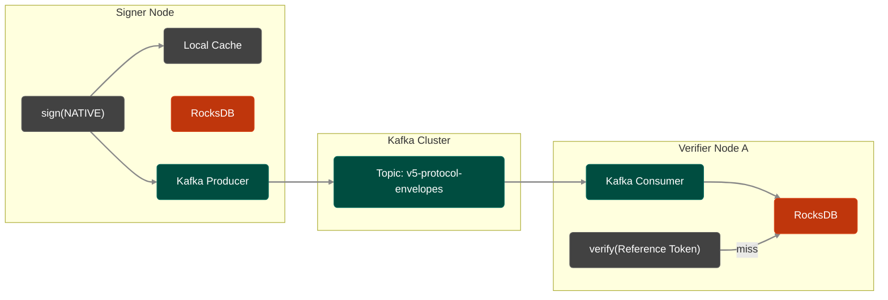

import Tabs from '@theme/Tabs';
import TabItem from '@theme/TabItem';

# veridot-kafka

`veridot-kafka` is the **high-performance broker implementation** for Veridot V5. It uses Kafka for fan-out distribution and RocksDB for local read caching. In `NATIVE` distribution mode, this achieves sub-millisecond offline verifications.

<Tabs>
<TabItem value="maven" label="Maven">

```xml
<dependency>
    <groupId>io.github.cyfko</groupId>
    <artifactId>veridot-kafka</artifactId>
    <version>5.0.0</version>
</dependency>
```

</TabItem>
<TabItem value="gradle" label="Gradle">

```groovy
implementation 'io.github.cyfko:veridot-kafka:5.0.0'
```

</TabItem>
</Tabs>

## Architecture Overview

In Protocol V5, the broker is strictly untrusted. Kafka provides ordering, but `veridot-core` validates signatures, liveness, and capability entries.



## KafkaBroker Implementation Details

`KafkaBroker` implements both `Broker` and `WatermarkStore`:

```java
public class KafkaBroker implements Broker, WatermarkStore, AutoCloseable {
    private final KafkaProducer<String, String> producer;
    private final KafkaConsumer<String, String> consumer;
    private final RocksDB db;
    private final Map<String, byte[]> localCache = new ConcurrentHashMap<>();
}
```

## Background Consumer Loop

The consumer loop processes incoming V5 envelopes and persists them to RocksDB:

```java
private void runConsumerLoop() {
    while (!closed) {
        ConsumerRecords<String, String> records = consumer.poll(Duration.ofMillis(200));

        for (ConsumerRecord<String, String> record : records) {
            byte[] storageKey = HexFormat.of().parseHex(record.key());
            byte[] envelopeBytes = Base64.getDecoder().decode(record.value());

            try {
                // Strict V5 Validation
                EntryVerifier.verifyEnvelope(envelopeBytes); // Uses veridot-core EntryVerifier
                Envelope incoming = Envelope.parse(envelopeBytes);
                
                // Enforce monotonic versioning against RocksDB
                byte[] existingBytes = db.get(storageKey);
                if (existingBytes != null) {
                    Envelope existing = Envelope.parse(existingBytes);
                    if (incoming.getVersion() <= existing.getVersion()) {
                        continue; // Drop replayed or outdated envelopes
                    }
                }

                db.put(storageKey, envelopeBytes);
                localCache.put(toHexKey(storageKey), envelopeBytes);
            } catch (VeridotException e) {
                // Ignore V500x invalid envelopes (Broker untrusted)
            }
        }
        if (!records.isEmpty()) consumer.commitSync();
    }
}
```

:::warning[Explicit LIVENESS(REVOKED)]
In Protocol V5, revocations are **not** null tombstones. They are explicitly signed `LIVENESS` entries with the `REVOKED` state and an incremented monotonic version. Kafka topic compaction must be configured carefully to avoid deleting active or revoked explicit states.
:::

## Configuration

Par défaut, `veridot-kafka` utilise le topic Kafka **`token-verifier`** pour la distribution des évènements. 

Vous pouvez écraser (override) le nom de ce topic pour utiliser le vôtre. La configuration est résolue dans l'ordre de priorité suivant :

### 1. Via les Propriétés Java (Prioritaire)
C'est la méthode recommandée si vous configurez votre broker programmatiquement. Vous devez définir la propriété `veridot.broker.topic` (accessible via la constante `VerifierConfig.BROKER_TOPIC_CONFIG`).

```java
import io.github.cyfko.veridot.kafka.VerifierConfig;
import io.github.cyfko.veridot.kafka.KafkaBroker;
import java.util.Properties;

Properties props = new Properties();
props.setProperty("bootstrap.servers", "kafka:9092");
props.setProperty("embedded.db.path", "/var/lib/veridot/rocksdb");

// Écraser le topic par défaut (remplace "token-verifier")
props.setProperty(VerifierConfig.BROKER_TOPIC_CONFIG, "mon-nouveau-topic");

Broker broker = KafkaBroker.of(props);
```

### 2. Via les Variables d'Environnement (Alternative)
Si la propriété Java n'est pas fournie, le module va chercher la variable d'environnement `VDOT_TOKEN_VERIFIER_TOPIC`. C'est l'approche idéale si vous déployez via Docker, Kubernetes, ou dans un environnement CI/CD.

```bash
export VDOT_TOKEN_VERIFIER_TOPIC="mon-nouveau-topic"
```

> **Résumé de l'ordre d'évaluation (Fallback) :**
> 1. Valeur définie dans Java via `veridot.broker.topic`
> 2. Valeur définie dans l'OS via `VDOT_TOKEN_VERIFIER_TOPIC`
> 3. Valeur par défaut : `token-verifier`

## Snapshot (Range Scan)

`snapshot()` performs a binary range scan on RocksDB for periodic state reconciliation required by V5 capacity management.

```java
@Override
public List<BrokerEntry> snapshot(Scope scope) {
    byte[] lower = concat(scopeBytes, (byte) 0x00);
    byte[] upper = concat(scopeBytes, (byte) 0x01);
    // RocksDB iterator bounds...
}
```
