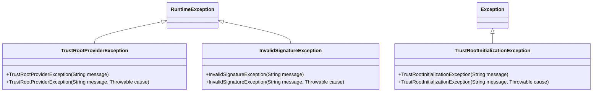

# TrustRoots API Reference

The `veridot-trustroots-api` module defines the **Service Provider Interface (SPI)** that all trust key sources must implement. It has zero dependencies beyond Jackson for JSON serialization and can be used standalone to build custom providers.

```xml
<dependency>
    <groupId>io.github.cyfko</groupId>
    <artifactId>veridot-trustroots-api</artifactId>
    <version>4.0.1</version>
</dependency>
```

## TrustRootProvider Interface

The central SPI contract. Any remote or local key source implements this interface to supply `TrustEntry` objects to the [CachingTrustRoot](./core.md) engine.

```java
package io.github.cyfko.veridot.trustroots.api;

public interface TrustRootProvider {

    /** Fetch the latest TrustEntry for a given subject. */
    Optional<TrustEntry> fetch(String subject) throws TrustRootProviderException;

    /** Incremental sync: fetch all entries modified since the given instant. */
    default List<TrustEntry> fetchModifiedSince(Instant since)
            throws TrustRootProviderException {
        return Collections.emptyList();
    }

    /** Batch fetch for multiple subjects. Default implementation calls fetch() in a loop. */
    default Map<String, TrustEntry> fetchBatch(Collection<String> subjects)
            throws TrustRootProviderException { /* ... */ }

    /** Health check — returns true if the remote source is reachable. */
    default boolean isHealthy() { return true; }

    /** Human-readable name for logging and metrics. */
    String name();
}
```

### Method Contract

| Method | Required | Description |
|---|---|---|
| `fetch(subject)` | ✅ Yes | Returns the **latest version** of the key for a subject, or `Optional.empty()` if unknown |
| `fetchModifiedSince(since)` | ⚡ Recommended | Enables incremental delta sync — critical for performance at scale |
| `fetchBatch(subjects)` | ⬜ Optional | Batch optimization; defaults to sequential `fetch()` calls |
| `isHealthy()` | ⬜ Optional | Used by the background sync scheduler to skip sync when the source is unreachable |
| `name()` | ✅ Yes | Used in log messages and metrics labels |

## TrustEntry Record

An immutable Java record representing a signed public key in the trust registry. All 12 fields are validated at construction time via the compact constructor.

```java
public record TrustEntry(
    @JsonProperty("_schemaVersion") int schemaVersion,  // Schema version (default 1)
    String subject,              // Issuer identifier (e.g., "order-service")
    String publicKeyEncoded,     // Base64 URL-safe encoded public key
    KeyAlgorithm algorithm,      // Cryptographic algorithm
    Instant notBefore,           // Validity start
    Instant notAfter,            // Validity end (expiration)
    long version,                // Sequential version number (must be > 0)
    String fingerprint,          // SHA-256 hex fingerprint of the public key
    String issuerSignature,      // Cryptographic signature proving authenticity
    Instant publishedAt,         // When this entry was published to the TAD
    boolean isRoot,              // Whether this is a root key
    Map<String, String> metadata // Additional key-value metadata
) { }
```

### Field Reference

| Field | Type | Required | Constraints |
|---|---|---|---|
| `schemaVersion` | `int` | No | Defaults to `1` |
| `subject` | `String` | ✅ | Non-blank, max 512 chars |
| `publicKeyEncoded` | `String` | ✅ | Base64 URL-safe encoded X.509 SubjectPublicKeyInfo |
| `algorithm` | `KeyAlgorithm` | ✅ | Must be a supported algorithm |
| `notBefore` | `Instant` | ✅ | Must be strictly before `notAfter` |
| `notAfter` | `Instant` | ✅ | Expiration timestamp |
| `version` | `long` | ✅ | Must be > 0, monotonically increasing per subject |
| `fingerprint` | `String` | ✅ | SHA-256 hex digest of the raw public key bytes |
| `issuerSignature` | `String` | ✅ | Base64 URL-safe encoded signature over `canonicalPayload()` |
| `publishedAt` | `Instant` | ✅ | Server-side publication timestamp |
| `isRoot` | `boolean` | No | `false` by default |
| `metadata` | `Map<String,String>` | No | Defensively copied to an immutable map; `null` becomes empty map |

### Validation Rules

The compact constructor enforces these invariants — any violation throws `IllegalArgumentException` at construction time:

- `subject`, `publicKeyEncoded`, `algorithm`, `notBefore`, `notAfter`, `fingerprint`, `issuerSignature`, `publishedAt` are **non-null**
- `subject` is **non-blank** and **≤ 512 characters**
- `notBefore` is **strictly before** `notAfter`
- `version` is **strictly positive** (> 0)

### Key Methods

```java
// Check if this entry is valid at a given instant
boolean valid = entry.isValidAt(Instant.now());

// Compute the canonical payload for signature verification
byte[] payload = entry.canonicalPayload();
// Format: subject\npublicKeyEncoded\nalgorithm.identifier()\nnotBefore\nnotAfter\nversion

// Use the fluent builder
TrustEntry entry = TrustEntry.builder()
    .subject("order-service")
    .publicKeyEncoded(base64Key)
    .algorithm(KeyAlgorithm.ED25519)
    .notBefore(Instant.now())
    .notAfter(Instant.now().plus(Duration.ofDays(90)))
    .version(1)
    .fingerprint(SignatureVerifier.computeFingerprint(base64Key))
    .issuerSignature(signature)
    .publishedAt(Instant.now())
    .build();
```

## KeyAlgorithm Enum

Maps Veridot algorithm identifiers to JCA standard names for both signature verification and key decoding.

```java
public enum KeyAlgorithm {
    ED25519   ("Ed25519",  "EdDSA",            "Ed25519"),
    EC_P256   ("EC/P-256", "SHA256withECDSA",  "EC"),
    EC_P384   ("EC/P-384", "SHA384withECDSA",  "EC"),
    RSA_2048  ("RSA-2048", "SHA256withRSA",    "RSA"),
    RSA_4096  ("RSA-4096", "SHA256withRSA",    "RSA");
}
```

| Enum Constant | Serialization ID | JCA Sign Algorithm | JCA Key Algorithm |
|---|---|---|---|
| `ED25519` | `Ed25519` | `EdDSA` | `Ed25519` |
| `EC_P256` | `EC/P-256` | `SHA256withECDSA` | `EC` |
| `EC_P384` | `EC/P-384` | `SHA384withECDSA` | `EC` |
| `RSA_2048` | `RSA-2048` | `SHA256withRSA` | `RSA` |
| `RSA_4096` | `RSA-4096` | `SHA256withRSA` | `RSA` |

:::tip[Recommended Algorithm]
Use **Ed25519** for new deployments. It provides constant-time operations (no timing side-channels), compact 32-byte keys, and the fastest signature verification among all supported algorithms.
:::

### Static Resolution

```java
// Resolve from serialization identifier
KeyAlgorithm alg = KeyAlgorithm.fromIdentifier("Ed25519");   // → ED25519
KeyAlgorithm alg = KeyAlgorithm.fromIdentifier("EC/P-256");  // → EC_P256
KeyAlgorithm alg = KeyAlgorithm.fromIdentifier("unknown");   // → IllegalArgumentException
```

## Exception Hierarchy



| Exception | Type | Thrown When |
|---|---|---|
| `TrustRootProviderException` | **Unchecked** (`RuntimeException`) | Network errors, HTTP failures, deserialization errors from the remote provider |
| `InvalidSignatureException` | **Unchecked** (`RuntimeException`) | A `TrustEntry` fails cryptographic signature verification |
| `TrustRootInitializationException` | **Checked** (`Exception`) | The `CachingTrustRoot` engine cannot initialize (TAD unreachable AND L2 cache empty) |

:::danger[Catch TrustRootInitializationException]
Since this is a **checked exception**, your initialization code must handle it explicitly. If initialization fails, the engine transitions to the `FAILED` state and all subsequent `resolve()` calls will throw `VeridotException`.
:::

## Implementing a Custom TrustRootProvider

You can implement `TrustRootProvider` to integrate with any key source — a database, a vault, a file system, or a custom API.

```java
import io.github.cyfko.veridot.trustroots.api.*;
import io.github.cyfko.veridot.trustroots.api.exception.*;

public class VaultTrustRootProvider implements TrustRootProvider {

    private final VaultClient vault;

    public VaultTrustRootProvider(VaultClient vault) {
        this.vault = vault;
    }

    @Override
    public Optional<TrustEntry> fetch(String subject) throws TrustRootProviderException {
        try {
            VaultSecret secret = vault.read("veridot/trust-entries/" + subject);
            if (secret == null) return Optional.empty();

            return Optional.of(TrustEntry.builder()
                .subject(subject)
                .publicKeyEncoded(secret.getData().get("publicKey"))
                .algorithm(KeyAlgorithm.fromIdentifier(secret.getData().get("algorithm")))
                .notBefore(Instant.parse(secret.getData().get("notBefore")))
                .notAfter(Instant.parse(secret.getData().get("notAfter")))
                .version(Long.parseLong(secret.getData().get("version")))
                .fingerprint(secret.getData().get("fingerprint"))
                .issuerSignature(secret.getData().get("signature"))
                .publishedAt(Instant.parse(secret.getData().get("publishedAt")))
                .build());
        } catch (VaultException e) {
            throw new TrustRootProviderException("Failed to fetch from Vault", e);
        }
    }

    @Override
    public List<TrustEntry> fetchModifiedSince(Instant since)
            throws TrustRootProviderException {
        // Implement incremental sync for production efficiency
        try {
            return vault.list("veridot/trust-entries/")
                .stream()
                .map(key -> fetch(key).orElse(null))
                .filter(Objects::nonNull)
                .filter(e -> e.publishedAt().isAfter(since))
                .toList();
        } catch (VaultException e) {
            throw new TrustRootProviderException("Failed to sync from Vault", e);
        }
    }

    @Override
    public boolean isHealthy() {
        return vault.isHealthy();
    }

    @Override
    public String name() {
        return "Vault-Provider";
    }
}
```

:::note[Wire it up]
Once implemented, pass your custom provider to `CachingTrustRoot.builder().provider(myProvider)` — see [CachingTrustRoot Deep-Dive](./core.md) for details.
:::
