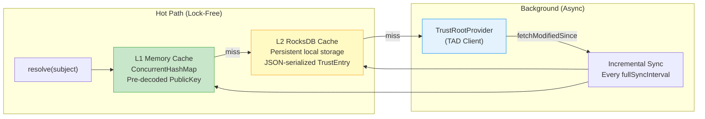
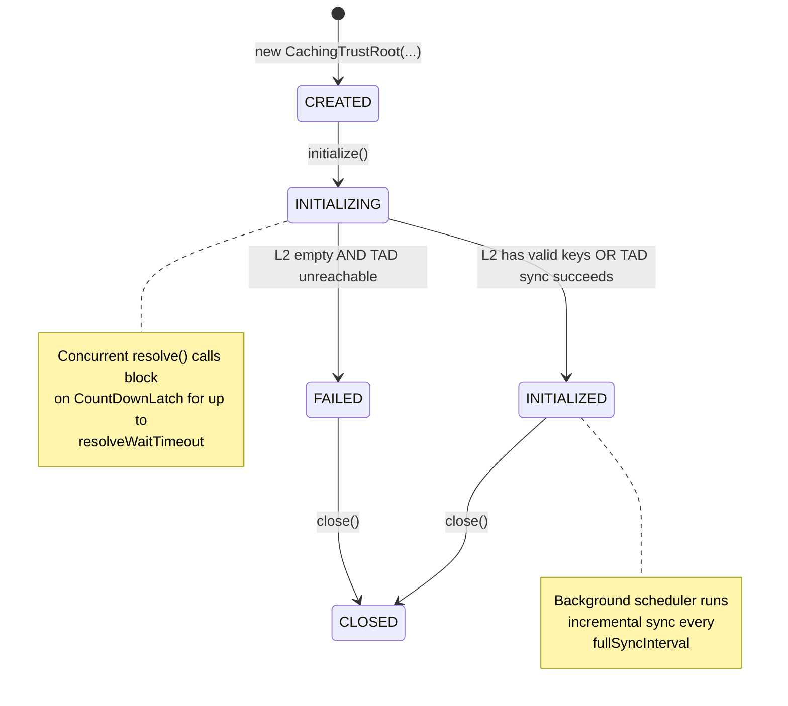
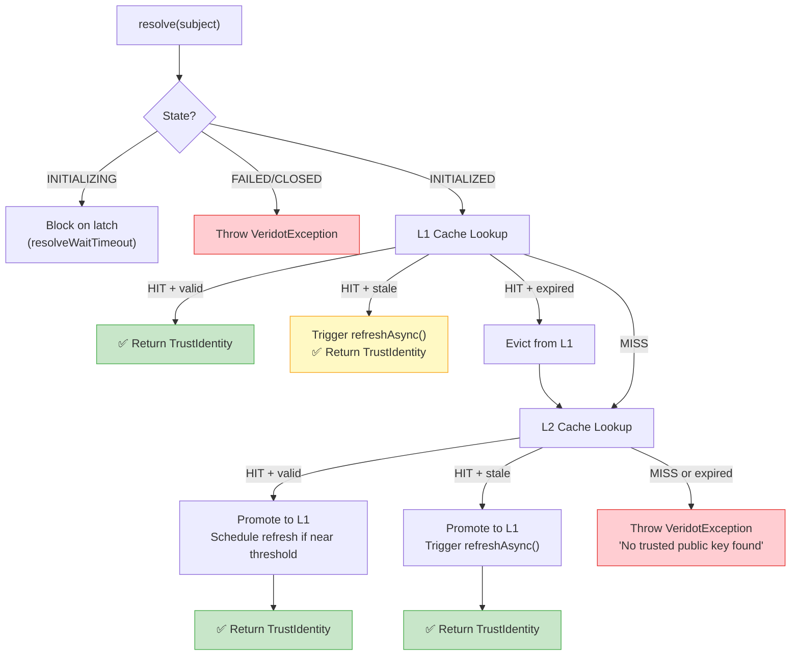

# CachingTrustRoot Deep-Dive

`CachingTrustRoot` is the production-grade implementation of the `PublicKeyTrustRoot` interface. It orchestrates a **two-tier cache** (L1 memory + L2 RocksDB) backed by a remote `TrustRootProvider` (typically a [TAD cluster](./tad-client.md)) to deliver **sub-microsecond key resolution** on the hot path.

```xml
<dependency>
    <groupId>io.github.cyfko</groupId>
    <artifactId>veridot-trustroots-core</artifactId>
    <version>4.0.1</version>
</dependency>
```

## Architecture



### Cache Tiers

| Tier | Storage | Content | Access Pattern |
|---|---|---|---|
| **L1** | `ConcurrentHashMap` (in-memory) | `CachedKeyEntry` with pre-decoded `java.security.PublicKey` | Lock-free `get()` — zero allocation on hit |
| **L2** | RocksDB (local disk) | JSON-serialized `TrustEntry` with composite key `<subject>0x00<version>` | Single RocksDB point lookup |

:::info[CachedKeyEntry vs TrustEntry]
L1 stores `CachedKeyEntry` records which contain the already-decoded `PublicKey` object. This avoids the cost of Base64 decoding + `KeyFactory.generatePublic()` on every token verification. The promotion from L2 → L1 performs this decode exactly once.
:::

## CachingTrustRootBuilder

The builder provides full control over cache sizing and timing parameters:

```java
CachingTrustRoot trustRoot = CachingTrustRoot.builder()
    .provider(tadProvider)              // Required — the remote key source
    .l2Directory(Path.of("/data/veridot/trust-cache"))  // Required if l2Cache not set
    .l1MaxSize(10_000)                  // Optional — default: 10,000 entries
    .refreshThreshold(Duration.ofHours(1))    // Optional — default: 1 hour
    .staleWindow(Duration.ofMinutes(5))       // Optional — default: 5 minutes
    .fullSyncInterval(Duration.ofHours(6))    // Optional — default: 6 hours
    .resolveWaitTimeout(Duration.ofSeconds(5)) // Optional — default: 5 seconds
    .build();

trustRoot.initialize(); // Bootstrap caches + start background sync
```

### Builder Properties Reference

| Property | Type | Default | Description |
|---|---|---|---|
| `provider` | `TrustRootProvider` | **Required** | Remote key source (e.g., `TadTrustRootProvider`) |
| `l2Cache` | `L2Cache` | — | Custom L2 cache implementation (mutually exclusive with `l2Directory`) |
| `l2Directory` | `Path` | **Required** (if no `l2Cache`) | Local directory for the default RocksDB L2 cache |
| `l1MaxSize` | `int` | `10,000` | Maximum number of entries in the L1 memory cache. Throws `IllegalStateException` when exceeded |
| `refreshThreshold` | `Duration` | `1 hour` | When a key's remaining validity drops below this threshold, an async refresh is triggered |
| `staleWindow` | `Duration` | `5 minutes` | Grace period after nominal expiration during which a key is still accepted while being refreshed |
| `fullSyncInterval` | `Duration` | `6 hours` | How often the background daemon runs incremental sync via `fetchModifiedSince()` |
| `resolveWaitTimeout` | `Duration` | `5 seconds` | Max time `resolve()` will block waiting for initialization to complete |

:::warning[l2Directory vs l2Cache]
You must specify **exactly one** of `l2Directory` (uses the built-in `RocksDbL2Cache`) or `l2Cache` (your own implementation). If both are set, the custom `l2Cache` takes precedence.
:::

## Lifecycle States



| State | `resolve()` Behavior |
|---|---|
| `CREATED` | Throws `VeridotException` (not initialized) |
| `INITIALIZING` | **Blocks** up to `resolveWaitTimeout` waiting for bootstrap |
| `INITIALIZED` | ✅ Normal resolution through L1 → L2 → stale fallback |
| `FAILED` | Throws `VeridotException` (initialization failed) |
| `CLOSED` | Throws `VeridotException` (engine closed) |

### Bootstrap Process

During `initialize()`, the engine follows this sequence:

1. **Load L2**: Read all entries from the local RocksDB cache
2. **Validate + Promote**: For each L2 entry, verify its signature, then promote to L1 if it's currently valid or within the stale window
3. **If at least one valid key exists** → `INITIALIZED` (warm start)
4. **If L2 is empty** → Attempt a full sync from the TAD provider via `fetchModifiedSince(Instant.EPOCH)`
5. **If sync succeeds** → `INITIALIZED` (cold start)
6. **If sync fails** → `FAILED` + throw `TrustRootInitializationException`

:::tip[Warm Start Resilience]
If your L2 RocksDB cache directory is persistent (e.g., mounted volume), the engine will **boot successfully even if the TAD cluster is temporarily down** — as long as the L2 cache contains at least one valid or stale key.
:::

## Resolution Flow



### Key Validity Windows

```
←——————— notBefore ———————— notAfter ———— notAfter + staleWindow ——→

   INVALID               VALID              STALE              EXPIRED
                    (nominal period)     (grace period)
                                        ↑ async refresh
                                          triggered
```

- **Valid**: `now ≤ notAfter` — returned immediately
- **Stale**: `notAfter < now ≤ notAfter + staleWindow` — returned but triggers async refresh
- **Expired**: `now > notAfter + staleWindow` — evicted, not returned

### Async Refresh

When a key enters the stale window (or its remaining validity drops below `refreshThreshold`), the engine fires `refreshAsync(subject)`:

1. Runs on the dedicated single-thread `veridot-trust-refresh` daemon
2. Calls `provider.fetch(subject)` over the network
3. Validates the response via `SignatureVerifier`
4. Writes the updated entry to L2 cache
5. Promotes the new key to L1 (atomically replacing older version)

:::note[Non-Blocking]
`refreshAsync()` runs entirely off the critical path. The caller receives the stale key immediately and never blocks on network I/O.
:::

## L2 RocksDB Cache Internals

The built-in `RocksDbL2Cache` uses three RocksDB **Column Families**:

| Column Family | Key | Value | Purpose |
|---|---|---|---|
| `entries` | `<subject_bytes> \| 0x00 \| <version_8bytes_BE>` | JSON-serialized `TrustEntry` | Versioned entry store |
| `subjects` | `<subject_bytes>` | 8-byte big-endian version number | Points to the latest version for each subject |
| `meta` | String key (e.g., `"last_sync_time"`, `"schema_version"`) | Metadata value | Tracks sync state |

Key behaviors:
- **Writes are async** (`setSync(false)`) — L2 is a cache, not the source of truth
- **Atomic batch writes** via `WriteBatch` ensure entries and version index are updated together
- **Version-wins** semantics: a `put()` only updates the `subjects` index if `entry.version >= currentVersion`

## Performance Tuning Guide

### L1 Sizing

```java
// Rule of thumb: L1 max size ≥ number of distinct signers your service talks to
.l1MaxSize(5_000)  // If you verify tokens from ~5000 different services
```

:::danger[L1 Overflow]
If L1 reaches `l1MaxSize` and a new subject needs to be inserted, an `IllegalStateException` is thrown. Size your L1 to accommodate all distinct subjects you expect to verify. If this is unpredictable, increase the limit generously — each entry is ~200 bytes.
:::

### Refresh Threshold

```java
// Keys typically have 24h validity
// Refresh at 1h before expiry → 23h of guaranteed-valid cache hits
.refreshThreshold(Duration.ofHours(1))

// For short-lived keys (e.g., 1h validity), use a tighter threshold
.refreshThreshold(Duration.ofMinutes(10))
```

### Stale Window

The stale window provides **resilience against TAD outages**:

```java
// Conservative: accept keys up to 5 min past expiry
.staleWindow(Duration.ofMinutes(5))

// Aggressive resilience: tolerate up to 30 min of TAD downtime
.staleWindow(Duration.ofMinutes(30))
```

:::warning[Security vs. Availability Trade-off]
A larger stale window increases availability during TAD outages but also increases the window during which a compromised key could still be accepted after revocation. Choose based on your threat model.
:::

### Sync Interval

```java
// Default: sync every 6 hours
.fullSyncInterval(Duration.ofHours(6))

// High-security environments: sync more frequently
.fullSyncInterval(Duration.ofMinutes(30))
```

### Complete Production Example

```java
import io.github.cyfko.veridot.trustroots.core.CachingTrustRoot;
import io.github.cyfko.veridot.trustroots.tad.client.TadTrustRootProvider;

import java.nio.file.Path;
import java.time.Duration;
import java.util.List;

public class TrustRootSetup {

    public static CachingTrustRoot create() throws Exception {
        // 1. Create the TAD client provider
        var provider = new TadTrustRootProvider(
            List.of(
                "https://tad-1.internal:8443",
                "https://tad-2.internal:8443",
                "https://tad-3.internal:8443"
            ),
            SSLContext.getDefault(),
            Duration.ofSeconds(3)
        );

        // 2. Build and initialize the caching engine
        CachingTrustRoot trustRoot = CachingTrustRoot.builder()
            .provider(provider)
            .l2Directory(Path.of("/data/veridot/trust-cache"))
            .l1MaxSize(20_000)
            .refreshThreshold(Duration.ofHours(1))
            .staleWindow(Duration.ofMinutes(10))
            .fullSyncInterval(Duration.ofHours(3))
            .resolveWaitTimeout(Duration.ofSeconds(10))
            .build();

        trustRoot.initialize();

        // 3. Register shutdown hook
        Runtime.getRuntime().addShutdownHook(new Thread(trustRoot::close));

        return trustRoot;
    }
}
```

## Implementing a Custom L2 Cache

If RocksDB doesn't fit your environment, implement the `L2Cache` interface:

```java
public interface L2Cache extends AutoCloseable {
    Optional<TrustEntry> get(String subject);
    void put(TrustEntry entry);
    List<TrustEntry> loadAll();
    Optional<Instant> lastSyncTime();
    void markSyncTime(Instant time);
    long estimatedSize();
    void close();
}
```

Then pass it to the builder:

```java
CachingTrustRoot.builder()
    .provider(provider)
    .l2Cache(new MyCustomL2Cache())  // Instead of l2Directory
    .build();
```
