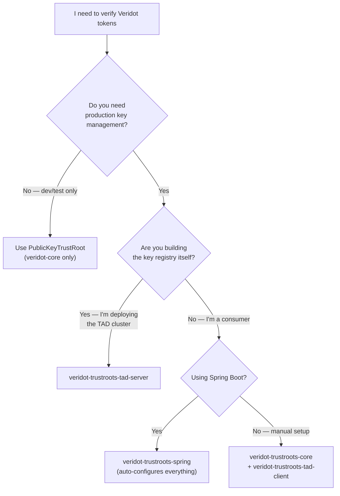
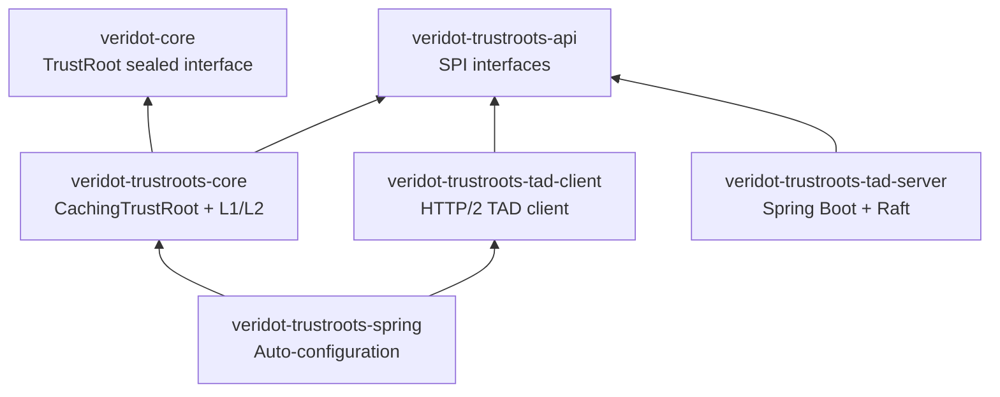

# TrustRoots Ecosystem Overview

The **veridot-trustroots** ecosystem solves one of the hardest problems in distributed token verification: **how does a verifier obtain the signer's public key without contacting the signer, without sharing secrets, and with sub-millisecond latency?**

The answer is a dedicated **Trust Authority Directory (TAD)** — a Raft-replicated registry of signed public keys — combined with a **multi-tier caching engine** that makes key resolution effectively zero-cost on the hot path.

## Sub-Modules at a Glance

| Sub-Module | Artifact | Role |
|---|---|---|
| **veridot-trustroots-api** | `io.github.cyfko:veridot-trustroots-api` | SPI interfaces: `TrustRootProvider`, `TrustEntry`, `KeyAlgorithm` |
| **veridot-trustroots-core** | `io.github.cyfko:veridot-trustroots-core` | `CachingTrustRoot` engine with L1 memory + L2 RocksDB caching |
| **veridot-trustroots-tad-client** | `io.github.cyfko:veridot-trustroots-tad-client` | HTTP/2 client for TAD clusters (read + publish) |
| **veridot-trustroots-tad-server** | `io.github.cyfko:veridot-trustroots-tad-server` | Spring Boot TAD server with SOFAJRaft consensus |
| **veridot-trustroots-spring** | `io.github.cyfko:veridot-trustroots-spring` | Spring Boot auto-configuration for zero-code setup |

All artifacts share the same version as the parent Veridot project (currently **4.0.1**).

## When to Use Which Module



## Dependency Graph



## Quick Comparison

| Feature | `PublicKeyTrustRoot` | `CachingTrustRoot` | TAD Server |
|---|---|---|---|
| **Artifact** | `veridot-core` | `veridot-trustroots-core` | `veridot-trustroots-tad-server` |
| **Purpose** | Manual / dev-time key injection | Production caching engine | Distributed key registry |
| **Key Source** | Hardcoded in code | TAD cluster via provider | Raft-replicated RocksDB |
| **Caching** | None | L1 memory + L2 RocksDB | N/A (is the source of truth) |
| **Stale Window** | N/A | Configurable (default 5 min) | N/A |
| **Auto-Refresh** | No | Async background thread | N/A |
| **High Availability** | N/A | Survives TAD outage via L2 | Raft consensus (3+ nodes) |
| **Use Case** | Unit tests, prototypes | Verifier microservices | Central key authority |

## Maven Coordinates

import Tabs from '@theme/Tabs';
import TabItem from '@theme/TabItem';

<Tabs>
<TabItem value="consumer" label="Consumer (Spring Boot)" default>

```xml
<!-- Just add the Spring starter — it pulls in core + tad-client transitively -->
<dependency>
    <groupId>io.github.cyfko</groupId>
    <artifactId>veridot-trustroots-spring</artifactId>
    <version>4.0.1</version>
</dependency>
```

</TabItem>
<TabItem value="manual" label="Consumer (Manual)">

```xml
<dependency>
    <groupId>io.github.cyfko</groupId>
    <artifactId>veridot-trustroots-core</artifactId>
    <version>4.0.1</version>
</dependency>
<dependency>
    <groupId>io.github.cyfko</groupId>
    <artifactId>veridot-trustroots-tad-client</artifactId>
    <version>4.0.1</version>
</dependency>
```

</TabItem>
<TabItem value="api-only" label="SPI Only (Custom Provider)">

```xml
<dependency>
    <groupId>io.github.cyfko</groupId>
    <artifactId>veridot-trustroots-api</artifactId>
    <version>4.0.1</version>
</dependency>
```

</TabItem>
</Tabs>

## What's Next?

- **[API Reference](./api.md)** — `TrustRootProvider` SPI, `TrustEntry` record, `KeyAlgorithm` enum
- **[CachingTrustRoot Deep-Dive](./core.md)** — L1/L2 architecture, lifecycle, resolution flow
- **[TAD Client](./tad-client.md)** — HTTP/2 client with failover
- **[TAD Server](./tad-server.md)** — Raft-replicated Spring Boot application
- **[TAD Deployment Guide](./tad-deployment.md)** — 3-node cluster setup
- **[Spring Auto-Configuration](./spring-autoconfiguration.md)** — Zero-code setup
