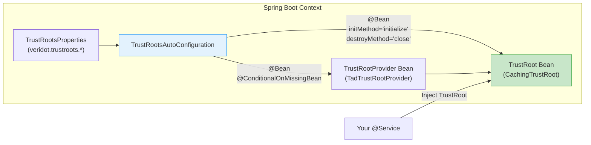

# Spring Boot Auto-Configuration

The `veridot-trustroots-spring` module provides a **zero-code setup** experience for Spring Boot applications. Add the dependency, configure a few properties in `application.yml`, and the entire trust key resolution stack is ready.

```xml
<dependency>
    <groupId>io.github.cyfko</groupId>
    <artifactId>veridot-trustroots-spring</artifactId>
    <version>4.0.1</version>
</dependency>
```

This single dependency transitively includes:
- `veridot-trustroots-core` (CachingTrustRoot engine)
- `veridot-trustroots-tad-client` (HTTP/2 TAD client)
- `veridot-trustroots-api` (SPI interfaces)

## How It Works



## TrustRootsAutoConfiguration

The auto-configuration class registers two beans conditionally:

### Registered Beans

| Bean | Type | Condition | Lifecycle |
|---|---|---|---|
| `trustRootProvider` | `TrustRootProvider` (→ `TadTrustRootProvider`) | `@ConditionalOnMissingBean(TrustRootProvider.class)` | Default |
| `trustRoot` | `TrustRoot` (→ `CachingTrustRoot`) | `@ConditionalOnMissingBean(TrustRoot.class)` | `initMethod="initialize"`, `destroyMethod="close"` |

### Activation Condition

The auto-configuration activates when:
- `TrustRoot.class` is on the classpath (`@ConditionalOnClass`)
- No existing `TrustRootProvider` or `TrustRoot` bean is already defined

:::tip Custom Provider Override
If you define your own `TrustRootProvider` bean (e.g., a Vault-backed provider), the auto-configuration will use it instead of creating a `TadTrustRootProvider`. The `CachingTrustRoot` bean is still created automatically using your custom provider.

```java
@Configuration
public class CustomTrustConfig {
    @Bean
    public TrustRootProvider trustRootProvider() {
        return new VaultTrustRootProvider(vaultClient);
    }
    // CachingTrustRoot is still auto-configured using this provider
}
```
:::

## TrustRootsProperties

All properties are prefixed with `veridot.trustroots`:

| Property | Type | Default | Description |
|---|---|---|---|
| `veridot.trustroots.provider-type` | `String` | `"tad"` | Provider type. Currently only `"tad"` is supported |
| `veridot.trustroots.tad-cluster-urls` | `List<String>` | `["http://127.0.0.1:8443"]` | TAD cluster node base URLs |
| `veridot.trustroots.connect-timeout` | `Duration` | `3s` | HTTP connection and read timeout for TAD requests |
| `veridot.trustroots.l1-max-size` | `int` | `10000` | Maximum L1 in-memory cache entries |
| `veridot.trustroots.l2-directory` | `String` | `~/.veridot/trust-cache` | Local RocksDB directory for L2 cache |
| `veridot.trustroots.refresh-threshold` | `Duration` | `1h` | Remaining validity threshold to trigger async refresh |
| `veridot.trustroots.stale-window` | `Duration` | `5m` | Grace period for expired keys during TAD outages |
| `veridot.trustroots.full-sync-interval` | `Duration` | `6h` | Background incremental sync interval |
| `veridot.trustroots.resolve-wait-timeout` | `Duration` | `5s` | Max wait time for resolve() during initialization |

## Zero-Code Setup

### Minimal Configuration

```yaml
# application.yml
veridot:
  trustroots:
    tad-cluster-urls:
      - https://tad-1.internal:8443
      - https://tad-2.internal:8443
      - https://tad-3.internal:8443
```

That's it! With just the cluster URLs, all other properties use sensible defaults.

### Full Configuration Example

```yaml
# application.yml
veridot:
  trustroots:
    provider-type: tad
    tad-cluster-urls:
      - https://tad-1.internal:8443
      - https://tad-2.internal:8443
      - https://tad-3.internal:8443
    connect-timeout: 3s
    l1-max-size: 20000
    l2-directory: /data/veridot/trust-cache
    refresh-threshold: 1h
    stale-window: 10m
    full-sync-interval: 3h
    resolve-wait-timeout: 10s
```

## Integration with Spring Boot Actuator

### Health Indicator

The `TrustRootProvider` exposes an `isHealthy()` method. You can integrate it with Spring Boot Actuator by defining a custom health indicator:

```java
import io.github.cyfko.veridot.trustroots.api.TrustRootProvider;
import org.springframework.boot.actuate.health.Health;
import org.springframework.boot.actuate.health.HealthIndicator;
import org.springframework.stereotype.Component;

@Component
public class TrustRootHealthIndicator implements HealthIndicator {

    private final TrustRootProvider provider;

    public TrustRootHealthIndicator(TrustRootProvider provider) {
        this.provider = provider;
    }

    @Override
    public Health health() {
        if (provider.isHealthy()) {
            return Health.up()
                .withDetail("provider", provider.name())
                .build();
        }
        return Health.down()
            .withDetail("provider", provider.name())
            .withDetail("reason", "TAD cluster unreachable")
            .build();
    }
}
```

This surfaces in the Actuator endpoint:

```bash
curl http://localhost:8080/actuator/health
```

```json
{
  "status": "UP",
  "components": {
    "trustRoot": {
      "status": "UP",
      "details": {
        "provider": "TAD-Cluster"
      }
    }
  }
}
```

## Complete Spring Boot Application Example

```java
package com.example.orderservice;

import io.github.cyfko.veridot.core.TrustRoot;
import io.github.cyfko.veridot.core.TrustIdentity;
import io.github.cyfko.veridot.core.GenericSignerVerifier;
import org.springframework.boot.SpringApplication;
import org.springframework.boot.autoconfigure.SpringBootApplication;
import org.springframework.web.bind.annotation.*;

@SpringBootApplication
public class OrderServiceApplication {

    public static void main(String[] args) {
        SpringApplication.run(OrderServiceApplication.class, args);
    }
}
```

```java
package com.example.orderservice;

import io.github.cyfko.veridot.core.GenericSignerVerifier;
import io.github.cyfko.veridot.core.TrustRoot;
import org.springframework.web.bind.annotation.*;

@RestController
@RequestMapping("/api/orders")
public class OrderController {

    private final GenericSignerVerifier verifier;

    public OrderController(TrustRoot trustRoot) {
        // TrustRoot is auto-injected by TrustRootsAutoConfiguration
        this.verifier = new GenericSignerVerifier(trustRoot);
    }

    @PostMapping
    public OrderResponse createOrder(
            @RequestHeader("Authorization") String authHeader,
            @RequestBody OrderRequest request) {

        // Extract the Veridot token from the Authorization header
        String token = authHeader.replace("Bearer ", "");

        // Verify the token — key resolution is sub-microsecond via L1 cache
        var claims = verifier.verify(token);

        // Use the verified claims
        String callerService = claims.subject();
        // ... create order logic ...

        return new OrderResponse("created", callerService);
    }
}
```

### application.yml

```yaml
spring:
  application:
    name: order-service

server:
  port: 8080

veridot:
  trustroots:
    tad-cluster-urls:
      - https://tad-1.internal:8443
      - https://tad-2.internal:8443
      - https://tad-3.internal:8443
    l2-directory: /data/order-service/trust-cache
    stale-window: 10m

# Actuator (optional)
management:
  endpoints:
    web:
      exposure:
        include: health,info
  endpoint:
    health:
      show-details: always
```

### pom.xml

```xml
<dependencies>
    <!-- Spring Boot -->
    <dependency>
        <groupId>org.springframework.boot</groupId>
        <artifactId>spring-boot-starter-web</artifactId>
    </dependency>
    <dependency>
        <groupId>org.springframework.boot</groupId>
        <artifactId>spring-boot-starter-actuator</artifactId>
    </dependency>

    <!-- Veridot TrustRoots Spring Starter -->
    <dependency>
        <groupId>io.github.cyfko</groupId>
        <artifactId>veridot-trustroots-spring</artifactId>
        <version>4.0.1</version>
    </dependency>
    <dependency>
        <groupId>io.github.cyfko</groupId>
        <artifactId>veridot-core</artifactId>
        <version>4.0.1</version>
    </dependency>
</dependencies>
```

:::note Automatic Lifecycle
The `CachingTrustRoot` bean's `initialize()` method is called automatically on application startup via `initMethod`, and `close()` is called on shutdown via `destroyMethod`. You don't need to manage its lifecycle manually.
:::

## Troubleshooting

### Common Issues

| Symptom | Cause | Solution |
|---|---|---|
| `TrustRootInitializationException` at startup | TAD cluster unreachable AND L2 cache empty | Ensure TAD cluster is running; check `tad-cluster-urls` |
| `IllegalArgumentException: Unsupported veridot provider type` | `provider-type` is not `"tad"` | Set `veridot.trustroots.provider-type=tad` |
| `IllegalStateException: L1 cache max size reached` | More distinct subjects than `l1-max-size` | Increase `veridot.trustroots.l1-max-size` |
| Slow first request | Cache cold-start; L2 is empty | Normal on first boot; subsequent starts will be fast due to L2 persistence |
| `VeridotException: TrustRoot is closed` | Application context shut down | Don't call `resolve()` after Spring context close |

:::warning First Boot
On the very first startup (cold start), the engine must sync from the TAD cluster. Ensure the cluster is reachable before starting your consumer service for the first time. After the first sync, the L2 RocksDB cache persists to disk, enabling offline warm starts.
:::
