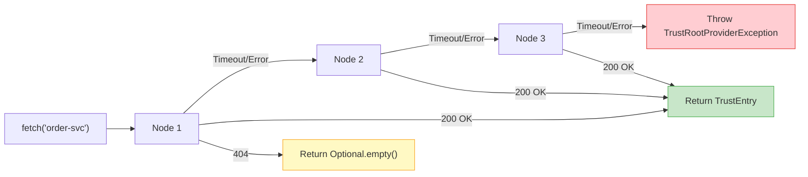

# TAD Client

The `veridot-trustroots-tad-client` module provides two HTTP/2 clients for interacting with a [TAD Server](./tad-server.md) cluster:

- **`TadTrustRootProvider`** — Implements `TrustRootProvider` for **reading** trust entries (used by `CachingTrustRoot`)
- **`TadPublisherClient`** — For **publishing** and **rotating** trust entries (used by signing services)

```xml
<dependency>
    <groupId>io.github.cyfko</groupId>
    <artifactId>veridot-trustroots-tad-client</artifactId>
    <version>4.0.1</version>
</dependency>
```

## TadTrustRootProvider

The primary read-side client. It implements the [`TrustRootProvider`](./api.md) SPI and is the recommended provider for `CachingTrustRoot` in production.

### Constructor

```java
public TadTrustRootProvider(
    List<String> clusterUrls,   // Base URLs of TAD cluster nodes
    SSLContext sslContext,       // Optional — null for plain HTTP
    Duration requestTimeout     // Optional — null defaults to 5 seconds
)
```

| Parameter | Type | Required | Default | Description |
|---|---|---|---|---|
| `clusterUrls` | `List<String>` | ✅ | — | Base URLs (e.g., `"https://tad-1:8443"`) — must not be empty |
| `sslContext` | `SSLContext` | ⬜ | `null` | JCA SSL context for TLS; `null` for unencrypted HTTP |
| `requestTimeout` | `Duration` | ⬜ | 5 seconds | Per-request timeout for both connection and read |

### Failover Strategy



The client iterates through all `clusterUrls` in order. If a node responds with an error or times out, it automatically tries the next node. The failover is **transparent** to callers.

:::tip Follow Redirects
The HTTP client is configured with `HttpClient.Redirect.NORMAL`, so it automatically follows HTTP 307 redirects from follower nodes to the Raft leader.
:::

### REST Endpoints Used

| Method | Endpoint | Purpose |
|---|---|---|
| `GET` | `/v1/trust-entries/{subject}` | Fetch the latest key for a subject |
| `GET` | `/v1/trust-entries?modifiedSince={iso8601}` | Incremental delta sync |

### Response Handling

| Status Code | Behavior |
|---|---|
| `200 OK` | Deserialize `TrustEntry` (or `TadSyncResponse` for batch) and return |
| `404 Not Found` | Return `Optional.empty()` — subject not registered |
| Any other | Throw `TrustRootProviderException` and try next node |

### Usage Example

```java
import io.github.cyfko.veridot.trustroots.tad.client.TadTrustRootProvider;
import io.github.cyfko.veridot.trustroots.core.CachingTrustRoot;

import javax.net.ssl.SSLContext;
import java.time.Duration;
import java.util.List;

// Create the provider with 3-node failover
var provider = new TadTrustRootProvider(
    List.of(
        "https://tad-1.internal:8443",
        "https://tad-2.internal:8443",
        "https://tad-3.internal:8443"
    ),
    SSLContext.getDefault(),
    Duration.ofSeconds(3)
);

// Use it standalone
Optional<TrustEntry> entry = provider.fetch("order-service");

// Or wire it into CachingTrustRoot (recommended)
CachingTrustRoot trustRoot = CachingTrustRoot.builder()
    .provider(provider)
    .l2Directory(Path.of("/data/veridot/cache"))
    .build();
trustRoot.initialize();
```

## TadPublisherClient

Used by **signing services** to publish new keys or rotate existing ones in the TAD cluster.

### Constructor

```java
public TadPublisherClient(
    List<String> clusterUrls,   // Same as TadTrustRootProvider
    SSLContext sslContext,       // Optional
    Duration requestTimeout     // Optional — defaults to 5 seconds
)
```

### Methods

#### `publish(TrustEntry entry)`

Publishes a new trust entry to the TAD cluster.

```java
void publish(TrustEntry entry) throws TrustRootProviderException
```

- Sends a `POST /v1/trust-entries` request with the JSON-serialized entry
- Expects `200 OK` or `201 Created`
- Iterates through cluster nodes on failure (failover)

#### `rotate(String subject, TrustEntry entry)`

Rotates the key for an existing subject by publishing a new version.

```java
void rotate(String subject, TrustEntry entry) throws TrustRootProviderException
```

- Sends a `PUT /v1/trust-entries/{subject}` request
- Expects `200 OK` or `204 No Content`
- The entry's `subject` field must match the path parameter (validated server-side)

### Key Rotation Example

```java
import io.github.cyfko.veridot.trustroots.tad.client.TadPublisherClient;
import io.github.cyfko.veridot.trustroots.api.*;
import io.github.cyfko.veridot.trustroots.core.validation.SignatureVerifier;

import java.security.*;
import java.time.*;
import java.util.*;

// 1. Generate a new key pair
KeyPairGenerator kpg = KeyPairGenerator.getInstance("Ed25519");
KeyPair keyPair = kpg.generateKeyPair();

String publicKeyEncoded = Base64.getUrlEncoder().withoutPadding()
    .encodeToString(keyPair.getPublic().getEncoded());

// 2. Build the trust entry
Instant now = Instant.now();
String fingerprint = SignatureVerifier.computeFingerprint(publicKeyEncoded);

// 3. Sign the canonical payload
TrustEntry unsigned = TrustEntry.builder()
    .subject("payment-service")
    .publicKeyEncoded(publicKeyEncoded)
    .algorithm(KeyAlgorithm.ED25519)
    .notBefore(now)
    .notAfter(now.plus(Duration.ofDays(90)))
    .version(2)  // Increment from previous version
    .fingerprint(fingerprint)
    .issuerSignature("")  // Placeholder
    .publishedAt(now)
    .build();

Signature sig = Signature.getInstance("EdDSA");
sig.initSign(keyPair.getPrivate());
sig.update(unsigned.canonicalPayload());
String signature = Base64.getUrlEncoder().withoutPadding()
    .encodeToString(sig.sign());

TrustEntry entry = TrustEntry.builder()
    .subject("payment-service")
    .publicKeyEncoded(publicKeyEncoded)
    .algorithm(KeyAlgorithm.ED25519)
    .notBefore(now)
    .notAfter(now.plus(Duration.ofDays(90)))
    .version(2)
    .fingerprint(fingerprint)
    .issuerSignature(signature)
    .publishedAt(now)
    .build();

// 4. Publish to the TAD cluster
var publisher = new TadPublisherClient(
    List.of("https://tad-1:8443", "https://tad-2:8443", "https://tad-3:8443"),
    SSLContext.getDefault(),
    Duration.ofSeconds(5)
);

publisher.rotate("payment-service", entry);
```

## TadSyncResponse

Internal record used to deserialize the incremental sync response:

```java
record TadSyncResponse(
    List<TrustEntry> entries,    // Modified entries since the requested timestamp
    String nextSyncToken,        // Opaque token for the next sync (ISO-8601 timestamp)
    boolean truncated            // true if results were paginated (not all returned)
) { }
```

:::warning Package-Private
`TadSyncResponse` is package-private and used internally by `TadTrustRootProvider`. You should not need to interact with it directly.
:::

## Security Considerations

:::danger Always Use TLS in Production
Configure an `SSLContext` with proper certificates when connecting to the TAD cluster. The trust entries contain public keys (not secrets), but a man-in-the-middle could substitute malicious keys if the connection is unencrypted.
:::

```java
// Load your trust store
SSLContext sslContext = SSLContext.getInstance("TLS");
KeyStore trustStore = KeyStore.getInstance("PKCS12");
trustStore.load(new FileInputStream("/etc/veridot/truststore.p12"), password);

TrustManagerFactory tmf = TrustManagerFactory.getInstance(
    TrustManagerFactory.getDefaultAlgorithm());
tmf.init(trustStore);

sslContext.init(null, tmf.getTrustManagers(), new SecureRandom());

var provider = new TadTrustRootProvider(clusterUrls, sslContext, Duration.ofSeconds(3));
```
