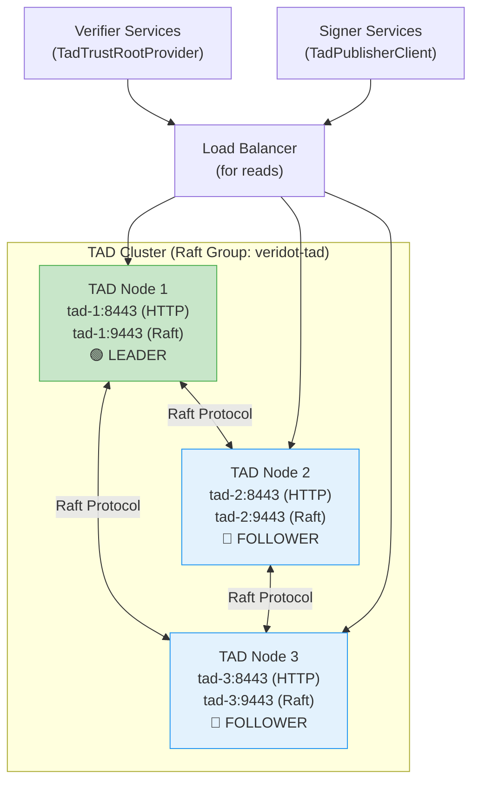
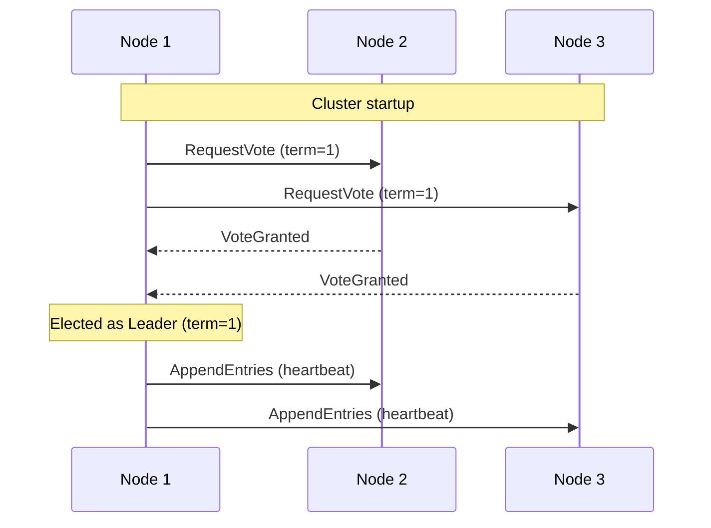

# TAD Deployment Guide

This guide walks you through deploying a production-ready **3-node TAD cluster** with Raft consensus, Docker Compose, and operational procedures for monitoring, backup, and failover.

## Prerequisites

- Docker and Docker Compose v2+
- Java 25+ (if running outside Docker)
- Network connectivity between all 3 nodes on both the HTTP port (8443) and the Raft port (9443)
- Persistent storage for RocksDB data directories

## 3-Node Cluster Topology



:::info Why 3 Nodes?
Raft requires a **majority quorum** (⌊N/2⌋ + 1) for writes. A 3-node cluster tolerates **1 node failure** while maintaining write availability. For higher fault tolerance, use 5 nodes (tolerates 2 failures).
:::

## Step 1: Spring Boot Configuration

Each node needs a unique `node-id` but shares the same `raft-group-id` and `initial-peers`.

### Node 1 — `application-node1.yml`

```yaml
server:
  port: 8443

veridot:
  tad-server:
    node-id: "tad-1:9443"
    raft-group-id: "veridot-tad"
    initial-peers: "tad-1:9443,tad-2:9443,tad-3:9443"
    storage:
      directory: "/data/veridot-tad"
```

### Node 2 — `application-node2.yml`

```yaml
server:
  port: 8443

veridot:
  tad-server:
    node-id: "tad-2:9443"
    raft-group-id: "veridot-tad"
    initial-peers: "tad-1:9443,tad-2:9443,tad-3:9443"
    storage:
      directory: "/data/veridot-tad"
```

### Node 3 — `application-node3.yml`

```yaml
server:
  port: 8443

veridot:
  tad-server:
    node-id: "tad-3:9443"
    raft-group-id: "veridot-tad"
    initial-peers: "tad-1:9443,tad-2:9443,tad-3:9443"
    storage:
      directory: "/data/veridot-tad"
```

### Configuration Reference

| Property | Required | Default | Description |
|---|---|---|---|
| `server.port` | ⬜ | `8080` | HTTP API port |
| `veridot.tad-server.node-id` | ✅ | — | `hostname:port` for Raft protocol |
| `veridot.tad-server.raft-group-id` | ⬜ | `"veridot-tad"` | Must be identical across all nodes |
| `veridot.tad-server.initial-peers` | ✅ | — | Comma-separated `host:port` list of all nodes |
| `veridot.tad-server.storage.directory` | ⬜ | `/tmp/veridot-tad` | Root directory for RocksDB + Raft data |

:::warning Storage Directory
**Always set a persistent directory** in production. The default `/tmp/veridot-tad` will be lost on container restart. Use a mounted volume.
:::

## Step 2: Docker Compose Deployment

### Dockerfile

```dockerfile
FROM eclipse-temurin:25-jre-alpine

WORKDIR /app
COPY target/veridot-trustroots-tad-server-4.0.1.jar app.jar

# Raft protocol port + HTTP API port
EXPOSE 8443 9443

# Persistent storage
VOLUME /data/veridot-tad

ENTRYPOINT ["java", "-jar", "app.jar"]
```

### docker-compose.yml

```yaml
version: "3.9"

services:
  tad-1:
    build: .
    hostname: tad-1
    ports:
      - "8443:8443"
      - "9443:9443"
    volumes:
      - tad1-data:/data/veridot-tad
    environment:
      SPRING_PROFILES_ACTIVE: node1
    networks:
      - tad-net

  tad-2:
    build: .
    hostname: tad-2
    ports:
      - "8444:8443"
      - "9444:9443"
    volumes:
      - tad2-data:/data/veridot-tad
    environment:
      SPRING_PROFILES_ACTIVE: node2
    networks:
      - tad-net

  tad-3:
    build: .
    hostname: tad-3
    ports:
      - "8445:8443"
      - "9445:9443"
    volumes:
      - tad3-data:/data/veridot-tad
    environment:
      SPRING_PROFILES_ACTIVE: node3
    networks:
      - tad-net

volumes:
  tad1-data:
  tad2-data:
  tad3-data:

networks:
  tad-net:
    driver: bridge
```

### Launch the Cluster

```bash
# Build and start all 3 nodes
docker compose up -d --build

# Verify all nodes are running
docker compose ps

# Check logs for leader election
docker compose logs -f tad-1 | grep -i "leader"
```

:::tip Startup Order
Raft handles node ordering automatically. All 3 nodes can start simultaneously — they will discover each other via `initial-peers` and elect a leader within a few seconds.
:::

## Step 3: Verify the Cluster

### Health Check All Nodes

```bash
# Check each node
curl -s http://localhost:8443/health | jq .
curl -s http://localhost:8444/health | jq .
curl -s http://localhost:8445/health | jq .
```

Expected responses:

```json
// Leader node
{"status": "UP", "role": "LEADER", "leaderId": "tad-1:9443"}

// Follower nodes
{"status": "UP", "role": "FOLLOWER", "leaderId": "tad-1:9443"}
```

### Publish a Test Entry

```bash
curl -X POST http://localhost:8443/v1/trust-entries \
  -H "Content-Type: application/json" \
  -d '{
    "_schemaVersion": 1,
    "subject": "test-service",
    "publicKeyEncoded": "MCowBQYDK2VwAyEAtest...",
    "algorithm": "Ed25519",
    "notBefore": "2026-07-01T00:00:00Z",
    "notAfter": "2026-10-01T00:00:00Z",
    "version": 1,
    "fingerprint": "abcdef1234567890",
    "issuerSignature": "MEUCIQD...",
    "publishedAt": "2026-07-01T12:00:00Z",
    "isRoot": false,
    "metadata": {}
  }'
```

### Verify Replication

```bash
# Read from a follower node — should return the same entry
curl -s http://localhost:8444/v1/trust-entries/test-service | jq .
```

## Monitoring and Health Checks

### Health Endpoint

Use the `/health` endpoint for liveness and readiness probes:

```yaml
# Kubernetes-style probes
livenessProbe:
  httpGet:
    path: /health
    port: 8443
  initialDelaySeconds: 15
  periodSeconds: 10

readinessProbe:
  httpGet:
    path: /health
    port: 8443
  initialDelaySeconds: 10
  periodSeconds: 5
```

### Monitoring Checklist

| Metric | How to Check | Alert Threshold |
|---|---|---|
| **Node role** | `GET /health` → `role` field | Alert if 0 leaders in cluster |
| **Leader stability** | Monitor leader changes over time | Alert if >3 elections per hour |
| **Replication lag** | Compare `modifiedSince` responses across nodes | Alert if follower lags >30s |
| **RocksDB disk usage** | Monitor `storage.directory` size | Alert at 80% disk capacity |
| **HTTP response time** | Monitor `GET /v1/trust-entries/{subject}` P99 | Alert if >100ms |

### Logging

SOFAJRaft logs election events, leader changes, and replication status. Configure logging levels:

```yaml
logging:
  level:
    com.alipay.sofa.jraft: INFO
    io.github.cyfko.veridot.trustroots.tad: DEBUG
```

## Backup and Recovery

### Backup Strategy

The TAD cluster data is stored in RocksDB. To back up a node:

```bash
# 1. Stop the node (or use RocksDB checkpoint for online backup)
docker compose stop tad-1

# 2. Copy the data directory
cp -r /var/lib/docker/volumes/tad1-data/_data /backup/tad-$(date +%Y%m%d)

# 3. Restart the node
docker compose start tad-1
```

:::tip Online Backup
For zero-downtime backups, back up a **follower** node. The cluster maintains write availability as long as a majority of nodes are online.
:::

### Recovery Procedure

To recover a failed node:

```bash
# 1. Remove the corrupted data
rm -rf /var/lib/docker/volumes/tad1-data/_data/*

# 2. Restart the node — it will re-sync from the cluster
docker compose restart tad-1
```

The Raft protocol will automatically replay committed logs to bring the recovered node up to date.

### Full Cluster Recovery

In the catastrophic scenario where all nodes fail:

1. Restore the latest backup to one node's data directory
2. Start that node as a single-node cluster temporarily
3. Add the other nodes back and let them sync

:::danger Never lose all RocksDB data
If all 3 nodes lose their data simultaneously (e.g., all volumes deleted), the trust entries are **permanently lost**. Maintain regular backups and consider cross-region replication for critical deployments.
:::

## Leader Election and Failover

### Normal Leader Election

When the cluster starts, nodes elect a leader within a few seconds:



### Failover Scenarios

| Scenario | Impact | Recovery |
|---|---|---|
| **Follower fails** | No impact on reads or writes | Node rejoins and syncs automatically |
| **Leader fails** | Writes blocked for ~5-10s during re-election | New leader elected from remaining followers |
| **2 of 3 nodes fail** | Cluster loses quorum — **no writes** | Reads still work on the surviving node; restore a second node to regain quorum |
| **Network partition** | Minority partition loses write access | Resolves automatically when partition heals |

### Leader Failover Timeline

```mermaid
gantt
    title Leader Failover Timeline
    dateFormat X
    axisFormat %Ls

    section Normal Operation
    Leader heartbeats : 0, 2000
    section Failure
    Leader crashes : crit, 2000, 2100
    Heartbeat timeout : 2100, 3500
    section Recovery
    Election phase : 3500, 4000
    New leader elected : milestone, 4000, 4000
    Writes resume : 4000, 6000
```



Typical failover time: **1-5 seconds** depending on the heartbeat and election timeout configuration in SOFAJRaft.

## Production Checklist

- [ ] **Persistent volumes** mounted for all nodes' `storage.directory`
- [ ] **TLS configured** for both HTTP (8443) and Raft (9443) ports
- [ ] **Health checks** configured for orchestrator (K8s, Docker, etc.)
- [ ] **Backup schedule** established (daily recommended)
- [ ] **Monitoring alerts** for leader stability and disk usage
- [ ] **Network policies** restrict Raft port access to cluster nodes only
- [ ] **Resource limits** set (each node typically uses ~256MB heap + RocksDB memory)
- [ ] **Log rotation** configured for SOFAJRaft WAL and application logs
