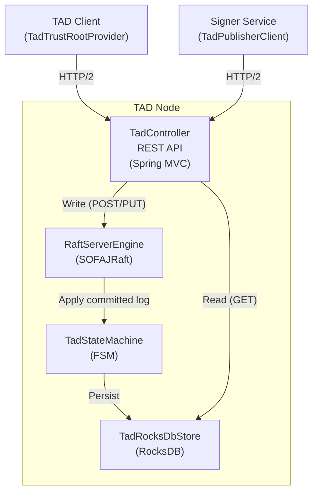
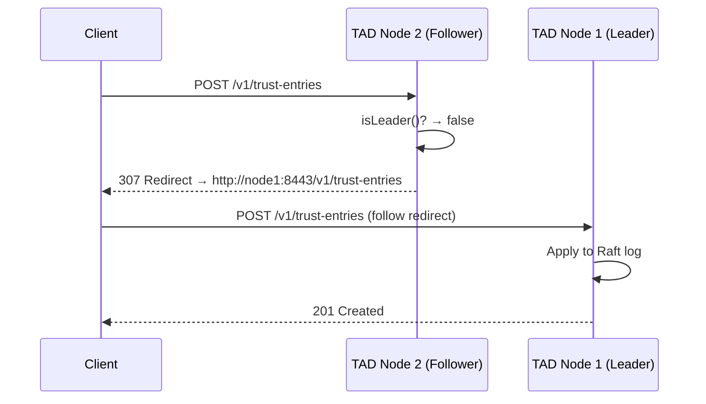

# TAD Server

The **Trust Authority Directory (TAD) Server** is a Spring Boot application that acts as the **centralized, replicated registry** for all signed public keys in a Veridot deployment. It uses **SOFAJRaft** (Raft consensus protocol) to achieve strong consistency across a cluster of nodes.

```xml
<dependency>
    <groupId>io.github.cyfko</groupId>
    <artifactId>veridot-trustroots-tad-server</artifactId>
    <version>4.0.1</version>
</dependency>
```

## Architecture



### Component Responsibilities

| Component | Class | Role |
|---|---|---|
| **REST API** | `TadController` | Exposes HTTP endpoints; redirects writes to Raft leader |
| **Raft Engine** | `RaftServerEngine` | Manages the SOFAJRaft node lifecycle (log, meta, snapshot directories) |
| **State Machine** | `TadStateMachine` | Applies committed Raft logs to the local RocksDB store deterministically |
| **Store** | `TadRocksDbStore` | Persistent RocksDB storage with 3 column families |

## REST API Reference

### Write Operations (Leader Only)

Write operations are submitted to the Raft consensus protocol. If a write request reaches a **follower** node, it returns **HTTP 307 Temporary Redirect** to the current leader.

#### `POST /v1/trust-entries` — Publish Entry

Publishes a new signed trust entry. The entry is replicated to a majority of nodes before the response is sent.

**Request:**
```json
{
  "_schemaVersion": 1,
  "subject": "order-service",
  "publicKeyEncoded": "MCowBQYDK2VwAyEA...",
  "algorithm": "Ed25519",
  "notBefore": "2026-07-01T00:00:00Z",
  "notAfter": "2026-10-01T00:00:00Z",
  "version": 1,
  "fingerprint": "a1b2c3d4e5f6...",
  "issuerSignature": "MEUCIQD...",
  "publishedAt": "2026-07-01T12:00:00Z",
  "isRoot": false,
  "metadata": {}
}
```

**Responses:**

| Status | Body | Condition |
|---|---|---|
| `201 Created` | `{"subject": "...", "version": 1, "fingerprint": "...", "publishedAt": "..."}` | Successfully replicated and committed |
| `307 Temporary Redirect` | — | This node is a follower; `Location` header points to the leader |
| `400 Bad Request` | `{"error": "INVALID_REQUEST", "detail": "..."}` | Raft apply failed (e.g., validation error) |
| `503 Service Unavailable` | `{"error": "RAFT_UNAVAILABLE", "detail": "Leader not elected yet"}` | Cluster is in election phase |

#### `PUT /v1/trust-entries/{subject}` — Rotate Key

Rotates the key for an existing subject. The `subject` in the path must match `entry.subject()`.

**Responses:**

| Status | Condition |
|---|---|
| `201 Created` | Key rotated successfully |
| `400 Bad Request` | Subject mismatch between path and body |
| `307 Temporary Redirect` | Follower → leader redirect |

### Read Operations (Any Node)

Read operations are served directly from the local RocksDB store — they do **not** go through Raft and can be served by any node (leader or follower).

:::info[Eventual Consistency on Reads]
Read queries to follower nodes may return slightly stale data if the follower's log hasn't caught up with the leader. For the TAD use case, this is acceptable because the [CachingTrustRoot](./core.md) tolerates stale keys via its stale window mechanism.
:::

#### `GET /v1/trust-entries/{subject}` — Resolve Entry

Returns the latest version of the trust entry for the given subject.

**Responses:**

| Status | Body |
|---|---|
| `200 OK` | Full `TrustEntry` JSON |
| `404 Not Found` | `{"error": "SUBJECT_NOT_FOUND", "detail": "Subject not registered"}` |

#### `POST /v1/trust-entries/batch` — Batch Resolve

Resolves multiple subjects in a single request.

**Request:**
```json
{
  "subjects": ["order-service", "payment-service", "auth-service"]
}
```

**Response:**
```json
{
  "found": {
    "order-service": { /* TrustEntry */ },
    "payment-service": { /* TrustEntry */ }
  },
  "notFound": ["auth-service"]
}
```

#### `GET /v1/trust-entries?modifiedSince={iso8601}` — Incremental Sync

Returns all entries published after the given timestamp. Used by `TadTrustRootProvider.fetchModifiedSince()` for delta synchronization.

**Response:**
```json
{
  "entries": [ /* TrustEntry[] */ ],
  "nextSyncToken": "2026-07-03T12:00:00Z",
  "truncated": false
}
```

### Health Check

#### `GET /health`

Returns the node's health status and Raft role.

```json
{
  "status": "UP",
  "role": "LEADER",
  "leaderId": "127.0.0.1:9443"
}
```

## Leader-Follower Redirect



:::tip[Automatic Redirect Handling]
The `TadTrustRootProvider` and `TadPublisherClient` are configured with `HttpClient.Redirect.NORMAL`, so they automatically follow 307 redirects. You don't need to handle this manually.
:::

## RaftServerEngine Configuration

The Raft engine is configured via Spring Boot properties:

| Property | Type | Default | Description |
|---|---|---|---|
| `veridot.tad-server.node-id` | `String` | **Required** | This node's `IP:PORT` for Raft protocol (e.g., `"127.0.0.1:9443"`) |
| `veridot.tad-server.raft-group-id` | `String` | `"veridot-tad"` | Raft group identifier — must be identical across all cluster nodes |
| `veridot.tad-server.initial-peers` | `String` | **Required** | Comma-separated `IP:PORT` list of all initial cluster nodes |
| `veridot.tad-server.storage.directory` | `String` | `/tmp/veridot-tad` | Root directory for RocksDB data and Raft logs |

The Raft engine creates these subdirectories under `storage.directory/raft/`:

```
storage.directory/raft/
├── log/        # Raft write-ahead log
├── meta/       # Raft metadata (term, vote)
└── snapshot/   # State machine snapshots
```

## TadStateMachine Internals

The `TadStateMachine` extends SOFAJRaft's `StateMachineAdapter`. It is the deterministic core that applies committed log entries to the local store.

```java
public class TadStateMachine extends StateMachineAdapter {
    // Tracks whether this node is the leader
    private final AtomicLong leaderTerm = new AtomicLong(-1);

    @Override
    public void onApply(Iterator iter) {
        // Deserialize each committed log entry and write to RocksDB
        while (iter.hasNext()) {
            TrustEntry entry = deserialize(iter.getData());
            store.put(entry);  // Synchronous write (setSync=true)
            iter.done().run(Status.OK());
            iter.next();
        }
    }

    @Override
    public void onLeaderStart(long term) { leaderTerm.set(term); }

    @Override
    public void onLeaderStop(Status status) { leaderTerm.set(-1); }

    public boolean isLeader() { return leaderTerm.get() > 0; }
}
```

### Key Differences: Server Store vs Client Cache

| Aspect | `TadRocksDbStore` (Server) | `RocksDbL2Cache` (Client) |
|---|---|---|
| **Purpose** | Source of truth | Local cache |
| **Write mode** | `setSync(true)` — durable | `setSync(false)` — fast |
| **Column families** | Same 3 CFs: `entries`, `subjects`, `meta` | Same 3 CFs |
| **Additional methods** | `getModifiedSince(Instant)`, `getLatestVersion(subject)` | `loadAll()`, `lastSyncTime()`, `markSyncTime()` |

## Spring Boot Bean Wiring

The `TadServerApplication` explicitly declares all beans (necessary for Java 25+ module compatibility):

```java
@SpringBootApplication
public class TadServerApplication {

    @Bean(destroyMethod = "close")
    public TadRocksDbStore tadRocksDbStore(
        @Value("${veridot.tad-server.storage.directory:/tmp/veridot-tad}") String dir) {
        return new TadRocksDbStore(dir);
    }

    @Bean
    public TadStateMachine tadStateMachine(TadRocksDbStore store) {
        return new TadStateMachine(store);
    }

    @Bean(initMethod = "start", destroyMethod = "stop")
    public RaftServerEngine raftServerEngine(
        @Value("${veridot.tad-server.node-id}") String nodeId,
        @Value("${veridot.tad-server.raft-group-id:veridot-tad}") String groupId,
        @Value("${veridot.tad-server.initial-peers}") String initialPeers,
        @Value("${veridot.tad-server.storage.directory:/tmp/veridot-tad}") String dir,
        TadStateMachine sm) {
        return new RaftServerEngine(nodeId, groupId, initialPeers, dir + "/raft", sm);
    }

    @Bean
    public TadController tadController(
        RaftServerEngine re, TadStateMachine sm, TadRocksDbStore store) {
        return new TadController(re, sm, store);
    }
}
```

:::note[Lifecycle Management]
- `RaftServerEngine`: `start()` is called on bean creation, `stop()` on context shutdown
- `TadRocksDbStore`: `close()` is called on context shutdown to release RocksDB resources
:::
