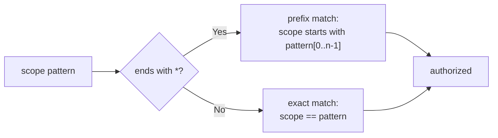
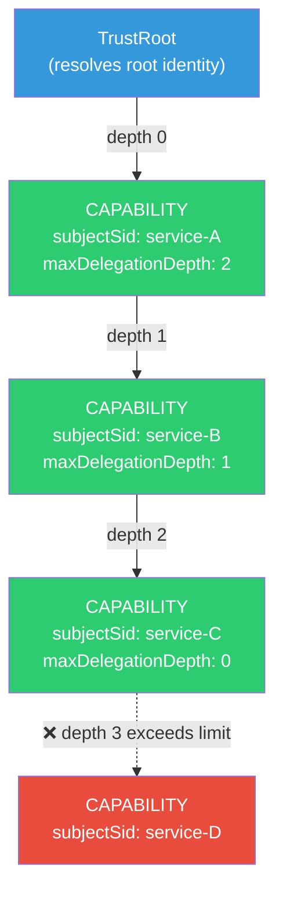
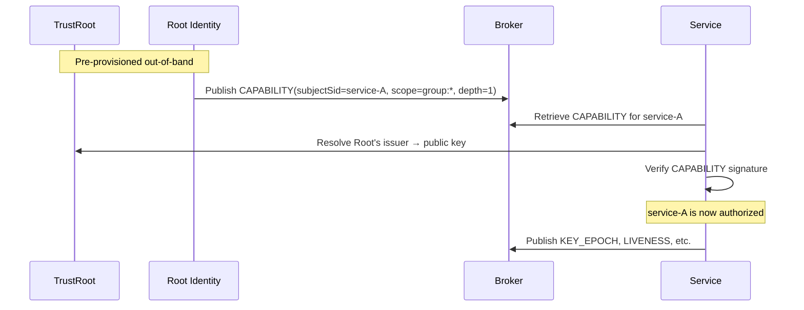

# Capability

A `CAPABILITY` entry is a signed grant establishing that a given issuer identity is authorized to publish entries within one or more scope patterns. Authorization in Veridot V4 is **never** established by application-supplied logic — it is established exclusively through capability entries or root-identity status.

:::info Specification reference
This page corresponds to **§6** of the Veridot Protocol V4 specification.
:::

## Purpose

A `CAPABILITY` entry authorizes its `subjectSid` to publish the following entry types within the scope patterns it grants:

- `KEY_EPOCH` — ephemeral key distribution
- `LIVENESS` — session validity attestation
- `CONFIG` — hierarchical configuration
- `FENCE` — capacity mutation ordering

:::danger No default grants
There is **no** default-authorized scope and **no** fallback grant. Absence of a valid `CAPABILITY` entry for the required scope and identity MUST result in rejection of the dependent entry, with no exception.
:::

## Entry Type Details

| Property | Value |
|---|---|
| Entry type code | `0x02` |
| Singleton per scope | No — one per `issuer`/grant |
| Envelope `key` field | MUST be set to the UTF-8 encoding of `subjectSid` |

The `key` field is set to `subjectSid` to ensure the broker storage key is unique per `(scope, subjectSid)` pair, enabling direct retrieval of all capabilities granted to a given identity within a scope.

## Payload Fields

The `payload` is a [TLV sequence](./entry-types.md#tlv-payload-encoding) of the following fields:

| FieldTag | Field | Type | Required | Description |
|:---:|---|---|:---:|---|
| `0x01` | `subjectSid` | string | REQUIRED | Identifier of the identity being granted the capability |
| `0x02` | `scopePatterns` | list of strings | REQUIRED | One or more scope patterns this capability authorizes; MUST contain at least one entry |
| `0x03` | `maxDelegationDepth` | u8 | REQUIRED | Maximum number of further delegation hops permitted from this grant; `0` = no further delegation |
| `0x04` | `validUntil` | i64 | REQUIRED | Expiry, milliseconds since epoch |

### List-of-Strings Encoding for `scopePatterns`

`scopePatterns` is encoded as a concatenation of length-prefixed strings within the TLV value:

```
┌────────────────────────┬────────────────────────┬─────┐
│ u16 len₁ │ UTF-8 pattern₁         │ u16 len₂ │ UTF-8 pattern₂         │ ... │
└────────────────────────┴────────────────────────┴─────┘
```

The outer TLV `len` covers the **entire serialized list**.

## Scope Pattern Matching

A scope pattern is a scope string (per [§3.5](./wire-format.md#identifier-constraints)) with an optional trailing `*` wildcard:

| Pattern | Matches | Does NOT match |
|---|---|---|
| `group:42` | `group:42` only | `group:421`, `group:4` |
| `group:42:*` | `group:42` and any scope with suffix | — |
| `site:us-east` | `site:us-east` only | `site:us-east-1` |
| `global` | `global` only | — |

### Rules

- A trailing `*` matches **any suffix** after the prefix
- `*` MUST NOT appear anywhere other than as a single trailing character
- In the current version, since `group:<groupId>` carries no sub-path, `group:42:*` matches `group:42` exactly



## Verification Process

A `CAPABILITY` entry authorizes `subjectSid` for `scope` if and only if **all four conditions** hold:

| # | Condition | Description |
|:---:|---|---|
| 1 | Structural + trust validation | The `CAPABILITY` entry passes [envelope validation](./wire-format.md) and [TrustRoot resolution](./wire-format.md#canonical-signing-bytes) of its own `issuer` |
| 2 | Temporal validity | `now < validUntil` |
| 3 | Scope match | `scope` matches at least one pattern in `scopePatterns` |
| 4 | Delegation depth | The issuing chain terminates at the TrustRoot within `maxDelegationDepth` hops |

### Delegation Chain



| Identity | Issued by | Depth | Bounded by |
|---|---|:---:|---|
| Root identity (TrustRoot-resolvable) | — | 0 | N/A |
| `service-A` | Root identity | 0 | Root's unlimited authority |
| `service-B` | `service-A` | 1 | `service-A`'s `maxDelegationDepth: 2` |
| `service-C` | `service-B` | 2 | `service-B`'s `maxDelegationDepth: 1` |
| `service-D` | `service-C` | 3 | ❌ Exceeds `service-C`'s `maxDelegationDepth: 0` |

### Error Codes

| Failure | Error code |
|---|---|
| No valid CAPABILITY found for issuer + scope | [`V4102`](./error-codes.md) |
| CAPABILITY found but expired (`now ≥ validUntil`) | [`V4103`](./error-codes.md) |
| Delegation chain exceeds `maxDelegationDepth` | [`V4104`](./error-codes.md) |

## Bootstrap and Root Authorization

An identity directly and successfully resolvable in the **TrustRoot** is called a **root identity**. Root identities have special privileges:

| Privilege | Description |
|---|---|
| Publish `CAPABILITY` entries | Authorized for **any scope**, without itself holding a prior `CAPABILITY` entry |
| Publish other entry types | Does NOT require a `CAPABILITY` entry to issue `KEY_EPOCH`, `LIVENESS`, `CONFIG`, or `FENCE` entries for any scope |
| Delegation depth | Treated as depth `0` for all delegation chain calculations |

### Bootstrap Sequence

In a fresh deployment, the first capability is established by a root identity:



:::warning No escape hatch
All non-root identities MUST derive their authorization from a `CAPABILITY` entry issued — directly or transitively within `maxDelegationDepth` hops — by a root identity. A processor MUST NOT grant authorization to any identity that cannot establish this chain terminating at a root identity.
:::

## See Also

- [Key Epoch](./key-epoch.md) — step 5 of the verification process requires capability validation
- [Liveness](./liveness.md) — liveness entries also require capability authorization
- [Wire Format](./wire-format.md) — envelope structure and TrustRoot resolution
- [Error Codes](./error-codes.md) — `V4102`, `V4103`, `V4104`
