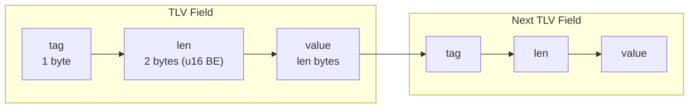

# Entry Types

Every Veridot V4 entry carries an `entryType` byte in its [envelope](./wire-format.md) that determines the semantics of its payload. This page documents the complete registry of entry types and the TLV (Tag–Length–Value) encoding used for all payloads.

:::info[Specification reference]
This page corresponds to **§4** of the Veridot Protocol V4 specification.
:::

## Entry Type Registry

| Code | Name | Singleton per scope | Key field | Specification |
|:---:|---|:---:|---|:---:|
| `0x01` | `KEY_EPOCH` | No | One per session `key` | [§5](./key-epoch.md) |
| `0x02` | `CAPABILITY` | No | One per `issuer`/grant (`key` = `subjectSid`) | [§6](./capability.md) |
| `0x03` | `CONFIG` | Yes | `key` MUST be empty | §7 |
| `0x04` | `LIVENESS` | Yes per session | `key` = session key | [§8](./liveness.md) |
| `0x05` | `FENCE` | Yes | `key` MUST be empty | §9 |
| `0x06` | `SNAPSHOT_MARKER` | Yes | `key` MUST be empty | §11.4 |
| `0x07` | `SECURE_PAYLOAD` | No | One per target `key` | §12 |

### Extension Rules

- Codes `0x08`–`0xFF` are **unassigned and reserved** for future specification.
- A processor receiving an unassigned code MUST reject the entry with [`V4002`](./error-codes.md) rather than ignore it.
- Entry types are **closed for extension** without a specification update — this prevents undocumented, unauthenticated semantics from entering the protocol surface.

:::danger[No silent extension]
Unlike optional payload fields (which support forward-compatible extension via unknown TLV tags), entry types cannot be extended without updating this specification. This is a deliberate restriction.
:::

## TLV Payload Encoding

The `payload` field of **every entry type** is encoded as a contiguous sequence of TLV (Tag–Length–Value) fields.

### TLV Field Structure

| Sub-field | Size | Type | Description |
|---|---|---|---|
| `tag` | 1 byte | u8 | Field identifier, entry-type-specific; `0x00` is reserved and MUST NOT appear |
| `len` | 2 bytes | u16, big-endian | Length in bytes of `value` |
| `value` | variable | binary | Field value |

### Processing Rules

| Rule | Behavior | Error |
|---|---|---|
| Tag `0x00` appears | MUST reject | [`V4007`](./error-codes.md) |
| REQUIRED field missing | MUST reject | [`V4007`](./error-codes.md) |
| OPTIONAL field absent | Apply documented default | — |
| Unrecognized tag | MUST silently ignore (forward compatibility) | — |
| Duplicate tag | MUST reject | [`V4007`](./error-codes.md) |

### Value Encoding

| Value Type | Encoding |
|---|---|
| Fixed-width numeric (u8, u16, u32, u64, i64) | Big-endian |
| String | UTF-8, no null terminator |
| List of strings | Concatenation of `(u16 length ‖ UTF-8 bytes)` pairs; outer `len` covers the entire serialized list |
| Enum | u8 with values defined per entry type |
| Bytes | Raw binary |

### Reserved Tags

Tags `0xF0`–`0xFF` within **any** entry type are reserved for future extension and MUST be ignored if unknown.

## Entry Type Summaries

### KEY_EPOCH (`0x01`)

Distributes the ephemeral public key, algorithm, and temporal validity window needed to verify a signed object. Each session has its own key epoch.

**Payload fields**: `alg`, `epochId`, `pk`, `validFrom`, `validUntil`, `site`

→ Full details: [Key Epoch](./key-epoch.md)

### CAPABILITY (`0x02`)

Signed grant authorizing an issuer identity to publish entries within scope patterns. Authorization is established **exclusively** through capabilities or root-identity status.

**Payload fields**: `subjectSid`, `scopePatterns`, `maxDelegationDepth`, `validUntil`

→ Full details: [Capability](./capability.md)

### CONFIG (`0x03`)

Hierarchical configuration applying at group, site, or global scope level. Singleton per scope (`key` MUST be empty).

**Payload fields**:

| FieldTag | Field | Type | Required | Default | Description |
|:---:|---|---|:---:|---|---|
| `0x01` | `max` | u32 | OPTIONAL | unbounded | Maximum active sessions per group |
| `0x02` | `pol` | enum(u8) | OPTIONAL | `0x01` (FIFO) | Eviction policy: `0x01`=FIFO, `0x02`=LIFO, `0x03`=LRU, `0x04`=REJECT |
| `0x03` | `dttl` | u64 | OPTIONAL | — | Default key-epoch validity duration (ms) |
| `0x04` | `name` | string | OPTIONAL | — | Descriptive name |
| `0x05` | `description` | string | OPTIONAL | — | Description |

**Hierarchy**: `group:<groupId>` (highest) → `site:<siteId>` → `global` (lowest)

### LIVENESS (`0x04`)

Positive-proof attestation of a session's current status (`ACTIVE` or `REVOKED`). Default-deny semantics — absence or expiration means rejection.

**Payload fields**: `status`, `asOf`, `validUntil`

→ Full details: [Liveness](./liveness.md)

### FENCE (`0x05`)

Monotonic counter for totally ordering capacity-affecting mutations within a scope. Singleton per scope (`key` MUST be empty).

**Payload fields**:

| FieldTag | Field | Type | Required | Description |
|:---:|---|---|:---:|---|
| `0x01` | `fenceCounter` | u64 | REQUIRED | Strictly increasing per scope |
| `0x02` | `grantedTo` | string | REQUIRED | Identifier of the processor instance this counter value was granted to |
| `0x03` | `validUntil` | i64 | REQUIRED | Expiry of the grant (ms since epoch) |

### SNAPSHOT_MARKER (`0x06`)

Signed record that a complete, consistent point-in-time enumeration of a scope was performed. Singleton per scope (`key` MUST be empty).

**Payload fields**:

| FieldTag | Field | Type | Required | Description |
|:---:|---|---|:---:|---|
| `0x01` | `snapshotAt` | i64 | REQUIRED | Wall-clock time the snapshot enumeration was initiated (ms since epoch) |
| `0x02` | `entryCount` | u32 | REQUIRED | Number of distinct EntryIds captured in this scope snapshot |

### SECURE_PAYLOAD (`0x07`)

Transports an application-level object through the broker with optional end-to-end encryption (E2EE) using hybrid encryption for specific recipients.

**Payload fields**:

| FieldTag | Field | Type | Required | Description |
|:---:|---|---|:---:|---|
| `0x01` | `encAlg` | enum(u8) | OPTIONAL | `0x01` = AES-256-GCM, `0x02` = ChaCha20-Poly1305. REQUIRED if `recipients` present |
| `0x02` | `nonce` | bytes | OPTIONAL | IV/nonce for symmetric encryption. REQUIRED if `recipients` present |
| `0x03` | `recipients` | bytes | OPTIONAL | Concatenation of `RecipientBlock`s. If absent, payload is plaintext |
| `0x04` | `data` | bytes | REQUIRED | Encrypted (if `recipients` present) or plaintext payload data |
| `0x05` | `payloadType` | string | OPTIONAL | MIME type or format identifier (e.g., `"application/json"`) |

## See Also

- [Wire Format](./wire-format.md) — the envelope that wraps every entry type
- [Key Epoch](./key-epoch.md) — detailed specification of `KEY_EPOCH`
- [Capability](./capability.md) — detailed specification of `CAPABILITY`
- [Liveness](./liveness.md) — detailed specification of `LIVENESS`
- [Error Codes](./error-codes.md) — complete error code reference
