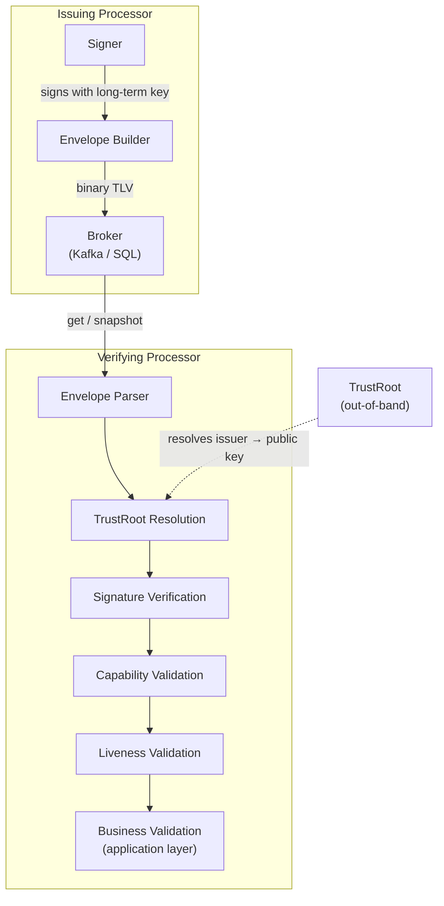

# Protocol V4 Overview

The Veridot Protocol version 4 (V4) is a **self-describing binary message format** for distributing cryptographic verification metadata across nodes. It defines the wire format, semantics, state model, and processing rules that all conforming implementations MUST follow.

:::info[Version]
**Protocol Version**: 4.0 &middot; **Status**: Standards Track &middot; **Created**: 2026-06-28
:::

## Purpose

The Veridot Protocol defines a **transport-agnostic binary format** for distributing:

- **Public-key verification metadata** — ephemeral key epochs for signing/verification
- **Authorization capabilities** — cryptographic grants scoped to namespaces
- **Liveness attestations** — positive-proof session validity
- **Capacity-fencing tokens** — monotonic counters for distributed quota enforcement

It enables any node with read access to the broker to **independently verify signed objects** produced by any other node, and to independently determine the current authoritative state of a session, a configuration scope, or a capacity quota — **without trusting the broker itself**.

## Scope

### What V4 covers

| Area | Specification |
|---|---|
| Binary envelope format & entry-type registry | [Wire Format](./wire-format.md), [Entry Types](./entry-types.md) |
| Key epoch distribution & ephemeral key verification | [Key Epoch](./key-epoch.md) |
| Capability-based authorization | [Capability](./capability.md) |
| Liveness attestation & revocation semantics | [Liveness](./liveness.md) |
| Session capacity management & fenced eviction | §9–§10 in the full spec |
| State consistency model (monotonicity, idempotence, reconciliation) | §11 in the full spec |

### What V4 does NOT cover

- Transport-layer implementation details (Kafka, SQL, or otherwise)
- Application-level business rules unrelated to session verification
- Signed object formats (JWT structure, API key encoding, etc.)
- Root-of-trust key management and provisioning procedures

## Design Principles

The protocol is built on six foundational principles that shape every processing rule:

### 1. Deny by Default

Any entry that is malformed, unauthorized, stale, or for which authoritative state cannot be positively established **MUST be rejected**. Absence of information MUST NOT be interpreted as a permissive state.

:::danger[Critical invariant]
There is no "allow unless explicitly denied" path in V4. Every verification starts from rejection and requires positive proof to pass.
:::

### 2. Structural Authorization

Authorization to act on a scope MUST be established by a **verifiable cryptographic capability** ([§6](./capability.md)), never by an implementation-defined callback or default. No configuration option may bypass this requirement.

### 3. Monotonic State

For any given scope and entry type, state MUST only move forward. No operation defined by this protocol permits a conforming processor to regress to an earlier known state. The `version` field (u64, strictly increasing per EntryId) is the sole arbiter of ordering — never wall-clock timestamps.

### 4. Positive Liveness Proof

A session or scope is considered valid **only when** a fresh, signed, positive attestation of validity is held by the verifying processor ([§8](./liveness.md)). Expiration, absence, or invalidity of such an attestation MUST produce the same outcome: **rejection**.

### 5. Uniform Envelope

All information exchanged through the broker, regardless of purpose, uses **one canonical signed envelope** and one verification pipeline. No entry type may bypass cryptographic verification through an alternate, lighter-weight read path.

### 6. Availability over Consistency for Non-Authoritative Reads

A processor reading a single key from the broker MAY be eventually consistent. Authoritative decisions (revocation, capacity fencing, configuration authorization) MUST NOT rely on single-read consistency; they rely on **monotonicity** and **periodic reconciliation** instead.

## Architecture

## Entry Types at a Glance

V4 defines **7 entry types**, each with a dedicated binary code and TLV payload:

| Code | Name | Purpose | Details |
|:---:|---|---|:---:|
| `0x01` | `KEY_EPOCH` | Distribute ephemeral public keys | [§5](./key-epoch.md) |
| `0x02` | `CAPABILITY` | Authorize issuers for scopes | [§6](./capability.md) |
| `0x03` | `CONFIG` | Hierarchical configuration | [Entry Types](./entry-types.md) |
| `0x04` | `LIVENESS` | Session validity attestation | [§8](./liveness.md) |
| `0x05` | `FENCE` | Capacity mutation ordering | [Entry Types](./entry-types.md) |
| `0x06` | `SNAPSHOT_MARKER` | Reconciliation completeness proof | [Entry Types](./entry-types.md) |
| `0x07` | `SECURE_PAYLOAD` | E2EE payload transport | [Entry Types](./entry-types.md) |

## Key Terminology

| Term | Definition |
|---|---|
| **Broker** | Transport/storage component; NOT a trusted authority over entry validity |
| **Processor** | Software implementing this protocol (issuance and/or verification) |
| **TrustRoot** | Out-of-band trust store resolving `issuer` → long-term public key |
| **Scope** | Typed namespace: `group:<groupId>`, `site:<siteId>`, or `global` |
| **Session** | Single verification context within a group, identified by `key` |
| **EntryId** | Tuple `(scope, entryType, key)` uniquely identifying an entry's logical position |
| **Version** | u64 strictly increasing per EntryId — the sole basis for ordering |
| **Epoch** | Time-bounded validity window (`validFrom`/`validUntil`) |

## Evolution from V3

V4 is a complete redesign of the [Protocol V3](../v3/index.md) (text-based, Base64url-encoded metadata). Key changes:

| Aspect | V3 | V4 |
|---|---|---|
| Wire format | Text (`version:group:seq\|metadata`) | Binary TLV envelope |
| Entry types | 3 (normal, config, revocation) | 7 (key epoch, capability, config, liveness, fence, snapshot, secure payload) |
| Authorization | TrustAnchor + `sig` field | Structural capability chain (§6) |
| Revocation model | Tombstone messages | Positive liveness attestation (§8) |
| Consistency | Eventual only | Monotonic version + fence tokens |
| State resolution | Latest-timestamp-wins | Strictly increasing `version` (timestamp advisory only) |
| Capacity management | Eventual (race-prone) | Fence-token serialized (§9) |

:::tip
For new deployments, always use Protocol V4. V3 is retained for reference only. See the [V3 archive](../v3/index.md).
:::

## Next Steps

- **[Wire Format](./wire-format.md)** — understand the binary envelope structure
- **[Entry Types](./entry-types.md)** — registry of all 7 entry types and TLV encoding
- **[Key Epoch](./key-epoch.md)** — ephemeral key distribution and the 9-step verification process
- **[Capability](./capability.md)** — scope-based authorization model
- **[Liveness](./liveness.md)** — positive-proof session validity
- **[Error Codes](./error-codes.md)** — complete reference of all V4 error codes
