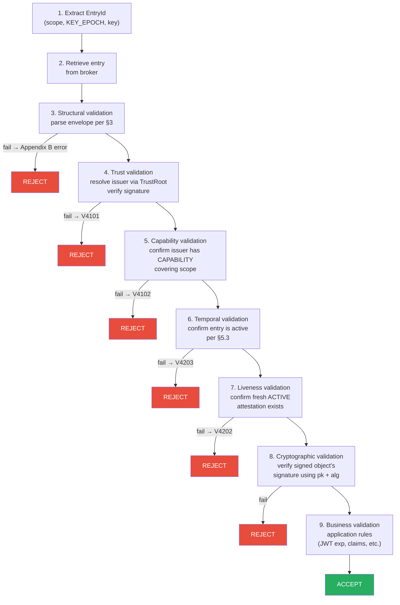

# Key Epoch

A `KEY_EPOCH` entry distributes the cryptographic elements required to verify a signed object: the ephemeral public key, its algorithm, and its temporal validity window. This is the foundational entry type that enables distributed verification without shared secrets.

:::info Specification reference
This page corresponds to **§5** of the Veridot Protocol V4 specification.
:::

## Purpose

A `KEY_EPOCH` entry is responsible for:

- Distributing the **ephemeral public key** used to verify signatures on signed objects (JWTs, API keys, etc.)
- Declaring the **algorithm** used for signing
- Declaring the **temporal validity window** during which the key is considered active

A `KEY_EPOCH` entry is **NOT** responsible for:

- The business-level expiration of the signed object (e.g., JWT `exp` claim)
- Authorization (that's handled by [CAPABILITY](./capability.md))
- Application-specific validation logic

## Entry Type Details

| Property | Value |
|---|---|
| Entry type code | `0x01` |
| Singleton per scope | No — one per session `key` |
| Envelope `key` field | The session identifier |

## Payload Fields

The `payload` of a `KEY_EPOCH` entry is a [TLV sequence](./entry-types.md#tlv-payload-encoding) of the following fields:

| FieldTag | Field | Type | Required | Description |
|:---:|---|---|:---:|---|
| `0x01` | `alg` | enum(u8) | REQUIRED | Signature algorithm for the ephemeral key |
| `0x02` | `epochId` | u64 | REQUIRED | Monotonic identifier of this key epoch, scoped to `(scope, key)` |
| `0x03` | `pk` | bytes | REQUIRED | Ephemeral public key, DER-encoded |
| `0x04` | `validFrom` | i64 | REQUIRED | Epoch validity start, milliseconds since epoch |
| `0x05` | `validUntil` | i64 | REQUIRED | Epoch validity end, milliseconds since epoch |
| `0x06` | `site` | string | OPTIONAL | Site identifier for configuration inheritance; valid only when `scope` starts with `group:` |

### Algorithm Values

| `alg` value | Algorithm | Recommended |
|:---:|---|:---:|
| `0x01` | RSA-SHA256 | — |
| `0x02` | ECDSA-SHA256 | — |
| `0x03` | RSA-PSS | — |
| `0x04` | Ed25519 | ✅ |

:::tip
**Ed25519** is recommended for all ephemeral keys. Its verification is mathematically constant-time, eliminating timing side-channel risks.
:::

### Forward Compatibility

Unknown `FieldTag` values within a `KEY_EPOCH` payload MUST be **silently ignored** by a conforming processor (forward compatibility per [§4.1](./entry-types.md#tlv-payload-encoding)). This applies only to payload fields, **not** to entry types themselves.

## Temporal Validity

A `KEY_EPOCH` entry is **active** if and only if all three conditions hold:

| # | Condition | Rationale |
|:---:|---|---|
| 1 | `now ≥ validFrom − 300000` | 5-minute clock-drift tolerance (in milliseconds) |
| 2 | `now < validUntil` | The key has not expired |
| 3 | No `LIVENESS` entry with status `REVOKED` and `version ≥` this entry's version exists for `(scope, key)` | The session has not been revoked |

```mermaid
gantt
    title KEY_EPOCH Temporal Validity
    dateFormat X
    axisFormat %s

    section Validity Window
    Clock drift tolerance (5 min)     :crit, drift, 0, 300
    Active window                      :active, valid, 300, 3900
    Expired                            :done, exp, 3900, 4200
```

:::warning Clock drift
The 5-minute tolerance is **fixed** by the protocol — it is not configurable. Processors MUST synchronize clocks to within this margin (NTP recommended).
:::

## Verification Process

A conforming processor verifying a signed object MUST execute these 9 steps **in order**:

### Step Details

| Step | Action | On failure |
|:---:|---|---|
| 1 | **Extract** the complete EntryId `(scope, KEY_EPOCH, key)` referenced by the signed object | — |
| 2 | **Retrieve** the corresponding entry from the broker | Rejection (no entry = not verifiable) |
| 3 | **Structural validation**: parse the [envelope](./wire-format.md); reject on any violation | Corresponding error from [Appendix B](./error-codes.md) |
| 4 | **Trust validation**: resolve `issuer` through the TrustRoot and verify `signature` over the [canonical bytes](./wire-format.md#canonical-signing-bytes) | [`V4101`](./error-codes.md) |
| 5 | **Capability validation**: confirm the `issuer` holds a valid, unexpired [CAPABILITY](./capability.md) whose `scopePatterns` cover `scope` | [`V4102`](./error-codes.md) |
| 6 | **Temporal validation**: confirm the entry is [active](#temporal-validity) | [`V4203`](./error-codes.md) |
| 7 | **Liveness validation**: confirm a fresh `ACTIVE` [liveness attestation](./liveness.md) exists for `(scope, key)` | [`V4202`](./error-codes.md) |
| 8 | **Cryptographic validation**: use `pk` and `alg` to verify the signed object's own signature | Application-defined error |
| 9 | **Business validation**: the application applies its own rules (JWT expiration, claims, permissions, etc.) | Application-defined error |

:::danger Steps 4–7 are mandatory
Steps 4 through 7 MUST each independently produce rejection on failure. **None of them may be skipped, reordered to occur after step 8, or replaced by an alternate, non-equivalent check.**
:::

### Algorithm Matching (JWT)

When verifying JWT tokens, the verifier MUST extract the JWT header and confirm that the `alg` attribute matches the expected JWT algorithm derived from the KEY_EPOCH's `alg`:

| KEY_EPOCH `alg` | Expected JWT `alg` |
|:---:|:---:|
| `0x01` (RSA-SHA256) | `RS256` |
| `0x02` (ECDSA-SHA256) | `ES256` |
| `0x03` (RSA-PSS) | `PS256` |
| `0x04` (Ed25519) | `EdDSA` |

Any mismatch MUST result in token rejection to prevent **algorithm confusion attacks**.

## Site Membership

The optional `site` field declares that the group identified by `scope` belongs to a specific site for configuration inheritance purposes. This field:

- Is valid **only** when `scope` starts with `group:`
- Links the group to a `site:<siteId>` configuration scope
- Enables shared configuration across multiple groups (see CONFIG entry type in [Entry Types](./entry-types.md#config-0x03))

## See Also

- [Wire Format](./wire-format.md) — envelope structure used by all entries
- [Capability](./capability.md) — authorization model (step 5)
- [Liveness](./liveness.md) — positive-proof validity (step 7)
- [Entry Types](./entry-types.md) — all 7 entry types and TLV encoding
- [Error Codes](./error-codes.md) — all error codes referenced in the verification process
