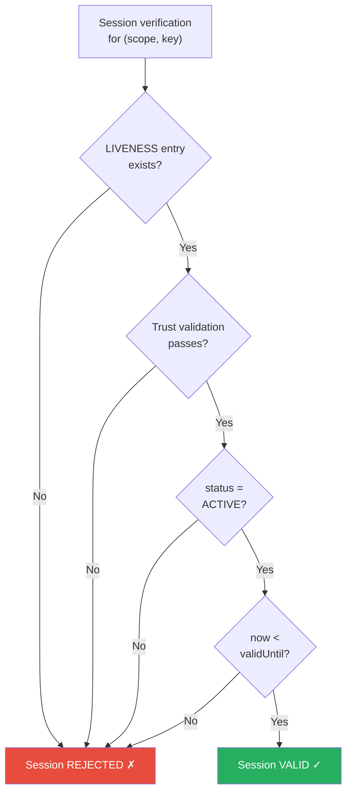
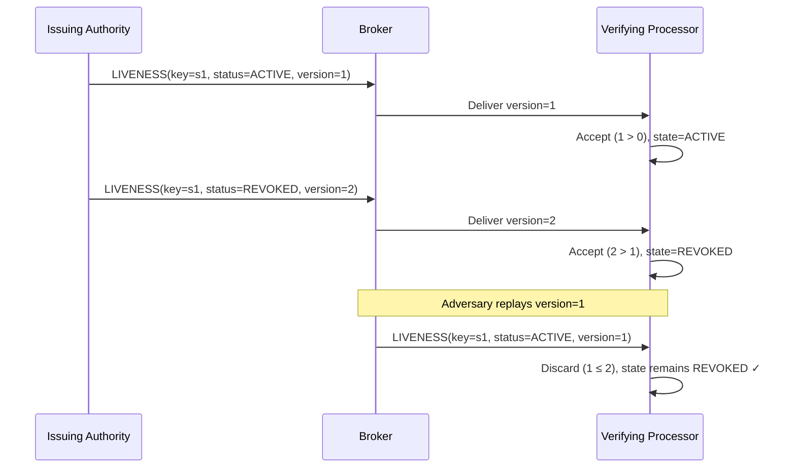
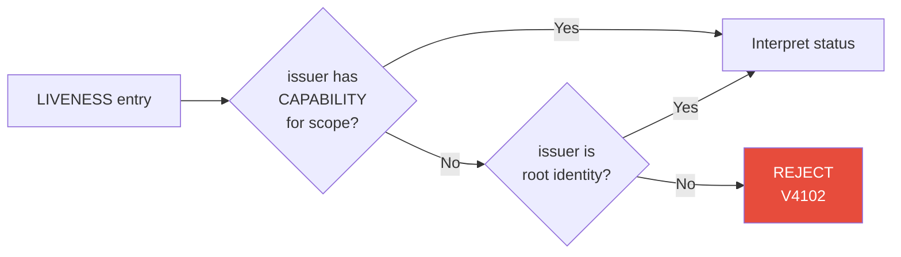

# Liveness

A `LIVENESS` entry is a signed, positive statement of a session's current status. It is the cornerstone of Veridot V4's **default-deny** verification model: a session is valid **only when** a fresh, positively verified `ACTIVE` attestation exists.

:::info[Specification reference]
This page corresponds to **§8** of the Veridot Protocol V4 specification.
:::

## Purpose

The `LIVENESS` entry replaces V3's tombstone-based revocation with a **positive-proof** model:

| V3 (Tombstone) | V4 (Liveness) |
|---|---|
| Sessions are valid unless explicitly revoked | Sessions are invalid unless positively attested |
| Missing revocation = session is valid | Missing attestation = session is **rejected** |
| Revocation is a destructive, irreversible action | Status can transition `ACTIVE` → `REVOKED` monotonically |

:::danger[The absence rule]
The absence of a `LIVENESS` entry, an expired one, or one that fails verification **NEVER** constitutes evidence that a session is valid. Validity is established exclusively by the presence of a fresh, positively verified `ACTIVE` attestation.
:::

## Entry Type Details

| Property | Value |
|---|---|
| Entry type code | `0x04` |
| Singleton per scope | Yes, per session (`key` = session key) |
| Envelope `key` field | The session key being attested |

## Payload Fields

The `payload` is a [TLV sequence](./entry-types.md#tlv-payload-encoding) of the following fields:

| FieldTag | Field | Type | Required | Description |
|:---:|---|---|:---:|---|
| `0x01` | `status` | enum(u8) | REQUIRED | `0x01` = `ACTIVE`, `0x02` = `REVOKED` |
| `0x02` | `asOf` | i64 | REQUIRED | Time the issuing authority asserts this status (ms since epoch) |
| `0x03` | `validUntil` | i64 | REQUIRED | Expiry of this attestation's freshness window (ms since epoch) |

### Status Values

| Value | Status | Meaning |
|:---:|---|---|
| `0x01` | `ACTIVE` | The session is currently valid |
| `0x02` | `REVOKED` | The session has been revoked |

## Default-Deny Semantics

A session identified by `(scope, key)` is considered **valid** for verification purposes if and only if **all four conditions** hold:

| # | Condition | Description |
|:---:|---|---|
| 1 | Entry exists | A `LIVENESS` entry exists for `(scope, key)` whose `version` is the highest among all entries the processor has observed for that EntryId |
| 2 | Trust validation passes | The entry passes [structural and trust validation](./wire-format.md#canonical-signing-bytes) |
| 3 | Status is `ACTIVE` | `status = 0x01` |
| 4 | Not expired | `now < validUntil` |



:::warning[All failures are equal]
Any failure of conditions 1–4 — including **broker unavailability**, **network failure**, **signature failure**, or **simple absence** of any entry — MUST produce the same outcome: the session is treated as **not valid**. A conforming processor MUST NOT distinguish "no attestation found" from "attestation invalid" for the purpose of deciding the default outcome.
:::

## Monotonicity and Conflict Resolution

For a given `(scope, key)`, an incoming `LIVENESS` entry is accepted **only if** its `version` is strictly greater than the highest `version` previously accepted for that EntryId.

| Incoming `version` vs. recorded | Action |
|---|---|
| Strictly greater | **Accept** — update recorded state |
| Equal or lower | **Discard** — no state change |

An entry with an equal or lower `version` — **regardless of** its `status`, its `asOf` value, or the validity of its own signature — MUST be discarded without altering the processor's recorded state.

### Why This Matters

This monotonicity rule is what **prevents revocation rollback**: once a `REVOKED` status is accepted at version `N`, no entry with `version ≤ N` can revert the status to `ACTIVE`, even if the entry itself is cryptographically valid.



## Renewal Strategy

Because validity requires `now < validUntil`, an issuing authority MUST **periodically publish renewed** `ACTIVE` attestations for every session it continues to consider valid.

### Renewal Timeline

```
                 asOf                                               validUntil
                  │                                                      │
                  ├──────────── attestation window ───────────────────────┤
                  │                                         │            │
                  │              80% of window              │  20% tail  │
                  │                                         │            │
                  │                              renew here ─┘            │
```

A renewed `ACTIVE` attestation SHOULD be published no later than:

```
validUntil − 0.2 × (validUntil − asOf)
```

This margin — the **last 20%** of the attestation's validity window — accommodates:

- Propagation latency from issuer to broker to verifiers
- Transient broker unavailability

### Lapsed Renewal

A session for which renewal has lapsed becomes **unverifiable** — indistinguishable from a revoked session — until a new attestation with a higher `version` is published. This is by design: the system fails safe.

:::tip[Caching]
A processor MAY cache a positively verified attestation for the full duration of its `validUntil` window without re-querying the broker on every verification call.
:::

## Authorization

A `LIVENESS` entry MUST be rejected unless its `issuer` holds a valid [CAPABILITY](./capability.md) entry whose `scopePatterns` cover the `LIVENESS` entry's `scope` (verified per [§6.4](./capability.md#verification-process)), **or** the `issuer` is a root identity per [§6.5](./capability.md#bootstrap-and-root-authorization).

This requirement applies **identically** to `ACTIVE` and `REVOKED` attestations — the authorization check is evaluated **before** the `status` field is interpreted.

### Authorization Flow



## Related Error Codes

| Code | Name | When raised |
|---|---|---|
| [`V4202`](./error-codes.md) | `LIVENESS_NOT_ESTABLISHED` | No fresh, valid `ACTIVE` liveness entry available for the target session |
| [`V4102`](./error-codes.md) | `CAPABILITY_NOT_FOUND` | Issuer lacks authorization for the scope |
| [`V4201`](./error-codes.md) | `STALE_VERSION` | Incoming version ≤ recorded watermark |

## See Also

- [Key Epoch](./key-epoch.md) — step 7 of the verification process requires liveness validation
- [Capability](./capability.md) — authorization model for liveness issuers
- [Entry Types](./entry-types.md) — all 7 entry types overview
- [Error Codes](./error-codes.md) — complete error code reference
