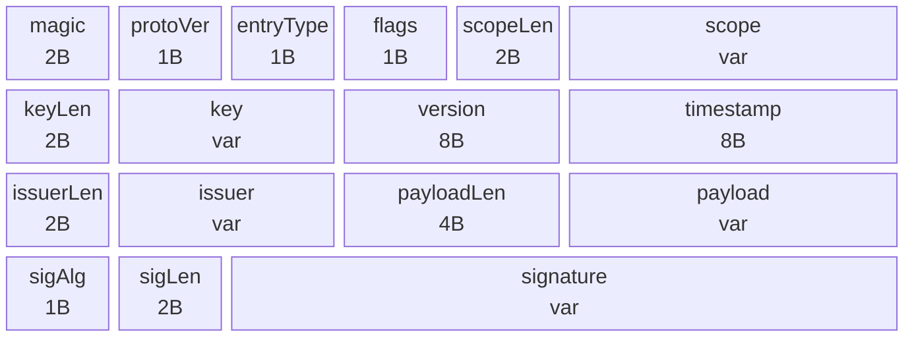
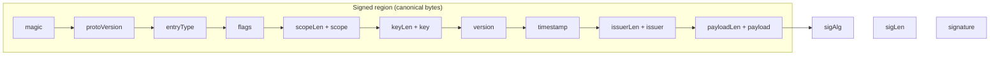

# Wire Format

Every piece of state exchanged through the Veridot broker — key epochs, capabilities, configuration, liveness attestations, fence tokens, snapshots, and secure payloads — is encoded as a single **binary envelope**. This page specifies the envelope structure, field constraints, storage key derivation, canonical signing bytes, and identifier rules.

:::info[Specification reference]
This page corresponds to **§3** of the Veridot Protocol V4 specification.
:::

## Envelope Structure

Every Veridot V4 entry is encoded as a single contiguous binary sequence with the following fields, in order:

| Field | Size | Type | Description |
|---|---|---|---|
| `magic` | 2 bytes | fixed | `0x56 0x44` (`"VD"`) — protocol marker |
| `protoVersion` | 1 byte | u8 | MUST be `0x04` |
| `entryType` | 1 byte | u8 | One of the registered [entry types](./entry-types.md) |
| `flags` | 1 byte | bitfield | Bit 0: `COMPACT_SIG` — MUST be `1` iff `sigAlg = 0x04` (Ed25519), `0` for RSA-SHA256 (`0x01`) or RSA-PSS (`0x03`); bits 1–7: reserved, MUST be zero |
| `scopeLen` | 2 bytes | u16 | Length in bytes of `scope` |
| `scope` | variable | UTF-8 | Typed scope identifier (see [Identifier Constraints](#identifier-constraints)) |
| `keyLen` | 2 bytes | u16 | Length in bytes of `key` |
| `key` | variable | UTF-8 | Entry key within scope; zero-length permitted for singleton entry types |
| `version` | 8 bytes | u64, big-endian | Monotonic version — sole basis for ordering |
| `timestamp` | 8 bytes | i64, big-endian | Issuer's wall-clock time (ms since epoch); **advisory only** — MUST NOT be used for ordering |
| `issuerLen` | 2 bytes | u16 | Length in bytes of `issuer` |
| `issuer` | variable | UTF-8 | Long-term identifier resolved by the TrustRoot |
| `payloadLen` | 4 bytes | u32, big-endian | Length in bytes of `payload` |
| `payload` | variable | binary TLV | Entry-type-specific fields ([§5](./key-epoch.md)–§9) |
| `sigAlg` | 1 byte | u8 | `0x01` = RSA-SHA256, `0x02` = ECDSA-SHA256, `0x03` = RSA-PSS, `0x04` = Ed25519 |
| `sigLen` | 2 bytes | u16 | Length in bytes of `signature` |
| `signature` | variable | binary | Signature over the canonical bytes |

All multi-byte integers are **big-endian**. There is no implicit padding or alignment between fields.

### Visual Layout



## Field Constraints

| Constraint | Rule | Error on violation |
|---|---|---|
| Magic + version | `magic` and `protoVersion` MUST be validated **before** any other field is interpreted. Mismatch → immediate rejection | `V4001` |
| Entry type | MUST be one of the [registered values](./entry-types.md). Unregistered value → rejection | `V4002` |
| Scope length | `scopeLen` MUST be in `1–4096` | `V4003` |
| Key length | `keyLen` MUST be in `0–4096` | `V4003` |
| Issuer length | `issuerLen` MUST be in `1–4096` | `V4003` |
| Payload length | `payloadLen` MUST be in `0–65536` | `V4004` |
| Reserved flags | Bits 1–7 of `flags`, if set → rejection | `V4005` |
| COMPACT_SIG consistency | `flags` bit 0 MUST be `1` iff `sigAlg = 0x04` (Ed25519), `0` for `sigAlg ∈ {0x01, 0x03}` | `V4005` |

:::warning[Order matters]
`magic` and `protoVersion` MUST be validated **first**. On mismatch, the processor MUST NOT attempt to parse the remainder of the envelope.
:::

## EntryId and Broker Storage Key

The **EntryId** is the triple:

```
(scope, entryType, key)
```

The broker storage key is computed deterministically as:

```
storageKey = scope ‖ 0x00 ‖ entryType ‖ 0x00 ‖ key
```

where `0x00` is a single NUL byte separator. Because `scope` and `key` are length-prefixed UTF-8 strings validated against the [identifier constraints](#identifier-constraints) (which exclude NUL), this construction is **unambiguous and injective**.

### Java Example

```java
byte[] deriveStorageKey(String scope, byte entryType, String key) {
    byte[] scopeBytes  = scope.getBytes(StandardCharsets.UTF_8);
    byte[] keyBytes    = key.getBytes(StandardCharsets.UTF_8);
    byte[] storageKey  = new byte[scopeBytes.length + 1 + 1 + 1 + keyBytes.length];

    System.arraycopy(scopeBytes, 0, storageKey, 0, scopeBytes.length);
    storageKey[scopeBytes.length]     = 0x00; // NUL separator
    storageKey[scopeBytes.length + 1] = entryType;
    storageKey[scopeBytes.length + 2] = 0x00; // NUL separator
    System.arraycopy(keyBytes, 0, storageKey, scopeBytes.length + 3, keyBytes.length);

    return storageKey;
}
```

## Canonical Signing Bytes

The `signature` field covers **every byte of the envelope preceding `sigAlg`**, in encoded order:

```
magic ‖ protoVersion ‖ entryType ‖ flags ‖ scopeLen ‖ scope ‖ keyLen ‖ key ‖
version ‖ timestamp ‖ issuerLen ‖ issuer ‖ payloadLen ‖ payload
```

**No field is excluded** from the signed region, and **no field is signed in isolation** from the others. This eliminates any possibility of relocating a valid signature to a different scope, key, version, or payload than the one it was produced for.

:::tip[Why everything is signed together]
By binding `scope`, `key`, `version`, and `payload` into a single signed region, V4 prevents "signature transplant" attacks where an adversary would reuse a legitimate signature from one entry on a different entry.
:::

### Signed Region Diagram



## Identifier Constraints

`scope` and `key` MUST satisfy the following rules:

### Character Set

Any UTF-8 codepoint **except**:
- `0x00` (NUL)
- ASCII control characters `0x01`–`0x1F`

### Length

| Field | Minimum | Maximum |
|---|:---:|:---:|
| `scope` | 1 byte | 4096 bytes |
| `key` | 0 bytes (zero permitted for singleton entry types) | 4096 bytes |

### Scope Grammar

`scope` MUST match one of the following patterns:

| Pattern | Example | Description |
|---|---|---|
| `"group:" 1*125(identifier-char)` | `group:user123` | A specific group |
| `"site:" 1*125(identifier-char)` | `site:us-east-1` | A site partition |
| `"global"` | `global` | The global scope |

Where `identifier-char` excludes `:` in addition to the character-set constraints above.

A scope not matching this grammar MUST be rejected with error [`V4006`](./error-codes.md).

## Supported Signature Algorithms

| `sigAlg` value | Algorithm | `COMPACT_SIG` flag (bit 0) |
|:---:|---|:---:|
| `0x01` | RSA-SHA256 | `0` |
| `0x02` | ECDSA-SHA256 | `0` |
| `0x03` | RSA-PSS | `0` |
| `0x04` | Ed25519 | `1` |

:::tip[Recommended algorithm]
Implementations SHOULD prefer **Ed25519** (`sigAlg = 0x04`) for all long-term and ephemeral keys. Ed25519 verification is mathematically constant-time and immune to timing side-channel attacks (NIST SP 800-186).
:::

## See Also

- [Entry Types](./entry-types.md) — the 7 registered entry types and TLV payload encoding
- [Key Epoch](./key-epoch.md) — the 9-step verification pipeline that uses this envelope
- [Error Codes](./error-codes.md) — all error codes referenced on this page
