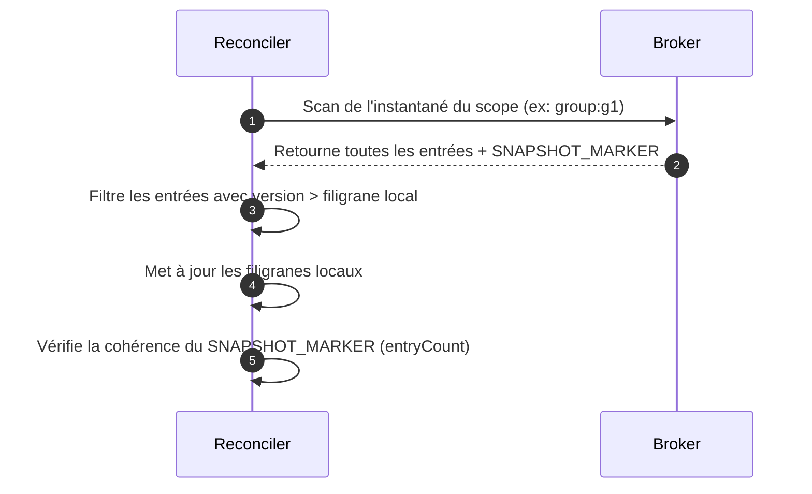

# Cohérence de l'État & Monotonie

Veridot V4 s'appuie sur un modèle de cohérence hybride conçu pour offrir une **cohérence à terme** (eventual consistency) sur les lectures à haut volume, et un **ordonnancement strict** sur les mutations de capacité, le tout sans verrou centralisé synchrone.

---

## 1. L'Invariant de Version Monotone

Pour se prémunir contre les attaques par rejeu et les retours en arrière de l'état (rollback), le protocole applique **l'Invariant de Version Monotone** :

- Chaque entrée possède une clé logique unique (EntryId) représentée par le triplet `(scope, entryType, key)`.
- Pour chaque EntryId, un vérificateur maintient localement un filigrane de version correspondant à la version la plus élevée qu'il a acceptée.
- Lorsqu'une entrée est lue sur le courtier, le vérificateur applique la vérification suivante :

$$\text{version}_{\text{entrante}} > \text{version}_{\text{filigrane}}$$

- Si la version entrante est inférieure ou égale au filigrane actuel, l'entrée est rejetée immédiatement avec le code **`V4201 (STALE_VERSION)`**.
- Ce contrôle intervient avant l'interprétation sémantique, interdisant la réapplication d'anciens états.

---

## 2. Magasin Persistant des Filigranes

Si un microservice de vérification redémarre, la perte de son cache local de filigranes pourrait le rendre vulnérable à un rejeu d'état (ex. réintroduction d'une session active révoquée avant le redémarrage).

Pour éviter cela, Veridot utilise un **`WatermarkStore`** :
- **Persistance** : Matérialisé par `FileWatermarkStore` (écriture dans un fichier local configuré via `VDOT_WATERMARK_PERSISTENCE_FILE`) ou en utilisant directement le stockage persistant du courtier.
- **Protection de l'Intégrité** : Le fichier de filigranes est protégé par une empreinte cryptographique HMAC. La clé HMAC est dérivée en hachant la clé privée long terme du nœud (`SHA-256`).
- **Mode Sécurisé (Fail-Safe)** : Si le fichier de filigranes est altéré ou corrompu, le contrôle d'intégrité échoue, le cache local est vidé et le processeur déclenche une réconciliation complète.

---

## 3. Réconciliation Périodique via Instantanés (Snapshots)

Les pannes réseau ou du Broker pouvant entraîner des pertes de messages de mise à jour, les vérificateurs exécutent une **boucle de réconciliation périodique** :



- **Fréquence** : Toutes les 15 minutes par défaut (configuré via `VDOT_RECONCILIATION_INTERVAL_MINUTES`).
- **Retard Maximum** : Si le cache local n'a pas pu se réconcilier avec succès depuis plus de 60 minutes (`VDOT_RECONCILIATION_MAX_STALENESS_MINUTES`), le vérificateur se bloque en mode sécurisé et lève l'exception **`RECONCILIATION_STALE`**, rejetant toute validation.
- **Marqueurs d'Instantané** : Une entrée `SNAPSHOT_MARKER` (type `0x06`) est publiée à la fin de chaque instantané, indiquant le nombre d'entrées (`entryCount`) et l'horodatage (`snapshotAt`). Le vérificateur l'utilise pour vérifier qu'il a bien reçu l'intégralité des données.

---

## 4. Cloisonnement de Capacité et Éviction

Veridot permet d'appliquer une limite stricte de sessions actives par groupe (ex. maximum 3 appareils connectés simultanément). Lorsque cette limite est atteinte, une nouvelle demande de session déclenche une **Politique d'Éviction** (définie dans l'enum `EvictionPolicy`) :

| Politique | Comportement |
|---|---|
| **`FIFO`** (First-In-First-Out) | Révoque la session active dont l'horodatage `asOf` liveness est le plus ancien. |
| **`LIFO`** (Last-In-First-Out) | Révoque la session active dont l'horodatage `asOf` liveness est le plus récent. |
| **`LRU`** (Least Recently Used) | Révoque la session active la moins récemment utilisée. |
| **`REJECT`** | Refuse purement et simplement la création de la session ; lève `SessionCapacityExceededException`. |

---

## 5. Cloisonnement de Concurrence via Jeton de Barrière (FENCE)

En environnement distribué, deux instances d'émetteurs distinctes pourraient tenter d'émettre des sessions simultanément pour un même groupe et dépasser le quota. Veridot l'empêche via les **Entrées `FENCE`** :

- Une entrée `FENCE` (type `0x05`) fait office de ticket d'époque distribué. Elle contient un compteur `fenceCounter` qui doit être strictement croissant par portée.
- Toute mutation modifiant la capacité (éviction ou création de session sous quota) doit s'accompagner d'une écriture `FENCE`.
- Si deux nœuds écrivent en parallèle, le courtier accepte le premier et rejette le second en raison d'un jeton obsolète (`V4301`).

```
Émetteur A (fenceCounter = 10) ---> ENREGISTRÉ (Succès)
Émetteur B (fenceCounter = 10) ---> REJETÉ (V4301 - Obsolète)
```
- L'émetteur rejeté doit récupérer le nouveau compteur `fenceCounter`, recalculer les sessions actives et réessayer sa mutation.
