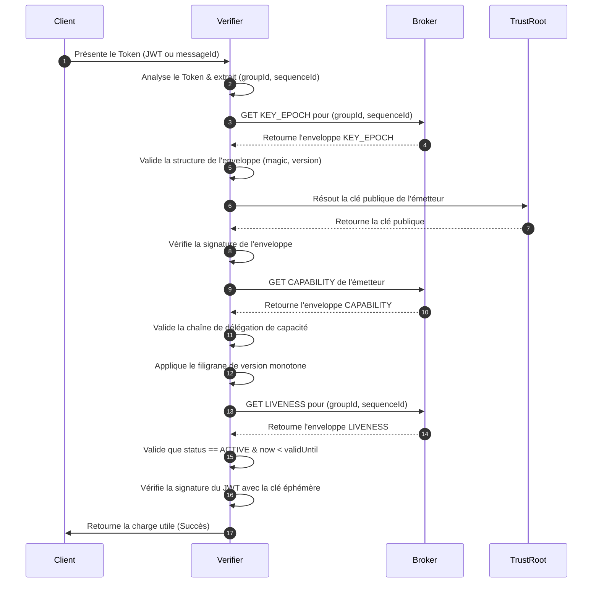

# Spécification du Protocole V4

Le Protocole Veridot Version 4 (V4) définit un **format d'enveloppe binaire auto-auditable** et les règles de transition d'état pour distribuer de manière sécurisée les métadonnées de vérification.

---

## 1. Format de l'Enveloppe Canonique

Chaque entrée publiée sur le courtier (Broker) doit respecter la structure d'enveloppe binaire suivante. Cela garantit que tous les types d'état partagent un même pipeline d'analyse et de validation cryptographique.

### Structure Binaire

| Champ | Taille (Octets) | Type | Description |
|---|---|---|---|
| `magic` | 2 | Fixe | `0x56 0x44` (`"VD"`) — Signature du protocole |
| `protoVersion` | 1 | u8 | Doit être égal à `0x04` |
| `entryType` | 1 | u8 | Type d'entrée (voir registre ci-dessous) |
| `flags` | 1 | Bitfield | Bit 0: `COMPACT_SIG` (1 pour Ed25519, 0 pour RSA). Bits 1-7: Réservés |
| `scopeLen` | 2 | u16, BE | Longueur du champ `scope` |
| `scope` | variable | UTF-8 | Chaîne de portée (ex: `group:g1`, `site:s1`, `global`) |
| `keyLen` | 2 | u16, BE | Longueur du champ `key` |
| `key` | variable | UTF-8 | Sous-clé de l'entrée (vide pour les singletons) |
| `version` | 8 | u64, BE | Numéro de version monotone |
| `timestamp` | 8 | i64, BE | Horodatage indicatif (millisecondes depuis l'époque) |
| `issuerLen` | 2 | u16, BE | Longueur de l'émetteur |
| `issuer` | variable | UTF-8 | Identifiant de l'émetteur, résolu via le `TrustRoot` |
| `payloadLen` | 4 | u32, BE | Longueur de la charge utile (`payload`) |
| `payload` | variable | TLV | Liste de champs Tag-Length-Value (voir ci-dessous) |
| `sigAlg` | 1 | u8 | `0x01` = RSA-SHA256, `0x02` = ECDSA, `0x03` = RSA-PSS, `0x04` = Ed25519 |
| `sigLen` | 2 | u16, BE | Longueur de la signature |
| `signature` | variable | Binaire | Signature cryptographique de tous les octets précédents |

---

## 2. Encodage Payload en TLV

Le champ `payload` de chaque type d'entrée est structuré sous forme de blocs **Tag-Length-Value (TLV)** consécutifs :

```
+----------+--------------------+-------------------------+
| Tag (1B) | Length (2B, BE)   | Value (longueur var)    |
+----------+--------------------+-------------------------+
```

- **Règles de traitement** :
  - Un tag `0x00` est invalide et provoque un rejet immédiat (`V4007`).
  - Les tags non reconnus sont ignorés en silence (pour la compatibilité ascendante).
  - Un tag en doublon dans le même payload provoque un rejet direct (`V4007`).

---

## 3. Registre des Types d'Entrées

Le protocole Veridot V4 répertorie six types d'entrées :

| Code | Nom de l'Entrée | Singleton ? | Rôle |
|---|---|---|---|
| `0x01` | `KEY_EPOCH` | Non (par clé) | Distribution des clés publiques éphémères et TTL |
| `0x02` | `CAPABILITY` | Non (par sujet) | Autorise une identité à écrire dans une portée |
| `0x03` | `CONFIG` | Oui | Configuration des limites et politiques d'éviction |
| `0x04` | `LIVENESS` | Oui (par clé) | État de session : `ACTIVE` ou `REVOKED` |
| `0x05` | `FENCE` | Oui | Ordonne les écritures concurrentes de quotas |
| `0x06` | `SNAPSHOT_MARKER` | Oui | Marqueur pour limiter la détection de retard |

---

## 4. Diagramme de Séquence de Vérification

Ce schéma illustre les étapes exécutées par le `TokenVerifier` lors de la validation d'un token présenté par un client :



---

## 5. Codes d'Erreur (Annexe B)

Chaque rejet de conformité produit un code d'erreur standardisé pour faciliter le monitoring :

- **`V4001`** : Anomalie de signature magique ou de version du protocole.
- **`V4002`** : Code `entryType` inconnu dans le registre.
- **`V4003`** : Longueur d'identifiant hors limites (scope/key > 4096 octets).
- **`V4005`** : Incohérence des drapeaux (ex: bit `COMPACT_SIG` activé pour RSA).
- **`V4006`** : Syntaxe de portée invalide. Doit suivre : `group:<id>`, `site:<id>` ou `global`.
- **`V4101`** : Échec de résolution de confiance ou signature invalide.
- **`V4102`** : L'émetteur ne possède pas la capacité requise sur cette portée.
- **`V4201`** : Régression de version détectée (`version <= filigrane actuel`).
- **`V4202`** : Aucune attestation `ACTIVE` valide trouvée.
- **`V4203`** : Clé éphémère hors limites de validité temporelle.
- **`V4301`** : Jeton de barrière (`FENCE`) obsolète.
