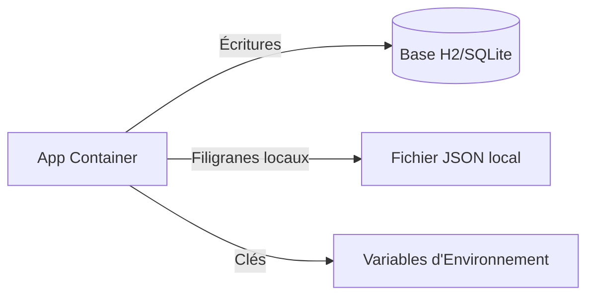
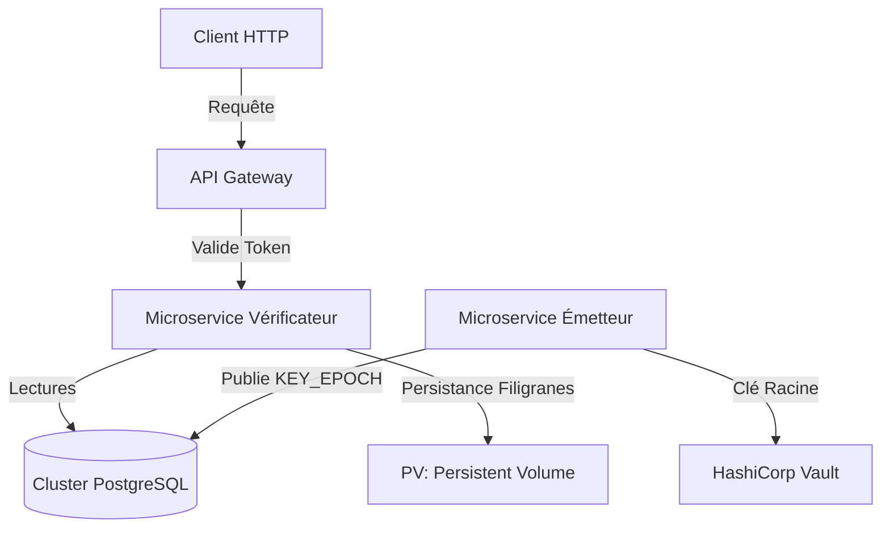
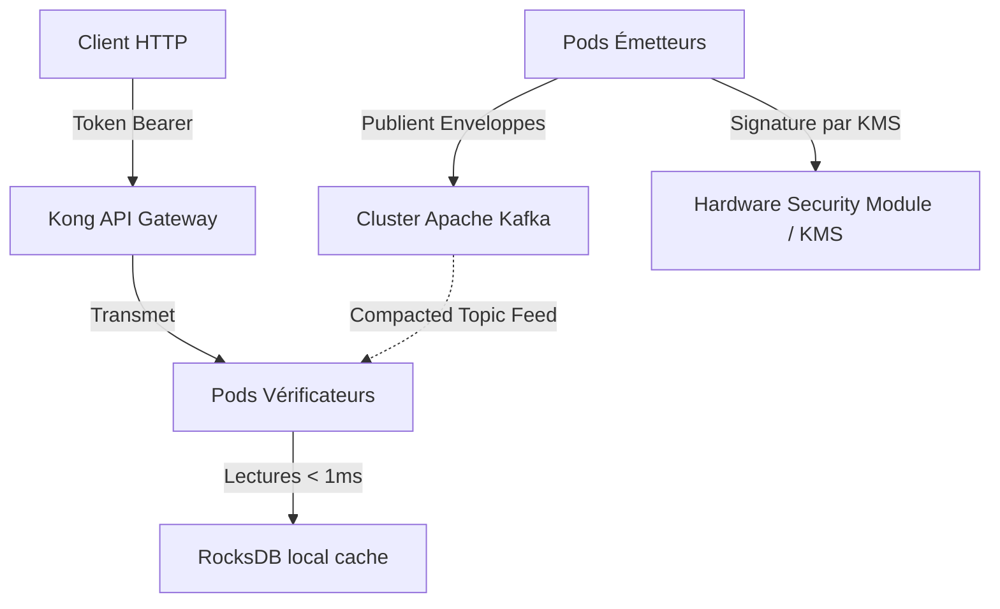

# Modèles d'Architecture

Ce guide détaille les modèles de déploiement pour Veridot V4. Chaque choix d'infrastructure est justifié à partir des exigences définies dans les spécifications du protocole (`PROTOCOL_V4.md`).

---

## 1. Justification des Composants d'Infrastructure

Veridot ne dicte pas un modèle de déploiement unique. Vos choix d'infrastructure dépendent de l'implémentation choisie pour le courtier (Broker), le magasin de confiance (TrustRoot) et le stockage des filigranes (WatermarkStore).

### A. Le Courtier (Broker) : Base de Données vs. Apache Kafka
- **PostgreSQL / MySQL / Oracle (`veridot-databases`)** :
  - *Rôle* : Stocke les enveloppes binaires dans une table de base de données relationnelle en utilisant des requêtes upsert (`ON CONFLICT`, `DUPLICATE KEY`).
  - *Conséquences de son absence* : Sans courtier, les vérificateurs ne peuvent pas résoudre les clés éphémères ni l'état actif des sessions.
  - *Compromis* : Simplifie l'exploitation pour les déploiements de petite et moyenne taille, mais introduit un goulot d'étranglement de performance sur les requêtes de lecture.
- **Apache Kafka + RocksDB (`veridot-kafka`)** :
  - *Rôle* : Diffuse les enveloppes via un sujet (topic) Kafka compacté. Les pods vérificateurs consomment ce sujet et écrivent les métadonnées directement dans leur base RocksDB locale.
  - *Conséquences de son absence* : Les vérificateurs doivent interroger la base de données de manière synchrone, ce qui augmente considérablement la latence HTTP.
  - *Compromis* : Offre des lectures en mémoire de l'ordre de la sous-milliseconde. Repose sur une cohérence à terme, sécurisée par l'invariant de version monotone.

### B. Gestion des Secrets : HashiCorp Vault / Cloud KMS vs. Fichiers PEM
- *Rôle* : Stocke la clé privée racine long terme de manière sécurisée et effectue les opérations de signature par API (KMS).
- *Statut* : **Fortement Recommandé** en production.
- *Conséquences de son absence* : Les clés stockées en clair sur les disques des serveurs (fichiers PEM) peuvent être compromises, détruisant toute la chaîne de confiance (§13.4).
- *Alternatives* : Modules de sécurité matériels (HSM) pour les environnements bancaires ou hautement réglementés.

### C. Persistance des Filigranes : Système de Fichiers vs. Base de Données
- *Rôle* : Enregistre les versions maximales acceptées par `EntryId` pour bloquer les attaques par retour en arrière (§11.1).
- *Statut* : **Obligatoire** pour la résistance aux rollbacks.
- *Conséquences de son absence* : En cas de redémarrage, un nœud repart avec un filigrane de 0, ce qui permet à un attaquant de rejouer des jetons révoqués avant le redémarrage.

---

## 2. Niveaux de Déploiement

### Niveau 1 : Développement Local / Sandbox
Parfait pour les tests unitaires et le développement local.

- **Courtier** : Base de données H2 ou SQLite via `DatabaseBroker`.
- **TrustRoot** : `PublicKeyTrustRoot` avec les clés initialisées depuis les variables d'environnement.
- **Watermark Store** : Fichier JSON écrit sur le disque de la machine de développement.

---

### Niveau 2 : Déploiement PME (SQL-Backed)
Adapté aux PME exploitant leurs services sur Kubernetes.

- **Courtier** : Cluster PostgreSQL avec réplication lecture/écriture.
- **Gestionnaire de Secrets** : HashiCorp Vault KV Engine.
- **Persistance** : Écriture des filigranes sur un volume persistant (PV) Kubernetes chiffré via `FileWatermarkStore`.
- **Flux Réseau** :
  1. L'émetteur récupère la clé privée racine auprès de Vault.
  2. L'émetteur publie `KEY_EPOCH` et `LIVENESS` dans PostgreSQL.
  3. Les vérificateurs interrogent PostgreSQL pour valider les requêtes.

---

### Niveau 3 : Entreprise Haute Disponibilité (Kafka + RocksDB + HSM)
Conçu pour les environnements à forte charge exigeant des temps de réponse ultra-rapides et une haute disponibilité.

- **Courtier** : Cluster Apache Kafka avec un sujet compacté répliqué 3 fois (`veridot-tokens`).
- **Cache Vérificateur** : Chaque pod vérificateur intègre RocksDB en local (`veridot-kafka`). Les lectures évitent tout appel réseau.
- **Racine de Confiance** : Module de Sécurité Matériel (HSM) accessible via PKCS#11 ou service KMS cloud (GCP KMS / AWS KMS).
- **Supervision** : Prometheus collecte les métriques de rejets `VDOT_STALE_VERSION` et d'échecs de signatures. Grafana déclenche des alertes.
- **Plan de Reprise (DR)** : En cas de sinistre, un nouveau cluster de vérificateurs rejoue le sujet Kafka depuis l'offset 0 pour reconstruire la base RocksDB locale.
