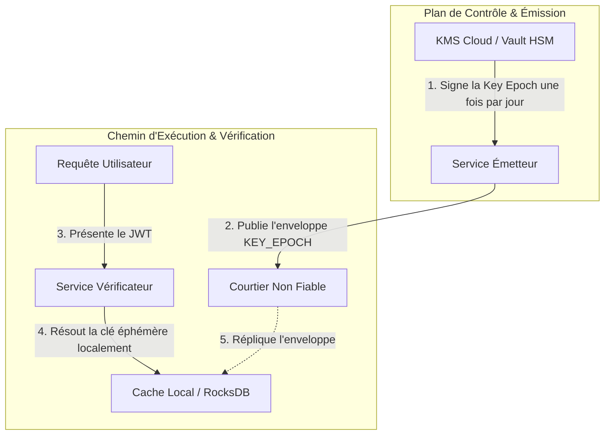
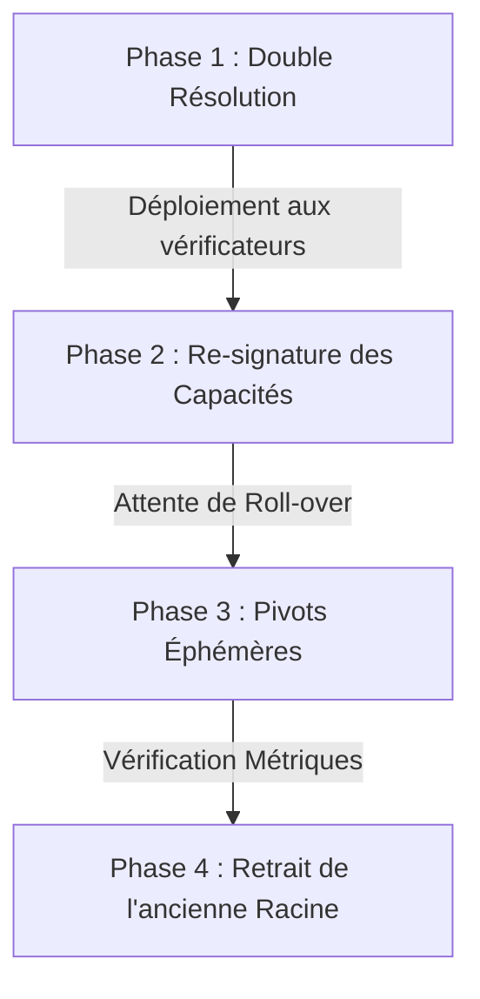

# Gestion des Clés & de la Confiance

Le modèle de sécurité de Veridot repose sur l'intégrité de sa hiérarchie de clés et le strict respect des procédures opérationnelles de rotation.

---

## 1. Rôles et Durées de Vie des Clés

| Type de Clé | Lieu de Stockage | Durée de Vie | Portée de Signature |
|---|---|---|---|
| **Clé Racine (Root)** | Module de Sécurité Matériel (HSM) / KMS | 1–3 Ans | Enveloppes `CAPABILITY`, `CONFIG`, `KEY_EPOCH` (bootstrap) |
| **Clé de Signataire Délégué** | Coffre-fort KMS (ex: HashiCorp Vault) | 3–6 Mois | Enveloppes `KEY_EPOCH`, `LIVENESS`, `FENCE` |
| **Clé Éphémère** | En mémoire (gérée par `KeyRotationService`) | 24 Heures | Charges utiles applicatives (JWT) |

---

## 2. Architecture Découplée du KMS : Élimination du SPoF

Une préoccupation majeure dans les systèmes distribués sécurisés par cryptographie est que le Service de Gestion des Clés (KMS) ou le Module de Sécurité Matériel (HSM) hébergeant les clés privées racines devienne un **point unique de défaillance (SPoF)** en production. Une panne du KMS pourrait théoriquement bloquer toute l'authentification de l'entreprise.

L'architecture de Veridot empêche cela de façon structurelle grâce au **découplage cryptographique** :

### Pourquoi le KMS n'est PAS un SPoF :

1. **Isolation des Flux** : Le flux chaud d'exécution (la vérification des tokens par les microservices vérificateurs) ne communique jamais avec le KMS. Le vérificateur a uniquement besoin des clés publiques, distribuées via les enveloppes `KEY_EPOCH` publiées sur le Courtier (Broker).
2. **Vérification Asymétrique** : Les vérificateurs valident les signatures des enveloppes en local à l'aide de leur magasin de confiance public `TrustRoot` (chargé en mémoire ou en configuration statique). Ils n'appellent jamais Vault ou le KMS pour valider des signatures de tokens.
3. **Mise en Cache Temporelle** : Le nœud Émetteur sollicite le KMS pour signer une nouvelle enveloppe `KEY_EPOCH` uniquement lors de la rotation de sa clé (par exemple, toutes les 24 heures). Une fois la `KEY_EPOCH` publiée sur le Courtier, l'Émetteur signe les JWT applicatifs des utilisateurs en mémoire à l'aide de la **paire de clés éphémères** active générée localement.
4. **Résilience aux Pannes de KMS** : Si le KMS subit une panne totale :
   - Les tokens actifs déjà émis continuent d'être validés avec succès sur les vérificateurs.
   - L'Émetteur peut continuer à émettre de nouveaux tokens pour les sessions actives avec sa clé éphémère en mémoire jusqu'à la fin de la validité de l'époque actuelle (`validUntil`).
   - Les équipes opérationnelles disposent d'un d'un délai confortable (souvent 24 heures) pour rétablir le KMS avant qu'une quelconque panne d'authentification ne devienne visible pour les utilisateurs.

---

## 3. Procédure Opérationnelle : Rotation Planifiée de la Clé Racine (Sans interruption)

Pour pivoter une clé racine long terme sans provoquer d'erreurs de vérification chez les clients, les équipes DevSecOps doivent suivre ce protocole en quatre phases :

### Phase 1 : Configuration de la Double Résolution
1. **Générer la Nouvelle Clé** : Créer une nouvelle paire de clés (RSA-PSS `0x03` ou Ed25519 `0x04`) dans votre KMS/HSM.
2. **Double Confiance** : Mettre à jour l'implémentation de `TrustRoot` sur les vérificateurs pour accepter **à la fois** la clé racine existante et la nouvelle clé publique racine.
3. **Déployer** : Redémarrer les nœuds de vérification avec cette configuration.

### Phase 2 : Re-signer les Capacités
1. **Lister les Délégations Actives** : Identifier toutes les enveloppes `CAPABILITY` signées par l'ancienne racine.
2. **Signer et Publier** : Générer des enveloppes équivalentes signées par la **nouvelle** clé racine. Pour chaque entrée, incrémenter le numéro de version par rapport à la version précédente pour contourner le contrôle de filigrane monotone (§11.1).
3. **Valider** : Confirmer que les enveloppes ont été répliquées sur les nœuds sans rejet de version.

### Phase 3 : Pivotement des Clés Éphémères
1. **Attente d'Expiration** : Attendre que les époques de clés éphémères actives expirent naturellement.
2. **Génération** : Les services émetteurs généreront de nouvelles clés éphémères et publieront des enveloppes `KEY_EPOCH` signées par les nouvelles capacités.

### Phase 4 : Retrait de l'Ancienne Racine
1. **Audit des Logs** : S'assurer qu'aucune requête active ne sollicite plus l'ancienne clé racine.
2. **Retirer** : Mettre à jour `TrustRoot` pour supprimer l'ancienne clé publique racine.
3. **Détruire** : Supprimer définitivement la clé privée obsolète de l'HSM.

---

## 4. Rétablissement Après Compromission (Urgence)

Si une clé racine ou une clé de signataire délégué est compromise :

1. **Révocation Immédiate** : Publier une enveloppe `LIVENESS` avec le statut `REVOKED` (`0x02`) pour toutes les sessions actives sous cette clé de signataire. Veiller à utiliser un numéro de version très élevé pour écraser instantanément les filigranes des vérificateurs.
2. **Injection de Barrière (FENCE)** : Publier une nouvelle enveloppe `FENCE` pour bloquer la création de nouvelles sessions par le signataire compromis.
3. **Mise à jour d'Urgence du Magasin de Confiance** : Retirer immédiatement la clé compromise de la configuration de `TrustRoot` et redémarrer les pods. Dès lors, toute enveloppe signée par la clé compromise échouera à la validation cryptographique (`V4101`).

---

## 5. Métriques de Supervision

Les instances de vérificateurs exposent les métriques Prometheus suivantes :

- **`veridot_watermark_staleness_ms`** : Mesure le retard entre les filigranes de version locaux et les instantanés du courtier.
- **`veridot_rejections_total{error="V4101"}`** : Compte le nombre d'échecs de signatures d'enveloppes (souvent lié à une clé non synchronisée).
- **`veridot_rejections_total{error="V4201"}`** : Compte les rejets pour version obsolète.
- **`veridot_fence_contention_total`** : Nombre de collisions sur les compteurs de FENCE lors d'écritures concurrentes.
