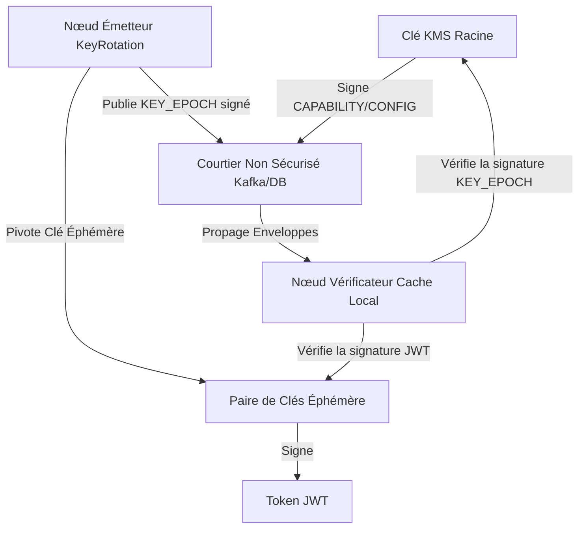

# Pourquoi Veridot ?

Dans les architectures de microservices distribués modernes, la validation des sessions utilisateur et la vérification des tokens posent un défi architectural majeur : trouver le bon équilibre entre **sécurité**, **performance** et **complexité opérationnelle**.

Veridot a été conçu pour résoudre ces compromis à l'aide d'un **protocole de vérification cryptographique décentralisé et basé sur des capacités (Protocole V4)**.

---

## Le Défi des Sessions Distribuées

Traditionnellement, les développeurs valident les sessions et les tokens d'API à l'aide de l'une de ces trois approches, chacune comportant des inconvénients notables :

### 1. Magasin de Session Centralisé (Base de données/Redis)
- **Fonctionnement** : Chaque requête entrante doit interroger une base de données partagée ou un cluster Redis pour vérifier si la session est active.
- **Inconvénient** : Crée un point unique de défaillance (SPOF) et un goulot d'étranglement de performance. Cela ajoute de la latence réseau à chaque appel d'API et augmente considérablement les coûts d'infrastructure.

### 2. Secrets HMAC Partagés (Tokens symétriques)
- **Fonctionnement** : Les services vérifient localement la signature du token à l'aide d'une clé HMAC partagée.
- **Inconvénient** : Tout microservice compromis par un attaquant expose la clé secrète partagée, lui permettant de forger des tokens pour l'ensemble du système. De plus, la révocation est complexe à gérer sans réintroduire des vérifications centralisées.

### 3. Infrastructure à Clés Asymétriques Classique (JWT avec JWKS)
- **Fonctionnement** : Le fournisseur d'identité signe les tokens avec sa clé privée, et les microservices récupèrent les clés publiques depuis un point d'accès JWKS.
- **Inconvénient** : La révocation nécessite d'interroger le serveur d'identité ou de vérifier des listes CRL (Certificate Revocation List), réintroduisant des appels réseau. Le partage de l'état des clés éphémères en temps réel n'est pas standardisé.

---

## La Solution Veridot : Cryptographie Double Couche

Veridot élimine ces inconvénients en séparant **la signature des tokens** de **la distribution des métadonnées de vérification**. Il repose sur une **hiérarchie de confiance double couche** :

### 1. Clés Éphémères (Courte durée & Haute Performance)
- Pivotées automatiquement en tâche de fond (ex: toutes les 1 à 2 heures).
- Utilisées pour signer les charges utiles applicatives individuelles.
- La vérification est effectuée localement par les vérificateurs en mémoire.

### 2. Clés Long Terme (Frontière de Sécurité)
- Gérées de manière hautement sécurisée (dans un HSM ou un service KMS comme Vault).
- Utilisées pour signer les configurations (`CONFIG`), les délégations (`CAPABILITY`) et les attributions de clés éphémères (`KEY_EPOCH`).
- Résolues via un magasin de confiance hors-bande (`TrustRoot`).

---

## Garanties Fondamentales du Protocole

Veridot V4 applique strictement cinq propriétés de sécurité :

### 1. Découplage de Confiance (Courtier Non Fiable)
Toutes les communications entre Émetteurs et Vérificateurs transitent par un **Courtier** (comme Kafka ou une base de données). Le courtier est traité comme un simple canal de transport. S'il est compromis, il est structurellement incapable d'injecter de fausses clés ou de falsifier des états, car toutes les entrées sont enveloppées dans des enveloppes cryptographiques signées.

### 2. Autorisation par Capacités
Aucune identité ne peut publier de configuration ou d'époque de clé sans détenir une entrée `CAPABILITY` valide et non expirée signée par une identité racine. L'autorisation est prouvée cryptographiquement.

### 3. Monotonie de Version (Défense contre le Rejeu)
Chaque enveloppe porte un numéro de version strictement croissant. Les vérificateurs conservent un filigrane de version local. Une fois qu'un vérificateur a accepté la version `N`, toute entrée avec une version `≤ N` est rejetée instantanément (`STALE_VERSION`), bloquant les attaques par rejeu ou retour en arrière.

### 4. Preuve Positive de Liveness
Veridot applique un principe de **fail-closed** (refus par défaut). Une session est considérée comme valide uniquement si une entrée `LIVENESS` signée et récente porte l'état `ACTIVE`. Si le courtier est indisponible ou si l'attestation expire, le vérificateur rejette le token.

### 5. Cloisonnement de Capacité de Session
Vous pouvez appliquer des quotas de session stricts par groupe (ex: maximum 5 appareils actifs par utilisateur). Les conflits de concurrence sont ordonnés à l'aide de jetons de barrière (`FENCE`), empêchant les dépassements lors des connexions simultanées.
