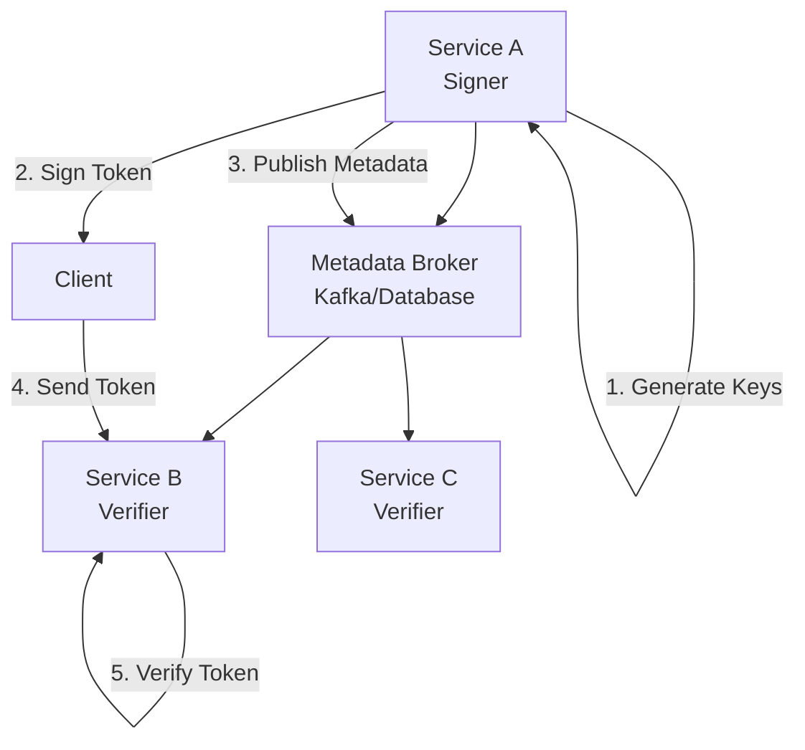

# Getting Started with Veridot

Welcome to Veridot! This guide will help you get up and running with secure, distributed token verification in your applications.

## What is Veridot?

Veridot is a multi-language library that enables secure token verification in distributed systems using:
- **Ephemeral asymmetric cryptography** - No shared secrets
- **Distributed metadata propagation** - Public keys shared via Kafka or databases
- **High-performance verification** - Sub-millisecond token validation

## Choose Your Language

<div class="language-grid">
  <div class="language-card">
    <h3>☕ Java</h3>
    <p>Production-ready with Spring Boot integration</p>
    <ul>
      <li>Maven/Gradle support</li>
      <li>Multiple broker implementations</li>
      <li>Enterprise monitoring hooks</li>
    </ul>
    <a href="{{ '/docs/java-guide' | relative_url }}" class="btn">Java Guide →</a>
  </div>
  
  <div class="language-card">
    <h3>🟢 Node.js</h3>
    <p>TypeScript-first with automatic key management</p>
    <ul>
      <li>npm package available</li>
      <li>LMDB for fast local storage</li>
      <li>Environment-based configuration</li>
    </ul>
    <a href="{{ '/docs/nodejs-guide' | relative_url }}" class="btn">Node.js Guide →</a>
  </div>
</div>

## Quick Installation

### Java (Maven)
```xml
<dependencies>
    <dependency>
        <groupId>io.github.cyfko</groupId>
        <artifactId>veridot-core</artifactId>
        <version>2.0.1</version>
    </dependency>
    <dependency>
        <groupId>io.github.cyfko</groupId>
        <artifactId>veridot-kafka</artifactId>
        <version>2.0.1</version>
    </dependency>
</dependencies>
```

### Java (Gradle)
```gradle
dependencies {
    implementation 'io.github.cyfko:veridot-core:2.0.1'
    implementation 'io.github.cyfko:veridot-kafka:2.0.1'
}
```

### Node.js
```bash
npm install dverify
# or
yarn add dverify
```

## Architecture Overview



### How it Works

1. **Key Generation**: Each service generates ephemeral RSA/ECDSA key pairs
2. **Token Signing**: Services sign data with private keys and return tokens
3. **Metadata Distribution**: Public keys are shared via brokers (Kafka/Database)
4. **Token Verification**: Other services verify tokens using distributed public keys
5. **Key Rotation**: Automatic rotation ensures forward security

## Basic Example

### Java
```java
// Initialize with Kafka broker
Properties props = new Properties();
props.setProperty("bootstrap.servers", "localhost:9092");
props.setProperty("embedded.db.path", "./veridot-keys");

MetadataBroker broker = KafkaMetadataBrokerAdapter.of(props);
GenericSignerVerifier veridot = new GenericSignerVerifier(broker);

// Sign data
UserData data = new UserData("john.doe@example.com");
BasicConfigurer config = BasicConfigurer.builder()
    .useMode(TokenMode.jwt)
    .trackedBy(12345L)
    .validity(3600) // 1 hour
    .build();

String token = veridot.sign(data, config);

// Verify token (in another service)
UserData verified = veridot.verify(token, 
    BasicConfigurer.deserializer(UserData.class));
```

### Node.js
```typescript
import { DVerify } from 'dverify';

const dverify = new DVerify();

// Sign data
const { token } = await dverify.sign({
    userId: 123,
    role: 'admin'
}, 3600);

// Verify token
const result = await dverify.verify(token);
if (result.valid) {
    console.log('User:', result.data);
}
```

## Prerequisites

### For Java
- Java 17 or higher
- Maven 3.6+ or Gradle 7+
- Kafka cluster (for distributed deployment)

### For Node.js
- Node.js 16 or higher
- npm or yarn
- Kafka cluster (for distributed deployment)

## Next Steps

- **Java Developers**: Continue to the [Java Guide]({{ '/docs/java-guide' | relative_url }})
- **Node.js Developers**: Check out the [Node.js Guide]({{ '/docs/nodejs-guide' | relative_url }})
- **Learn More**: Explore the [API Reference]({{ '/docs/api-reference' | relative_url }})
- **Security**: Review [Security Best Practices]({{ '/docs/security' | relative_url }})

<style>
.language-grid {
  display: grid;
  grid-template-columns: repeat(auto-fit, minmax(300px, 1fr));
  gap: 2rem;
  margin: 2rem 0;
}

.language-card {
  padding: 2rem;
  border: 1px solid #e1e5e9;
  border-radius: 8px;
  background: #f8f9fa;
}

.language-card h3 {
  margin-top: 0;
  color: #2c3e50;
}

.language-card ul {
  margin: 1rem 0;
}

.btn {
  display: inline-block;
  padding: 0.5rem 1rem;
  background-color: #007bff;
  color: white;
  text-decoration: none;
  border-radius: 4px;
  margin-top: 1rem;
}

.btn:hover {
  background-color: #0056b3;
  text-decoration: none;
  color: white;
}

@media (prefers-color-scheme: dark) {
  .language-card {
    background: #2d3748;
    border-color: #4a5568;
  }
  
  .language-card h3 {
    color: #e2e8f0;
  }
}
</style>