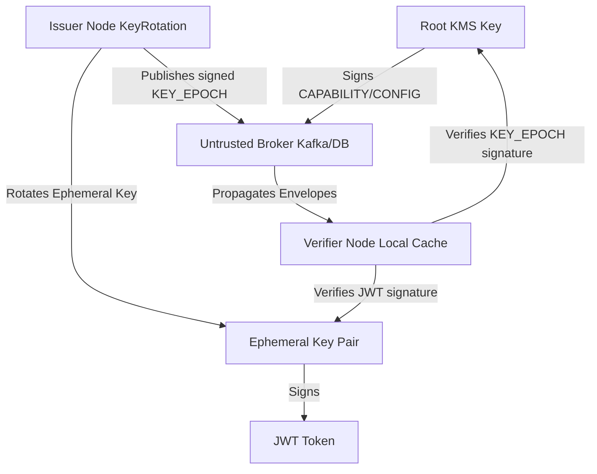

# Why Veridot?

In modern distributed microservice architectures, session validation and token verification present a major architectural challenge: finding the right balance between **security**, **performance**, and **operational complexity**.

Veridot was designed to solve these tradeoffs using a **decentralized, capability-based cryptographic verification protocol (Protocol V4)**.

---

## The Distributed Session Challenge

Traditionally, developers validate user sessions and API tokens using one of three approaches, each carrying substantial disadvantages:

### 1. Centralized Session Store (Database/Redis)
- **How it works**: Every incoming request must query a shared database or Redis cluster to check if the session is active.
- **Drawback**: Creates a single point of failure (SPOF) and a severe performance bottleneck. It adds network latency to every API call and incurs significant database licensing and scaling costs.

### 2. Opaque Shared HMAC Tokens (e.g. standard JWTs signed with a symmetric secret)
- **How it works**: Services verify the token signature locally using a shared HMAC key.
- **Drawback**: Any microservice compromised by an attacker exposes the shared secret, allowing the attacker to forge valid tokens for the entire system. Furthermore, revocation is hard; you must maintain a distributed blacklist, leading back to centralized database checks.

### 3. Traditional Public-Key Infrastructure (Asymmetric JWTs with JWKS)
- **How it works**: The identity provider signs tokens with a private key, and microservices fetch public keys from a JWKS endpoint.
- **Drawback**: Revocation requires checking a CRL (Certificate Revocation List) or querying the identity server, reintroducing network requests. Sharing ephemeral key state in real-time is not standardized, causing clock-drift issues and key-rotation lag.

---

## The Veridot Solution: Dual-Layer Cryptography

Veridot eliminates these drawbacks by separating **token signing** from **verification metadata distribution**. It operates on a **dual-layer trust hierarchy**:

### 1. Ephemeral Keys (Short-Lived & Performance-Oriented)
- Rotated automatically (e.g., every 1–2 hours) in the background.
- Used to sign individual application payloads (like user claims).
- Verification is performed locally by verifiers in-memory.

### 2. Long-Term Keys (Security Boundary)
- Managed securely (e.g., inside an HSM or Cloud KMS like Vault).
- Used to sign configuration changes (`CONFIG`), capability delegations (`CAPABILITY`), and ephemeral key allocations (`KEY_EPOCH`).
- Resolved via an out-of-band trust store (`TrustRoot`).

---

## Core Protocol Guarantees

Veridot V4 enforces these five security properties:

### 1. Trust Decoupling (Untrusted Broker)
All communication between Issuers and Verifiers passes through an untrusted **Broker** (such as Kafka or a shared database). The Broker is treated as transport only. A compromised Broker is structurally incapable of injecting forged key material or creating unauthorized states because all messages are encapsulated in signed cryptographic envelopes.

### 2. Capability-Based Authorization
No identity can publish config changes or key epochs unless they hold a valid, unexpired `CAPABILITY` entry signed by a root identity. Authorization is proven cryptographically, not by system configuration or IP addresses.

### 3. Version Monotonicity (Rollback Defense)
Every envelope carries a strictly increasing version number. Verifiers maintain a local watermark cache. Once a verifier accepts version `N`, any entry for the same resource with a version `≤ N` is rejected immediately (`STALE_VERSION`), preventing replay and rollback attacks.

### 4. Positive-Proof Liveness
Veridot operates on a **fail-closed** design. A session is only valid if a fresh, signed `LIVENESS` entry with status `ACTIVE` is present. If the broker is offline, or if the liveness entry expires or is absent, the verifier automatically rejects the token (`default-deny`).

### 5. Fenced Session Capacity
Deployments can enforce strict session quotas per group (e.g., maximum 5 active devices per user). Concurrency races are ordered using `FENCE` tokens, preventing double-allocations or bypasses during concurrent login events.
