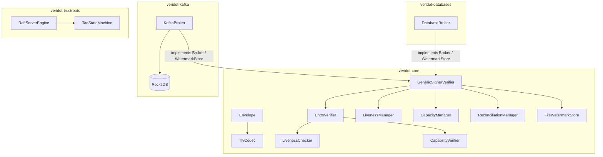

# Compréhension du Projet Veridot (Protocol V4)

Ce document récapitule de manière exhaustive la spécification, les mécanismes de sécurité, le modèle de cohérence et l'architecture logicielle du projet **Veridot** (version 4), établis exclusivement sur la base de [PROTOCOL_V4.md](file:///home/frank-kossi/Workplace/kunrin/veridot/PROTOCOL_V4.md) et du code source Java.

---

## 1. Principes Directeurs & Objectifs du Protocole V4

Le protocole **Veridot V4** définit un format d'enveloppe binaire auto-descriptif et signé pour la distribution et la vérification décentralisée d'objets (JWT, clés API, documents) sans secrets partagés. Il sépare la logique d'autorisation/gestion des clés de la logique métier applicative.

### Principes Cryptographiques et Modèle de Menace (§1.3, §14)
1. **Rejet par défaut (Deny by default)** : Toute entrée mal formée, non autorisée, expirée ou dépourvue d'attestation de vie valide et fraîche est immédiatement rejetée. L'absence d'information équivaut à un rejet.
2. **Autorisation Structurelle** : L'autorité d'un émetteur (`issuer`) sur un scope est établie exclusivement par une chaîne de délégation cryptographique valide (`CAPABILITY`), sans configuration locale ou callbacks.
3. **Monotonicité et Anti-Rollback** : L'état d'une entrée logique (`EntryId`) ne peut évoluer que vers l'avant via une version strictement croissante ($Version \ge 1$, la version $0$ est rejetée par défaut via l'erreur `V4201`). Les watermarks locaux de version ne peuvent jamais régresser.
4. **Preuve Positive de Liveness** : Une session est valide si et seulement si une attestation fraîche `LIVENESS` de statut `ACTIVE` est présente et vérifiée.
5. **Indépendance vis-à-vis du Broker** : Le broker (stockage/transport) n'est pas de confiance. Même s'il subit une injection ou une corruption de données, il lui est structurellement impossible de forger une transition d'état valide sans les clés privées associées à une ancre de confiance.

---

## 2. Structure Physique & Format Wire V4

### 2.1 L'Enveloppe Binaire Canonique (§3.1)
Chaque message ou enregistrement est encodé sous forme d'une enveloppe binaire unique :

| Champ | Taille | Type | Description |
|---|---|---|---|
| `magic` | 2 octets | fixe | `0x56 0x44` (`"VD"`) |
| `protoVersion` | 1 octet | u8 | `0x04` |
| `entryType` | 1 octet | u8 | Type d'entrée (voir registre ci-dessous) |
| `flags` | 1 octet | bitfield | bit 0: `COMPACT_SIG` (1 si signature Ed25519, 0 sinon). bits 1–7 réservés (0). |
| `scopeLen` | 2 octets | u16 BE | Longueur en octets du champ `scope` |
| `scope` | variable | UTF-8 | Identifiant du scope cible (`group:<id>`, `site:<id>`, ou `global`) |
| `keyLen` | 2 octets | u16 BE | Longueur en octets du champ `key` |
| `key` | variable | UTF-8 | Clé unique dans le scope (vide pour les singletons) |
| `version` | 8 octets | u64 BE | Numéro de version monotone ($\ge 1$) |
| `timestamp` | 8 octets | i64 BE | Date d'émission de l'émetteur (advisory) |
| `issuerLen` | 2 octets | u16 BE | Longueur en octets de l'émetteur |
| `issuer` | variable | UTF-8 | Identifiant resolved via le TrustRoot |
| `payloadLen` | 4 octets | u32 BE | Longueur en octets du payload TLV |
| `payload` | variable | TLV | Données utiles encodées en Tag-Length-Value (§4.1) |
| `sigAlg` | 1 octet | u8 | Algorithme (`0x01`=RSA-SHA256, `0x02`=ECDSA-SHA256, `0x03`=RSA-PSS, `0x04`=Ed25519) |
| `sigLen` | 2 octets | u16 BE | Longueur en octets de la signature |
| `signature` | variable | binary | Signature sur tous les octets précédents (de `magic` à `payload`) |

* **Clé de stockage Broker** : Construite de manière déterministe et injective : `scope || 0x00 || entryType || 0x00 || key`.
* **Signature canonique** : Elle couvre l'intégralité de l'enveloppe précédant le champ `sigAlg` afin d'empêcher les attaques par relocalisation ou falsification de métadonnées.

---

## 3. Registre des Types d'Entrées (`EntryType`) (§4)

### 0x01 — `KEY_EPOCH`
* **Rôle** : Distribue les métadonnées de clés publiques éphémères nécessaires pour valider les objets signés par les nœuds émetteurs.
* **Payload TLV** :
  * `0x01` `alg` (u8) : Algorithme de clé éphémère.
  * `0x02` `epochId` (u64) : Identifiant de l'epoch de clé.
  * `0x03` `pk` (bytes) : Clé publique éphémère au format DER.
  * `0x04` `validFrom` (i64) : Date de début de validité de la clé.
  * `0x05` `validUntil` (i64) : Date de fin de validité de la clé.
  * `0x06` `site` (string, optionnel) : Rattachement à un site (pour l'héritage de config).
  * `0x07` `token` (string, optionnel) : Le jeton JWT complet en mode de distribution `INDIRECT`.

### 0x02 — `CAPABILITY`
* **Rôle** : Délégation de droits cryptographiques à une identité cible (`subjectSid`) pour publier des données sur certains scopes.
* **Payload TLV** :
  * `0x01` `subjectSid` (string) : Identité autorisée.
  * `0x02` `scopePatterns` (list of strings) : Liste de filtres de scope (ex: `group:42:*`).
  * `0x03` `maxDelegationDepth` (u8) : Nombre maximal de délégations descendantes autorisées.
  * `0x04` `validUntil` (i64) : Expiration de la délégation.

### 0x03 — `CONFIG` (Singleton, `key` vide)
* **Rôle** : Configuration globale, par site, ou par groupe.
* **Payload TLV** :
  * `0x01` `max` (u32, optionnel) : Nombre maximal de sessions actives autorisées simultanément.
  * `0x02` `pol` (u8, optionnel) : Politique d'éviction (`0x01`=FIFO, `0x02`=LIFO, `0x03`=LRU, `0x04`=REJECT).
  * `0x03` `dttl` (u64, optionnel) : TTL par défaut des epochs de clé.
  * `0x04` `name` / `0x05` `description` (strings, optionnels).
  * `0x06` `validity` (u64, optionnel) : Durée de validité des jetons par défaut.

### 0x04 — `LIVENESS` (Singleton par session, `key` = session key)
* **Rôle** : Attestation périodique de validité ou révocation explicite d'une session.
* **Payload TLV** :
  * `0x01` `status` (u8) : `0x01` = `ACTIVE`, `0x02` = `REVOKED`.
  * `0x02` `asOf` (i64) : Date de constatation du statut.
  * `0x03` `validUntil` (i64) : Expiration de cette attestation de liveness.

### 0x05 — `FENCE` (Singleton, `key` vide)
* **Rôle** : Ordonnancement strict des mutations concurrentes sur les quotas de capacité.
* **Payload TLV** :
  * `0x01` `fenceCounter` (u64) : Compteur de barrière strictement croissant.
  * `0x02` `grantedTo` (string) : Processeur ayant obtenu le droit de mutation.
  * `0x03` `validUntil` (i64) : Expiration de la barrière.

### 0x06 — `SNAPSHOT_MARKER` (Singleton, `key` vide)
* **Rôle** : Indique la complétion d'une réconciliation globale d'un scope.
* **Payload TLV** :
  * `0x01` `snapshotAt` (i64) : Date du snapshot.
  * `0x02` `entryCount` (u32) : Nombre total d'EntryIds uniques capturés.

### 0x07 — `SECURE_PAYLOAD`
* **Rôle** : Transport de données applicatives chiffrées de bout en bout (E2EE hybride) ou publiques en clair.
* **Payload TLV** :
  * `0x01` `encAlg` (u8, optionnel) : Algorithme symétrique (`0x01`=AES-256-GCM, `0x02`=ChaCha20-Poly1305).
  * `0x02` `nonce` (bytes, optionnel) : IV pour le chiffrement symétrique.
  * `0x03` `recipients` (bytes, optionnel) : Blocs destinataires chiffrés (`RecipientBlock`).
  * `0x04` `data` (bytes) : Données chiffrées (ou en clair si pas de destinataires).
  * `0x05` `payloadType` (string, optionnel) : Type MIME du contenu décrypté.

---

## 4. Cohérence Distribuée, Capacité & Sécurité

### 4.1 Modèle de Cohérence et Anti-Tampering (§11, §13.3)
* **Monotonicité absolue** : Le processeur maintient un filigrane de version (`VersionWatermark`) en mémoire. Toute entrée présentée avec une version inférieure ou égale au filigrane local est ignorée ou rejetée.
* **Persistance sécurisée des Watermarks** : Le filigrane local est écrit via `WatermarkStore` en utilisant une méthode de "write-and-rename" atomique. Pour se prémunir des attaques par rollback physique, le fichier de watermark est authentifié par un code **HMAC-SHA256** calculé à l'aide d'une clé dérivée par HKDF de la clé privée à long terme du processeur. Si l'HMAC est invalide, le filigrane est ignoré et une réconciliation complète est forcée.

### 4.2 Gestion de Capacité et Algorithmes d'Éviction (§10, §10.2)
Lorsqu'une nouvelle session est initiée, si le nombre de sessions actives dépasse `max` :
* Si `pol = REJECT`, la création échoue avec une exception.
* Si `pol` vaut `FIFO`, `LIFO` ou `LRU`, le processeur élit une session victime, publie un enregistrement `LIVENESS(REVOKED)` à version incrémentée, et supprime l'ancien `KEY_EPOCH` du broker.
* **Fencing obligatoire** : Afin d'éviter les écritures concurrentes conflictuelles sur les quotas de session sans verrous distribués, toute mutation de capacité doit être précédée par l'acquisition d'une barrière `FENCE` à compteur incrémenté. Avant de publier une révocation ou un nouvel epoch, le processeur vérifie que son compteur `FENCE` est toujours valide et n'a pas été écrasé.

### 4.3 Renouvellement de Liveness et Réconciliation (§8.5, §11.4)
* **Règle des 20%** : Le liveness devant être positif pour maintenir une session active, l'autorité de liveness doit publier une mise à jour d'attestation `LIVENESS(ACTIVE)` avec une version incrémentée dans la marge des derniers 20% de la fenêtre de validité courante.
* **Réconciliation de Snapshot** : Les processeurs effectuent périodiquement (maximum toutes les 60 minutes ou à l'expiration d'un liveness) un scan complet (`snapshot`) du scope auprès du broker pour synchroniser leurs filigranes locaux et résorber d'éventuelles pertes d'événements. Si le délai de réconciliation maximum est dépassé, le processeur lève l'erreur de staleness `V4402` et rejette les vérifications.

---

## 5. Architecture Logicielle Java du Projet

Le code source est structuré en plusieurs sous-modules Maven qui matérialisent les exigences de la spécification :

### 5.1 Module `veridot-core` (Abstractions & Protocole)
* [Envelope.java](file:///home/frank-kossi/Workplace/kunrin/veridot/java/veridot-core/src/main/java/io/github/cyfko/veridot/core/impl/Envelope.java) : Parse et valide strictement la structure des enveloppes binaires (vérification du magic, de la version, des contraintes d'identifiants et de la concordance du flag `COMPACT_SIG` avec Ed25519).
* [TlvCodec.java](file:///home/frank-kossi/Workplace/kunrin/veridot/java/veridot-core/src/main/java/io/github/cyfko/veridot/core/impl/TlvCodec.java) : Encode et décode les payloads au format Tag-Length-Value. Garantit l'absence de tag `0x00` et rejette les tags dupliqués (§4.1).
* [EntryVerifier.java](file:///home/frank-kossi/Workplace/kunrin/veridot/java/veridot-core/src/main/java/io/github/cyfko/veridot/core/impl/EntryVerifier.java) : Implémente le pipeline de validation de clé éphémère (étapes 1 à 7) et de signature d'objet (étape 8). En particulier, il valide l'en-tête du JWT applicatif (`alg` vs algorithme de `KEY_EPOCH`) pour bloquer les attaques par confusion d'algorithme.
* [LivenessChecker.java](file:///home/frank-kossi/Workplace/kunrin/veridot/java/veridot-core/src/main/java/io/github/cyfko/veridot/core/impl/LivenessChecker.java) : Évalue si une session possède une attestation `LIVENESS(ACTIVE)` valide et non expirée (Default-Deny).
* [CapabilityVerifier.java](file:///home/frank-kossi/Workplace/kunrin/veridot/java/veridot-core/src/main/java/io/github/cyfko/veridot/core/impl/CapabilityVerifier.java) : Parcourt récursivement la chaîne de délégation cryptographique (jusqu'à une profondeur maximale de 10 hops) pour valider l'autorité de l'émetteur. Gère la résolution des identités racines (`isRoot()`) qui terminent la récursion à la profondeur 0. Intègre un cache thread-safe (avec positive et negative caching) pour optimiser les performances.
* [CapacityManager.java](file:///home/frank-kossi/Workplace/kunrin/veridot/java/veridot-core/src/main/java/io/github/cyfko/veridot/core/impl/CapacityManager.java) : Coordonne l'acquisition du `FENCE`, la collecte des sessions périmées (lazy GC), la comptabilisation des jetons actifs et la publication des révocations.
* [VersionWatermark.java](file:///home/frank-kossi/Workplace/kunrin/veridot/java/veridot-core/src/main/java/io/github/cyfko/veridot/core/impl/VersionWatermark.java) : Registre thread-safe mémorisant les filigranes de version. Utilise une séparation par caractère nul `\0` pour composer ses clés internes.
* [FileWatermarkStore.java](file:///home/frank-kossi/Workplace/kunrin/veridot/java/veridot-core/src/main/java/io/github/cyfko/veridot/core/impl/FileWatermarkStore.java) : Persistance de watermark avec renommage atomique et contrôle d'intégrité par HMAC-SHA256.
* [GenericSignerVerifier.java](file:///home/frank-kossi/Workplace/kunrin/veridot/java/veridot-core/src/main/java/io/github/cyfko/veridot/core/impl/GenericSignerVerifier.java) : Point d'orchestration principal implémentant les interfaces `DataSigner`, `TokenVerifier`, `TokenRevoker` et `TokenTracker`. Gère les verrous de concurrence par groupe (`groupLocks`), coordonne les planificateurs de renouvellement de liveness et de réconciliation de snapshot, et implémente les flux de chiffrement hybride / déchiffrement pour `SECURE_PAYLOAD`.
* [Protocol.java](file:///home/frank-kossi/Workplace/kunrin/veridot/java/veridot-core/src/main/java/io/github/cyfko/veridot/core/impl/Protocol.java) : **Attention !** Cette classe utilitaire implémente la spécification historique **Protocol V3** (format textuel text-based `3:<groupId>:<sequenceId>|...`). Elle est conservée pour la rétrocompatibilité (notamment pour parser les messageId et JWT).

### 5.2 Module `veridot-databases` (Stockage SQL)
* [DatabaseBroker.java](file:///home/frank-kossi/Workplace/kunrin/veridot/java/veridot-databases/src/main/java/io/github/cyfko/veridot/databases/DatabaseBroker.java) : Implémente le broker sur base de données relationnelle.
  * Supporte les dialectes d'écriture d'upsert (`ON CONFLICT` PostgreSQL/H2, `ON DUPLICATE KEY` MySQL, `MERGE INTO` Oracle/SQL Server).
  * **Sécurité Anti-tampering des filigranes** : Implémente également `WatermarkStore`. Pour stocker le snapshot de watermark dans la même table sans risque de collision avec les EntryId normaux (qui sont en UTF-8 valide), la clé de stockage du snapshot est préfixée par l'octet binaire invalide `0xFF` (`WATERMARK_KEY = 0xFF || "__watermark_snapshot__"`).
  * Gère un cache local thread-safe pour éliminer les latences d'écriture-lecture sur le nœud émetteur.

### 5.3 Module `veridot-kafka` (Stockage distribué & Événementiel)
* [KafkaBroker.java](file:///home/frank-kossi/Workplace/kunrin/veridot/java/veridot-kafka/src/main/java/io/github/cyfko/veridot/kafka/KafkaBroker.java) : Broker s'appuyant sur un topic Kafka pour l'échange d'événements et une base RocksDB embarquée locale pour la persistance locale des enveloppes.
  * **Validation à la réception** : La boucle de consommation Kafka valide structurellement chaque enveloppe au vol avant de l'écrire dans RocksDB.
  * **Offset committing sécurisé** : L'auto-commit Kafka est désactivé (`ENABLE_AUTO_COMMIT_CONFIG = false`). Le broker effectue des commits manuels synchrones (`commitSync`) uniquement après confirmation de l'écriture permanente dans RocksDB, éliminant les pertes de messages lors de crashs.
  * **Range scan** : Les scans de snapshot RocksDB utilisent un itérateur binaire (`RocksIterator`) borné entre les octets de séparation `0x00` et `0x01` du scope cible.
  * **Clé de watermark** : Utilise également le préfixe de clé binaire `0xFF` dans RocksDB pour isoler le snapshot de filigranes.

### 5.4 Module `veridot-trustroots` (Distribution des Ancres de Confiance)
* Gère la distribution sécurisée et hautement disponible des ancres de confiance à l'aide d'un consensus de groupe Raft (via SOFAJRaft).
* [RaftServerEngine.java](file:///home/frank-kossi/Workplace/kunrin/veridot/java/veridot-trustroots/veridot-trustroots-tad-server/src/main/java/io/github/cyfko/veridot/trustroots/tad/server/raft/RaftServerEngine.java) : Gère l'initialisation du nœud de consensus local, l'allocation des répertoires Raft (logs, meta, snapshots) et démarre le groupe Raft.
* [TadStateMachine.java](file:///home/frank-kossi/Workplace/kunrin/veridot/java/veridot-trustroots/veridot-trustroots-tad-server/src/main/java/io/github/cyfko/veridot/trustroots/tad/server/raft/TadStateMachine.java) : Reçoit les logs répliqués par consensus Raft et applique de manière déterministe les transactions d'enregistrement ou mise à jour de clés publiques (`TrustEntry`) dans le stockage local RocksDB (`TadRocksDbStore`).

---

## 6. Table de Diagnostic & Codes d'Erreurs (§13.4, Appendix B)

| Code d'Erreur | Nom de l'Erreur | Cause Directe de Rejet |
|---|---|---|
| `V4001` | `INVALID_ENVELOPE` | Magic (`magic != 0x5644`) ou version de protocole (`protoVersion != 4`) incorrects, ou enveloppe tronquée. |
| `V4002` | `UNREGISTERED_ENTRY_TYPE` | Type d'entrée inconnu ou non répertorié. |
| `V4003` | `INVALID_IDENTIFIER_LENGTH` | Taille des identifiants (`scope`, `key`, `issuer`) hors limites (1–4096 octets, 0–4096 pour `key`). |
| `V4004` | `INVALID_PAYLOAD_LENGTH` | Taille du payload TLV excessive ($> 65536$ octets). |
| `V4005` | `RESERVED_FLAG_SET` | Bits réservés de flags définis à 1, ou bit 0 (`COMPACT_SIG`) incohérent avec `sigAlg` (doit être 1 si Ed25519, 0 sinon). |
| `V4006` | `INVALID_SCOPE_GRAMMAR` | Scope non conforme à la grammaire (`group:<id>`, `site:<id>`, `global`) ou contenant des caractères invalides. |
| `V4007` | `MALFORMED_PAYLOAD` | Tag TLV nul (`0x00`), tag obligatoire manquant, tag dupliqué ou structure de liste mal formée. |
| `V4101` | `TRUST_RESOLUTION_FAILED` | Signature de l'enveloppe ou de l'objet invalide, ou issuer impossible à résoudre par le TrustRoot. |
| `V4102` | `CAPABILITY_NOT_FOUND` | Aucune capacité cryptographique n'autorise l'issuer sur le scope spécifié. |
| `V4103` | `CAPABILITY_EXPIRED` | La capacité cryptographique correspondante est expirée (`now >= validUntil`). |
| `V4104` | `DELEGATION_DEPTH_EXCEEDED` | La chaîne de délégation dépasse la profondeur de délégation maximale spécifiée ou la limite matérielle de 10 hops. |
| `V4201` | `STALE_VERSION` | Version de l'enveloppe obsolète (inférieure ou égale au filigrane actuel) ou version nulle ($Version = 0$). |
| `V4202` | `LIVENESS_NOT_ESTABLISHED` | Absence d'attestation `LIVENESS`, ou attestation de statut non `ACTIVE`. |
| `V4203` | `KEY_EPOCH_EXPIRED` | L'epoch de clé référencé est expiré ou n'est pas encore entré dans sa phase de validité (en tenant compte de la dérive d'horloge de 5 minutes). |
| `V4204` | `SIGALG_KEY_MISMATCH` | Incompatibilité entre l'algorithme `sigAlg` déclaré et le type de clé de l'issuer résolu. |
| `V4205` | `DECRYPTION_FAILED` | Échec lors du déchiffrement asymétrique ou symétrique du payload dans `SECURE_PAYLOAD`. |
| `V4301` | `FENCE_TOKEN_STALE` | Le jeton FENCE présenté possède un compteur inférieur ou égal au watermark de FENCE enregistré pour le scope. |
| `V4302` | `CAPACITY_EXCEEDED` | Quota de sessions atteint sous la politique d'éviction `REJECT`. |
| `V4401` | `TRANSPORT_UNAVAILABLE` | Indisponibilité du broker de stockage ou du réseau (traité comme un rejet pour les vérifications). |
| `V4402` | `RECONCILIATION_STALE` | Le délai maximal de réconciliation périodique est dépassé (perte potentielle de cohérence). |
